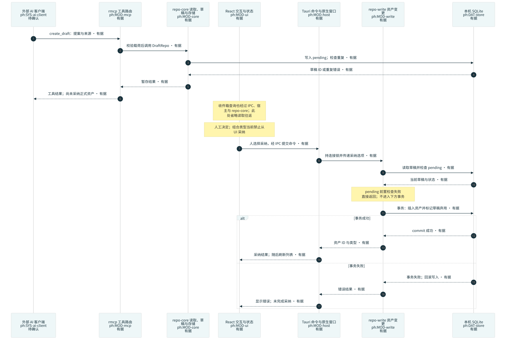

# prompt-hub 架构地图

> 派生架构视图；原需求和接口规范保持权威。状态为最近一次检查快照，不是后台监听。

检查时间：2026-09-23T14:12:21.287091+00:00

图例：有据＝有来源支持（不等于运行验收）；推断／待确认始终用文字标出。时序虚线表示返回。

## D1 · 系统全景：本地资产与外部边界

[图源](D1.mmd) · [PNG](D1.png) · [视图清单](views.json)

- **回答**：本机系统包含什么，数据在哪些边界流动？
- **视角／深度**：系统／技术 / L0
- **范围**：prompt-hub 本机应用及伴随 MCP；外部客户端部署未核查
- **架构状态**：current
- **基线**：317106deaef72b5edc83a74bd63402bd1b4ac6c2 / app 0.2.0
- **负责人**：本轮 Codex 制作与检查；长期维护人待指定
- **审阅**：AI 按来源复核；不代表人审需求或目标验收通过
- **检查**：可能过期，需要复核
- **阅读提示**：使用者通过桌面应用操作资产并决定采纳；是否粘贴到外部 AI 未观测。；有据仅表示当前代码支持该路径，客户端配置和实际调用不在本图验证范围。；SQLite 是共享存储；桌面宿主与 MCP 为独立进程。

对象与证据：`ph:CLM-c01@0.1.0`、`ph:CLM-c02@0.1.0`、`ph:CLM-c03@0.1.0`、`ph:CLM-c04@0.1.0`、`ph:CLM-c06@0.1.0`、`ph:CLM-c07@0.1.0`、`ph:CLM-c10@0.1.0`、`ph:CMP-desktop@0.1.0`、`ph:DAT-files@0.1.0`、`ph:DAT-store@0.1.0`、`ph:EVD-fe@0.1.0`、`ph:EVD-probe@0.1.0`、`ph:EVD-rust@0.1.0`、`ph:EVD-source@0.1.0`、`ph:IF-clipboard@0.1.0`、`ph:MOD-mcp@0.1.0`、`ph:SYS-ai-client@0.1.0`、`ph:SYS-hub@0.1.0`、`ph:SYS-releases@0.1.0`

## D2 · 模块分工：调用与存储职责

[图源](D2.mmd) · [PNG](D2.png) · [视图清单](views.json)

- **回答**：前端动作经过哪些边界，谁执行写入与检查？
- **视角／深度**：系统／技术 / L2–L3
- **范围**：桌面前端、Rust 宿主、独立 MCP 和共享 SQLite
- **架构状态**：current
- **基线**：317106deaef72b5edc83a74bd63402bd1b4ac6c2 / app 0.2.0
- **负责人**：本轮 Codex 制作与检查；长期维护人待指定
- **审阅**：AI 按来源复核；不代表人审需求或目标验收通过
- **检查**：可能过期，需要复核
- **阅读提示**：repo-core 表示共享库职责；两进程分别创建连接，不是同一个服务或同一个 Mutex。；repo-write 可经共享数据库连接写入；本图不是全部 SQL 调用的调用图。；MCP 无 repo-write 依赖是工具路径约束，不是 SQLite 表级权限隔离。

对象与证据：`ph:CLM-c01@0.1.0`、`ph:CLM-c03@0.1.0`、`ph:CLM-c04@0.1.0`、`ph:CLM-c05@0.1.0`、`ph:CLM-c06@0.1.0`、`ph:CLM-c07@0.1.0`、`ph:CLM-c08@0.1.0`、`ph:CLM-c09@0.1.0`、`ph:DAT-store@0.1.0`、`ph:EVD-fe@0.1.0`、`ph:EVD-probe@0.1.0`、`ph:EVD-rust@0.1.0`、`ph:EVD-source@0.1.0`、`ph:IF-tauri@0.1.0`、`ph:MOD-core@0.1.0`、`ph:MOD-gates@0.1.0`、`ph:MOD-host@0.1.0`、`ph:MOD-mcp@0.1.0`、`ph:MOD-ui@0.1.0`、`ph:MOD-write@0.1.0`

## D3 · 关键时序：草稿暂存到人工采纳

[图源](D3.mmd) · [PNG](D3.png) · [视图清单](views.json)

- **回答**：何时产生正式资产，事务失败如何返回？
- **视角／深度**：行为 / L3
- **范围**：外部客户端、MCP、宿主、仓储与 SQLite；展示选定正常链及事务失败
- **架构状态**：current
- **基线**：317106deaef72b5edc83a74bd63402bd1b4ac6c2 / app 0.2.0
- **负责人**：本轮 Codex 制作与检查；长期维护人待指定
- **审阅**：AI 按来源复核；不代表人审需求或目标验收通过
- **检查**：可能过期，需要复核
- **阅读提示**：虚线箭头表示返回，证据状态看文字；客户端节点待确认不否定服务端接口有源码依据。；数据访问通过宿主／仓储；前端不直接连接 SQLite。；pending 去重不等于永久幂等；恢复草稿后再次采纳可生成另一个资产，见原分析 C04。；采纳命令对应 promote_draft；图中使用短标签以保持可读。

对象与证据：`ph:CLM-c01@0.1.0`、`ph:CLM-c03@0.1.0`、`ph:CLM-c04@0.1.0`、`ph:DAT-store@0.1.0`、`ph:EVD-probe@0.1.0`、`ph:EVD-rust@0.1.0`、`ph:EVD-source@0.1.0`、`ph:MOD-core@0.1.0`、`ph:MOD-host@0.1.0`、`ph:MOD-mcp@0.1.0`、`ph:MOD-ui@0.1.0`、`ph:MOD-write@0.1.0`、`ph:SYS-ai-client@0.1.0`

## D4 · 资产生命周期：软删除、恢复与清空

[图源](D4.mmd) · [PNG](D4.png) · [视图清单](views.json)

- **回答**：资产删除后还保留什么，何时不可再恢复？
- **视角／深度**：数据／行为 / L3
- **范围**：七类软删除资产；不包括草稿 discarded 与 AxisValue 删除
- **架构状态**：current
- **基线**：317106deaef72b5edc83a74bd63402bd1b4ac6c2 / app 0.2.0
- **负责人**：本轮 Codex 制作与检查；长期维护人待指定
- **审阅**：AI 按来源复核；不代表人审需求或目标验收通过
- **检查**：依赖未变
- **阅读提示**：软删除设置 deleted_at；恢复检查依赖和唯一约束。图内使用短标签，细节保留在此图卡。；恢复 Phrase 同时处理已删除祖先，避免数据库已恢复但界面仍不可达。；默认项冲突时按源规则降为普通项；恢复不保证每个字段回到旧值。；有存活子项的场景可能保留；图中清空边是有条件转换。

对象与证据：`ph:CAP-trash@0.1.0`、`ph:CLM-c05@0.1.0`、`ph:DAT-store@0.1.0`、`ph:EVD-rust@0.1.0`、`ph:EVD-source@0.1.0`

