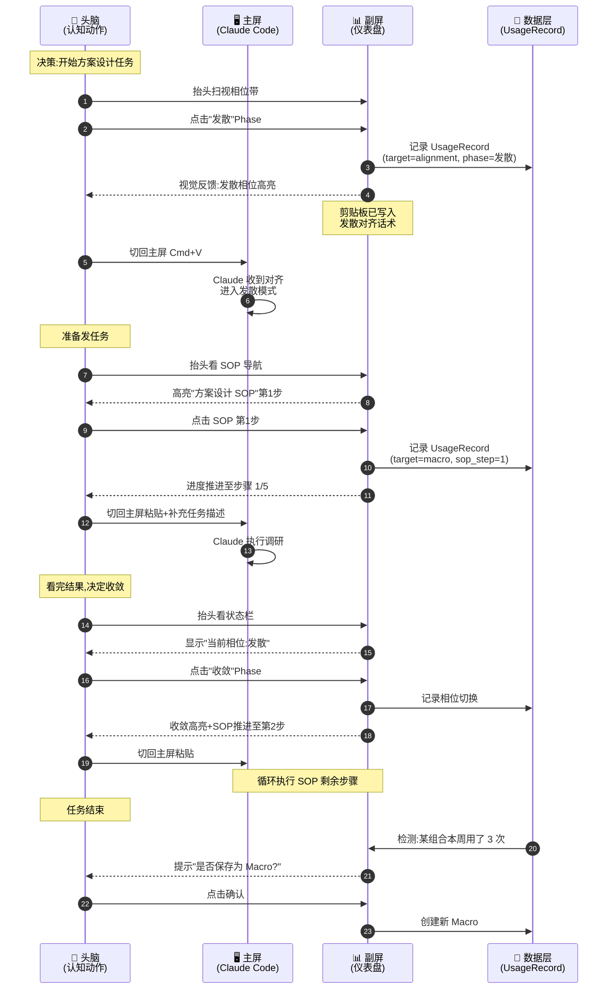
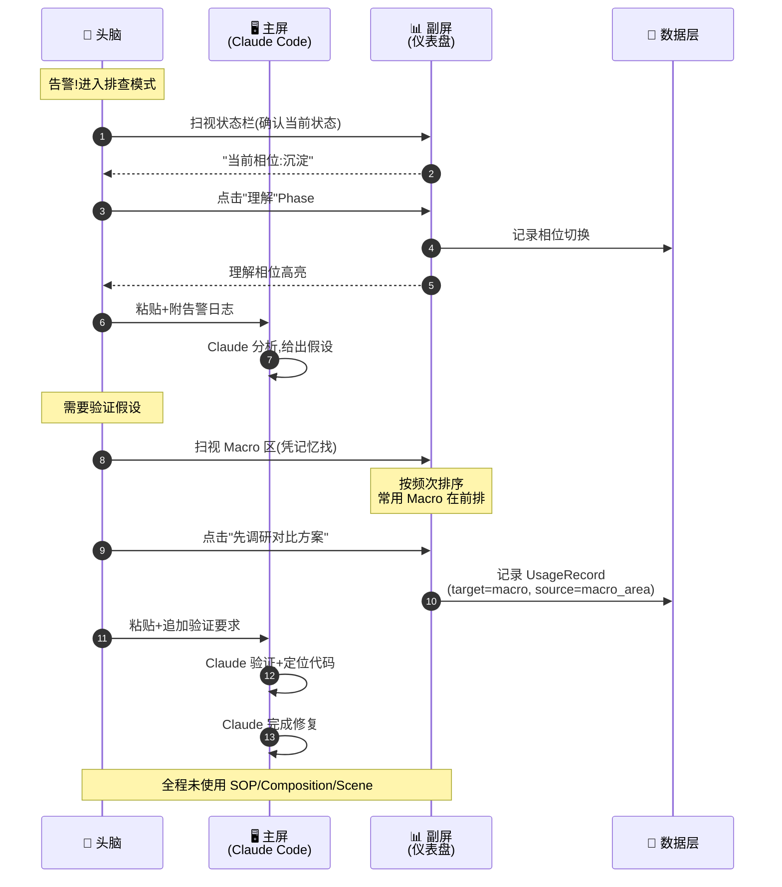
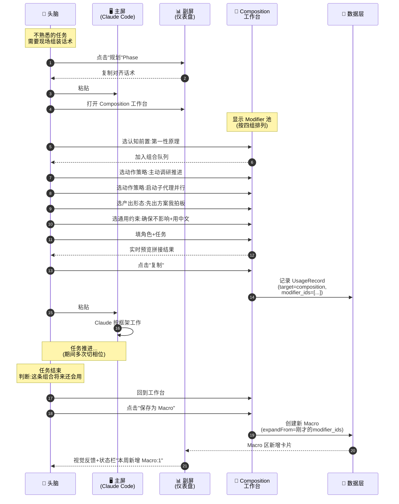
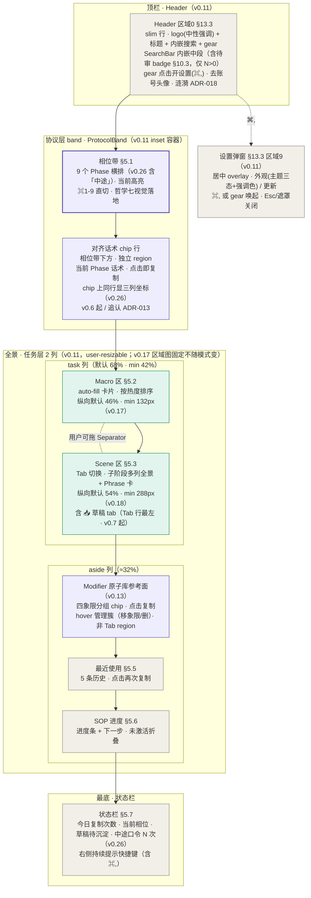

# Product Spec: prompt-hub（UI 契约）

> 本文件是 `prompt-hub-prd.md` 拆分版的 **product-spec.md**——承载 UI 契约（信息架构 + 模块布局 + 用户旅程 + UI 草案）。
> 项目定位见 [[01-spec]]、视觉规范见 [[05-design-spec]]、数据契约见 [[06-prd]]。
>
> 本文件来源：原 PRD §4 界面设计原则 + §4.5 用户旅程 + §13 主形态 UI 草案。
> §4.3 的视觉 Token 部分已迁至 [[05-design-spec]]，本文件只保留「交互频率与路径」行为表。
> 原 §4.6 已升格为 [[01-spec#2.9-哲学九]]，本文件不重复。

---

## 4. 界面设计原则

### 4.0 双形态架构

> 本节是 v0.5 新增章节，承接哲学八（[[01-spec#2.8-哲学八]]）。

#### 4.0.1 两种形态的关系

本项目采用**单一应用、双形态承载**架构：

- **主形态：快捷键唤起的全屏覆盖窗口**——80% 使用场景
- **辅形态：副屏常驻视图**——20% 深度场景

**关键性质**：

- **一个桌面应用**：两种形态由同一个 Tauri/Electron 应用提供，不是两个产品
- **共享数据后端**：所有 Modifier / Macro / Phrase / Phase / AlignmentPhrase / Scene / SOP / UsageRecord 由两种形态共享，零同步成本
- **共享 UI 模块**：相位带、Macro 区、Scene 区、最近使用、SOP 导航等模块代码复用，只是容器布局不同
- **形态切换无成本**：用户的所有沉淀、配置、使用记录在两种形态下完全一致

#### 4.0.2 主形态的核心特征

- **触发**：全局快捷键（默认 `⌥ Space`，可配置）
- **承载**：全屏覆盖窗口，半透明背景（透明度约 92%），主屏内容可透出感知
- **退出**：**调用态**复制话术后自动隐藏（整理态复制不隐藏、窗口驻留，见 §4.0.7）；ESC 手动隐藏；点击窗口外区域隐藏——后两者不分态
- **使用画面**：

> 在主屏想事情 → 按下快捷键 → 仪表盘全屏覆盖 → 扫视/搜索定位话术 → 点击或回车复制 → 窗口自动隐藏 → 回到主屏粘贴

这是 80% 场景下使用者与本应用交互的全部流程。详见 §4.5 user flow 与 [[06-prd#5-功能模块]]。

#### 4.0.3 辅形态的核心特征

- **触发**：应用启动时常驻于副屏
- **承载**：副屏常驻窗口，不覆盖主屏
- **退出**：不退出（关闭应用即关闭副屏视图）
- **使用画面**：

> 月度 review / 整理资产 / 跟随长 SOP 时 → 抬头看副屏 → 在副屏点击/编辑 → 主屏继续工作

这是 20% 场景下使用者依赖副屏的全部流程。详见 §4.5 user flow 中的相应场景。

#### 4.0.4 UI 共用规则

两种形态使用**同一套 UI 模块**，区别只在容器布局：

> **v0.17 重写（涟漪 [[026-fixed-spatial-layout]]）**：本表原为 pre-reshape 口径（「中部左侧 60%」「底部左右各 50%」），自 v0.11 任务层 3→2 列后一直未回流。现按 reshape 后的**固定区域图**重写。位置字段以本表为准，[[05-design-spec#10.5]] 承载其视觉与尺寸规格。

| 模块 | 主形态（快捷键全屏） | 辅形态（副屏常驻） |
|------|-----------------|----------------|
| Header（区域 0） | 最顶部 slim 行，内嵌搜索框 | 同左 |
| 待审 badge（[[06-prd#10.3]]，v0.7 起） | Header 行右段，仅 pending>0 显示 | 同左 |
| 相位带（[[06-prd#5.1-相位带（Phase-Bar）]]） | 协议层 band 上半，8 个**等宽**横排 | 同左 |
| 对齐话术（AlignmentPhrases，[[013-alignment-phrases-tab-inclusion]]） | 协议层 band 下半 chip 行（独立 region，v0.6 起）| 同左 |
| Macro 区（[[06-prd#5.2-Macro-快捷区]]） | **task 列上部**，与 Scene 共享用户可拖纵向分配 | 同左 |
| Scene 区（[[06-prd#5.3-Scene-全景区]]） | **task 列下部**，同上 | 同左 |
| Modifier 参考面（§13.3 aside 补充） | **aside 列顶部** | 同左 |
| 最近使用（[[06-prd#5.5-最近使用区]]） | **aside 列中部** | 同左 |
| SOP 导航（[[06-prd#5.6-SOP-导航区]]） | **aside 列底部** | 同左 |
| 状态栏（[[06-prd#5.7-状态仪表区]]） | 最底部 | 最底部 |

**区域图对 `interactionMode` 不变（[[026-fixed-spatial-layout]] 子决策 4）**：调用态与整理态共用**同一套空间**——区域位置、列宽、区域尺寸三者完全一致，模式只改点击语义与动作显隐（§4.0.7）。task/aside 两列宽度与 Macro/Scene 纵向分配均为**用户可拖 + 持久化**，两态共享同一组持久化键（不再按态分列）。

差异点：
- **主形态**：背景半透明、有"复制即隐藏"动画（仅调用态，见 §4.0.7）、ESC 关闭
- **辅形态**：背景不透明、不会隐藏、可选展开 Composition 工作台为侧栏

> **图标占位约定**：本文中「📥」（草稿 tab / 待审 badge）均为**阅读占位符**，实际渲染为 lucide `Inbox` 图标——禁 emoji as UI（[[05-design-spec#8.2]]），chrome 图标统一走 lucide（[[05-design-spec#12.3]]）。下游实现以 lucide 为准，不得直接渲染 emoji 字面。

#### 4.0.5 形态之间的边界

**主形态承载 80% 高频动作**：切相位、调用 Macro、查找话术、复制粘贴、查看 SOP 下一步。

**辅形态承载 20% 深度动作**：
- 月度 review（看长期趋势、清理 deprecated 资产）
- 整理资产（批量编辑 Modifier、调整 Scene 结构）
- 跟随长 SOP（持续可见进度，不希望窗口隐藏打断节奏）
- 配置管理（编辑 Phase、增删 Scene）

> **边界注（v0.15）**：主形态**整理态**（§4.0.7）承接*轻量*整理——单条增删改、组内排序、草稿处置等窗口内即可完成的动作；批量编辑、结构性重组、月度 review 仍归辅形态。整理态不改变 80/20 形态分工，只是把「顺手整理一条」从辅形态解放出来。

**两种形态都做的事**：都能完整复制任何话术；都显示完整的相位带和 SOP 进度；都可以编辑资产（只是辅形态体验更好）。

**只有主形态做的事**：ESC 隐藏 / 复制即隐藏（仅调用态，见 §4.0.7）。

**只有辅形态做的事**：余光感知状态（因为主形态用完即走，没有"余光"的概念）。

#### 4.0.6 哲学映射

| 哲学 | 在主形态如何落地 | 在辅形态如何落地 |
|------|--------------|--------------|
| 二·看见全局 | 唤起时一屏铺开全景 | 持续呈现全景 |
| 三·分离 | 时间分离（按需唤起） | 空间分离（副屏） |
| 四·使用即沉淀 | 唤起时推送沉淀提示 | 状态仪表持续可见 |
| 六·受控离手 | 按快捷键是一次明确的离手 | 抬头看副屏是一次明确的离手 |
| 七·协议对齐 | 相位带永远在最顶部 | 相位带永远在最顶部 |
| 八·双形态承载 | 自身即是哲学八的落地 | 自身即是哲学八的落地 |

#### 4.0.7 交互模式契约（调用态 / 整理态）

> 来源：2026-07-12 UX 任务流审计裁决 D-0~D-2（[[2026-07-12-ux-taskflow-audit#§0]]）。Scene 同时承担调用与整理，**来源无法表达意图**——点击语义与隐藏行为按显式模式区分，不按 source（scene/search）区分。

主形态存在两个显式交互模式，由 Header 的 ModeToggle（segmented control，`aria-pressed`）切换；`interactionMode` 持久化，重启保留：

| 语义 | 调用态（默认） | 整理态 |
|------|-------------|--------|
| Scene 话术卡整卡点击 | 复制 | 选择/预览；复制降为动作簇内显式按钮 |
| 复制后窗口行为 | 200ms 自动隐藏 | **驻留**（suppressHide）；usage 照计——隐藏与使用统计解耦 |
| 写操作（增删改排 / 草稿处置） | 窗口驻留 | 窗口驻留 |
| ESC / 点击窗口外 | 隐藏 | 隐藏（不分态） |
| 动作簇 | 不显（[[025-unified-anchored-editing]] 子决策 3.3 后为「仅选中项显」）| 选中项常显 |
| 编辑入口 | 不外露 | 外露 |
| **区域位置 / 列宽 / 区域尺寸** | **完全一致** | **完全一致** |

**作用范围**：点击语义变更**仅限 Scene 话术卡**；Macro 区、最近使用区、搜索结果等复制入口不随模式变化（其整卡复制即调用意图，无歧义）。

**反设计**：
- ❌ 按来源（scene/search）区分隐藏行为——D-2 否决，来源无法表达意图
- ❌ 整理态自动进入/自动退出——模式切换必须是用户显式动作（哲学六·受控离手）
- ❌ **模式切换改变区域位置 / 列宽 / 区域尺寸**（v0.17 补 · [[026-fixed-spatial-layout]]）——`interactionMode` 是**语义开关，不是布局开关**。实现层曾以一行 `"D-0 extended"` 注释自行把作用范围扩张为整页区域编排（三区跨列 + 一区尺寸剧变 + 列宽基准更换），越过本节作用范围条款、§13.3 区域 6 位置与 §13.4 Tab 顺序三处已批准契约，且从未开 ADR。仪表盘的核心资产是空间记忆，二值的「模式」承担不了连续的空间偏好——空间分配的表达权归**用户可拖拽的持久化分配**，不归模式。

---

### 4.1 布局原则：一屏全景

**真实仪表盘对应物**：汽车仪表盘上，时速表、转速表、油量、水温、挡位指示灯**同时可见**，驾驶员不需要切换视图。

**决策**：仪表盘首屏（两种形态都适用）必须同时呈现以下八个区域（v0.6 起，原 7 区域；新增对齐话术独立 region — 追认 ADR-013）：

1. **搜索框（顶部居中，中等大小）**——全局兜底入口，⌘K 唤起聚焦
2. **相位带**——9 个 Phase 横排（v0.26 起含第 9 个「中途」），承载 Phase 切换
3. **对齐话术（AlignmentPhrases）**——相位带下方 chip 行，独立显示当前 Phase 下的对齐话术（点 chip 即复制）
4. **Macro 区**——当前所有 Macro 作为卡片墙置顶
5. **Scene 区**——按场景横切的话术分类（Tab 切换）
6. **最近使用区**——最近 5 次复制历史（时间倒序）
7. **SOP 导航区**——当前激活的 SOP 模板 + 进度指示
8. **状态栏**——今日复制次数、当前相位、未分类草稿等指标

**为什么搜索框是"兜底"而非"主路径"**：
- 哲学二要求扫视为主、搜索为辅——主要查找路径是"扫视卡片墙找到目标"
- 搜索是"知道有这条话术但记不清在哪"时的兜底
- 搜索框视觉权重刻意压低（背景浅灰、占位文字、约 60% 宽度居中），不诱导优先使用
- 详见 [[06-prd#5.0-搜索区]] 设计

**理由**：
- 哲学二（看见全局 > 操作最快）要求全景呈现
- 哲学三（分离）要求形态承担"思考工具面板"的角色，不能只是被动列表
- 哲学七（协议对齐）要求相位带位于最显眼位置
- 把 SOP 导航放进首屏是整个设计的点睛之笔——它回答了"未来可以怎么操作"这个问题

**反设计**（明确拒绝的方案）：
- ❌ 搜索框作为主导航（Raycast、Alfred）——隐藏了全局信息，违背哲学二
- ❌ 瀑布流式——需要滚动才能看全
- ❌ 主导航 Tab 式——把同类信息藏在不同 Tab 里（注：Tab 仅用于 Scene 内部切换，不用于资产类型切换）

---

### 4.2 点击路径原则：按频率分层

**真实仪表盘对应物**：换挡杆的挡位布局——1、3、5 挡在上排（常用），2、4、R 挡在下排（次常用）。使用者的手在熟悉之后会**按频率找挡位**，不是按字母顺序。

**决策**：不同层级的话术对应不同的点击步数：

| 层级 | 点击路径 | 步数 |
|------|---------|------|
| AlignmentPhrase（相位带） | 首屏顶部 → 点击即复制 | 1 步 |
| Macro | 首屏直达 → 点击即复制 | 1 步 |
| 最近使用 | 首屏直达 → 点击即复制 | 1 步 |
| Scene 内话术 | 点 Scene → 点话术 | 2 步 |
| Composition 组合 | 进入组合模式 → 勾选 → 调序 → 复制 | 3-4 步 |

**理由**：
- 哲学二允许"多一步"，但不应允许"步数和频率倒挂"
- 哲学六（减少但不消除离手）要求高频操作必须极短路径
- 哲学七要求 AlignmentPhrase 比任何任务话术优先级更高，所以放在最顶部
- 这套阶梯让 80% 的调用落在 1-2 步内，保证流畅

**实现要求**：
- 相位带和 Macro 区必须在屏幕上半部分，避免使用者低头
- Scene 切换不应打开新页面——在首屏的 Scene 区直接展开当前 Scene 的全部话术

---

### 4.3 交互频率与路径（行为契约）

> 原 PRD §4.3「视觉设计原则」的视觉 Token 部分已迁至 [[05-design-spec]]，本节只保留行为契约部分。

| 调用频率 | 主要路径 | 设计要求 |
|---------|---------|---------|
| 极高频（70%）| 快捷键唤起 → 扫视 → 点击/回车复制 | 主形态默认入口，1-2 秒完成 |
| 高频（15%）| 快捷键唤起 → ⌘K 搜索 → 选 → 复制 | 搜索作为兜底，3-4 秒完成 |
| 中频（10%）| 快捷键唤起 → Composition 工作台（`⌘N`） → 组装 → 复制 | 现场组装场景 |
| 低频（5%）| 副屏深度操作 → 整理 / 配置 / Review | 月度场景，不追求速度 |
| 低频·窗口内（整理态，v0.15）| 快捷键唤起 → 切整理态 → 连续处置数条 → 切回/ESC | 窗口驻留不被踢出（§4.0.7），操作可撤销，不追求速度 |

这种分层意味着**仪表盘 UI 不需要为所有动作都做"极致快"的优化**——核心是把 70% 高频路径做到 2 秒内完成。

---

### 4.4 状态反馈原则：刚刚发生了什么

**真实仪表盘对应物**：转向灯指示、挡位指示灯、车速变化——驾驶员需要持续知道"刚才的操作生效了没"。

**决策**：任何操作都必须有即时的视觉确认：

- **复制成功**：话术卡片闪一下绿色 + 角落显示"已复制"
- **相位切换**：相位带高亮当前相位 + 状态栏显示"当前相位：X"
- **组合添加**：组合队列区出现新条目 + 该 Modifier 卡片变色
- **Macro 保存**：Macro 区顶部出现新卡片 + 轻微上浮动画
- **使用次数更新**：话术卡片右上角的数字 +1
- **保存成功**（v0.15，批次 A）：话术创建/更新成功后 toast「已保存」
- **草稿丢弃可撤销**（v0.15，批次 A）：discard 后 toast 提供「撤销」入口，toast 生命周期内有效；撤销遇 dedup 冲突诚实报错，不静默吞失败
- **草稿归档落地**（v0.15，批次 A）：promote 后自动切至目标 Phase 并 flash 高亮落地资产——回答「资产去了哪」
- **拆解视图展开**：Macro 长按（触控场景）/ 右键（鼠标场景）展开"由哪些 Modifier 组成"——这是哲学五（分层语言系统）的可视化入口

**理由**：
- 哲学四（使用即沉淀）需要让沉淀过程"看得见"
- 哲学七（协议对齐）需要让"当前在哪个相位"持续可见——这是状态反馈最重要的应用
- 手动挡阶段使用者需要信心反馈——"我刚才做的操作真的被记录了吗"
- 视觉确认比单纯的"静默成功"更能建立信任
- 拆解视图是连接 Macro 和 Modifier 的桥梁，否则三层结构在 UI 上不可见

---

### 4.5 引导原则：未来可以怎么操作

**真实仪表盘对应物**：导航仪告诉驾驶员"下一个路口右转"——不是命令，是建议。

**决策**：SOP 导航区不只是显示当前进度，还要**主动建议下一步**：

- 用户复制了某条话术之后，如果这条话术是某个 SOP 的一步，高亮下一步
- 如果用户已经偏离了任何已知 SOP，提示"是否开启新的 SOP 录制？"
- 首屏角落显示"今日建议的 SOP"，基于使用历史（比如上午常做调研型任务）

**理由**：
- 这是"手动挡变自动挡"的预热——使用者通过跟随 SOP 建议，无意中训练出自己的工作节奏
- 没有这个引导，SOP 视图就只是一张静态流程图，没有真正提升驾驶体验
- 但引导必须是**建议性**的，不能是**强制性**的——手动挡阶段人仍然是决策主体

**反设计**：
- ❌ 自动跳到下一步（那是自动挡）
- ❌ 强制使用者按 SOP 顺序点（那是流水线，不是仪表盘）

> 原 §4.6 迭代原则已升格为 [[01-spec#2.9-哲学九]]——本文件不重复。

---

## 4.5 用户旅程（User Flow）

> 本节是 v0.4 新增章节，承接 §4 界面设计原则，先于 [[06-prd#5-功能模块]] 展开。

### 4.5.0 关于本节

传统 App 的 user flow 是"用户从 A 屏点到 B 屏完成 X 任务"。本项目的 user flow **不只是 UI 跳转**——它必须把"人机协同的认知节奏"画出来，因为：

- 仪表盘不是独立 App，而是**主屏工作流的副产品**
- 一次完整任务横跨**主屏（Claude Code 对话）+ 仪表盘 + 头脑（认知动作）**三个空间
- 仪表盘的真正价值发生在"召唤仪表盘的瞬间"——这个瞬间不在常规 UI flow 图里

#### 形态视角说明（v0.5 新增）

下面的场景均按**主形态（快捷键唤起全屏覆盖窗口）**视角描写。"按下快捷键"即唤起仪表盘，"复制"后窗口自动隐藏。

如果使用辅形态（副屏常驻），关键差异是：
- 不需要"按下快捷键"——副屏永远在场，直接"抬头看副屏"
- 复制后窗口不会自动隐藏——副屏持续呈现
- 余光感知关键状态（当前相位、SOP 进度）

两种形态共享同一套 UI 模块与数据，差异仅在"触发方式"和"退出方式"。详见 §4.0 双形态架构。

#### 场景采用两层呈现

- **叙事层（A）**：第一人称讲一遍，让画面感成立
- **机制层（C）**：跨屏序列图，让运作机制可被验证

三个场景代表仪表盘的**三种典型协同模式**：

1. **完整 SOP 驱动型**（§4.5.1）：方案设计——展示完整的"对齐 → 任务 → 沉淀"循环
2. **单点快速调用型**（§4.5.2）：日常排查——展示"快速切相位 + 一键 Macro"的轻量路径
3. **组合工作台沉淀型**（§4.5.3）：新型任务——展示"现场组装 + 升级 Macro"的沉淀路径

三个场景合起来，覆盖了仪表盘所有核心模块在真实任务中的运转。

---

### 4.5.1 场景一：完整 SOP 驱动型（方案设计任务）

#### 任务背景

我接到一个新需求："给现有系统加一个数据导出模块"。这是典型的方案设计任务——已有"方案设计型 SOP"模板可以驱动整个流程。

#### 叙事层（第一人称）

> 我在主屏的 Claude Code 里打开了项目，光标停在对话框里。但我没有立刻打字——我先**抬头看副屏**。
>
> 副屏的相位带最顶部，9 个 Phase 横排着。我此刻要做的是方案设计，第一步应该是**调研外部最佳实践**——这是"发散"相位。我**点了一下"发散"**，剪贴板里立刻有了那条对齐话术。我**回到主屏**，Cmd+V 粘贴，回车。
>
> Claude 收到了对齐话术，回了一句"好，我们现在进入发散模式，先不下结论"。
>
> 然后我**再次抬头看副屏**——SOP 导航区已经识别出我刚才用的话术属于"方案设计型 SOP"的第 1 步，自动把这个 SOP 模板高亮出来，第 1 步标着"借力最优解"。我**点击 SOP 中的第 1 步**，剪贴板里换成了"借力最优解"这条 Macro。**回到主屏粘贴**，加上我的具体任务描述："调研外部主流系统的数据导出方案，给出 5 个不同实现思路"。
>
> Claude 开始干活。它跑了一会儿，给我铺开了 5 个方案。
>
> 我看完，发现已经够发散了，该收敛了。**抬头看副屏**——状态栏显示"当前相位：发散"，提醒着我现在的状态。我**点击相位带的"收敛"**，剪贴板里有了收敛对齐话术，**主屏粘贴**：让 Claude 从 5 个方案里选最优解。SOP 导航区同步推进到了第 2 步"全局视角出方案"。
>
> 后续步骤照此节奏：每切一次相位都用相位带，每发一次任务都用 SOP 导航或 Macro 区。整个 SOP 走完后，副屏的状态仪表显示："今日相位分布：发散 2 次、收敛 3 次、沉淀 1 次"。
>
> 任务结束前，副屏弹出一个不打扰的提示："你今天用了一个新组合 3 次，是否保存为 Macro？" 我**点确认**，那个组合成了 Macro 区的新卡片。

#### 机制层（跨屏序列图）



#### 这个 flow 验证了哪些设计

- **哲学三（物理分离）**：每次"抬头看副屏"都是从执行态切回决策态
- **哲学四（使用即沉淀）**：UsageRecord 默默记录、SOP 进度自动推进、组合自动识别为 Macro 候选
- **哲学六（受控离手）**：每次离手都是 1-2 步，且与认知动作绑定
- **哲学七（协议对齐）**：相位带在每次任务变化时被显式调用，框定本次协作模式
- **[[06-prd#5.1-相位带]]** 承担挡位切换器角色
- **[[06-prd#5.6-SOP-导航区]]** 承担"下一步建议"角色
- **[[06-prd#5.7-状态仪表区]]** 承担相位监视器角色

---

### 4.5.2 场景二：单点快速调用型（日常排查任务）

#### 任务背景

凌晨值班，监控告警了一个生产 bug。我需要快速排查，不走 SOP——这种任务太熟，凭肌肉记忆走就行。

#### 叙事层（第一人称）

> 告警弹出来，我直接打开 Claude Code，光标进对话框。
>
> 我**抬头一眼副屏**——不为切相位，只为确认当前状态。状态栏显示"当前相位：沉淀"（这是我上次工作留下的）。这次任务我要进入"理解"——先搞清楚 bug 是什么。
>
> 我**点击相位带的"理解"**，剪贴板有了对齐话术。**回主屏粘贴**，加上一句"这是生产告警日志：[贴日志]，请帮我定位根因"。
>
> Claude 开始分析。
>
> 我没动副屏，直接看 Claude 的输出。Claude 提出了一个假设：可能是某个服务的连接池耗尽了。
>
> 我需要让它去验证。这次任务有标准 Macro——"先调研对比方案"。我**抬头看 Macro 区**，第二排第一张卡片就是它（按使用频次排序，它经常用），**点击**，剪贴板就绪。**回主屏粘贴**，加上"验证你刚才的假设，看代码里有没有连接池配置问题"。
>
> Claude 给了一个明确答复+代码定位。问题确认了。
>
> 我让 Claude 直接修复。修完后我跑了测试通过，部署上线。
>
> 整个过程**没有打开 SOP 导航、没有用 Composition 工作台**——只用了相位带和 Macro 区。事后看状态仪表："今日复制次数 6 次"，跟我直觉吻合。

#### 机制层（跨屏序列图）



#### 这个 flow 验证了哪些设计

- **哲学二（看见全局 > 操作最快）的"反例验证"**：高频任务下,凭肌肉记忆只用相位带+Macro 区,**不需要看全景**——但全景"在那里"作为安全网，需要时随时可看
- **§4.2 点击路径分层**：1 步抵达 Macro 是高频任务的命脉
- **状态仪表的余光价值**：开始任务时一眼扫到"当前相位"，不需要打开任何界面
- **[[06-prd#5.6-SOP-导航区]] 的"克制"**：成熟任务不被 SOP 强制——这是哲学四（建议性而非强制性）

---

### 4.5.3 场景三：组合工作台沉淀型（新型任务）

#### 任务背景

我接到一个不熟悉的任务："给这个 Python 项目加单元测试覆盖率检查"。我没有现成的 SOP，没有现成的 Macro 能直接用——我得**临时组装一条话术**，并且这条话术可能将来还会再用。

#### 叙事层（第一人称）

> 我打开 Claude Code，但没立刻打字。这个任务我需要**先想清楚怎么问**。
>
> 我**切到副屏**，先点击相位带的"规划"——告诉 Claude 我们现在要规划，不是直接执行。**回主屏粘贴**。
>
> 然后我**回到副屏，打开 Composition 工作台**（[[06-prd#5.4-Composition-组合工作台]]）。
>
> 工作台左边是 Modifier 池，分四组排列着我所有的方法论原子。我开始挑：
>
> - 认知前置组：选**"第一性原理思考"**（因为我不熟这个领域，需要回到本质想）
> - 动作策略组:选**"主动调研推进"**（需要 Claude 自己去查最佳实践）和**"启动子代理并行"**（让多个 sub-agent 并行）
> - 产出形态组：选**"先出方案我拍板"**（不要直接动手）
> - 通用约束组：选**"确保不影响现有功能"**和**"用中文回答"**
>
> 选完后，我在角色输入框写"作为质量保障合伙人"，在任务输入框写"为本项目设计单测覆盖率检查方案"。
>
> 工作台底部实时预览，把我选的 Modifier 按顺序拼好了：
>
> > 作为质量保障合伙人，（使用第一性原理思考，）为本项目设计单测覆盖率检查方案，（主动调研、推进，启动子代理并行调研，）（先出方案供我拍板，确保不影响现有功能，用中文回答。）
>
> 我点**"复制"**——剪贴板就绪。
>
> **回主屏粘贴**，回车。Claude 开始按这个框架工作。
>
> 任务推进过程中我用了几次相位带切换相位。最终 Claude 交付了方案，我验收通过。
>
> 任务结束后，我**回到副屏的 Composition 工作台**。刚才那条组合还在预览区。我想了想——这条组合**将来做类似的"为陌生项目设计某类方案"还会用**。我点了**"保存为 Macro"**。
>
> 弹出来一个简短的命名框，我命名为"陌生领域方案设计"。Macro 区立刻多了一张新卡片，使用次数从 0 开始计数。
>
> 状态仪表显示"本周新增 Macro: 1"。一次新任务，沉淀出了一个新资产。

#### 机制层（跨屏序列图）



#### 这个 flow 验证了哪些设计

- **哲学五（话术是分层语言系统）**：完整跑通"Modifier 原子 → Composition 组合 → Macro 固化"三层跃迁
- **[[06-prd#5.4-Composition-组合工作台]]**：作为"陌生任务的应对工具"和"沉淀新资产的入口"双重价值
- **expandFrom 字段的实战价值**：新 Macro 保留了它的 Modifier 组成，将来可拆解回看
- **哲学四（使用即沉淀）的最强体现**：一个新任务的副产品是一个新 Macro——沉淀成本几乎为零

---

### 4.5.4 跨场景对照表

三个场景对仪表盘各模块的使用强度对照：

| 模块 | 场景一 SOP驱动 | 场景二 单点调用 | 场景三 现场组装 |
|------|:-:|:-:|:-:|
| [[06-prd#5.0-搜索区]] | — | — | — |
| [[06-prd#5.1-相位带（Phase-Bar）]] | ⭐⭐⭐ | ⭐⭐ | ⭐⭐ |
| [[06-prd#5.2-Macro-快捷区]] | ⭐⭐ | ⭐⭐⭐ | ⭐（创建） |
| [[06-prd#5.3-Scene-全景区]] | — | — | — |
| [[06-prd#5.4-Composition-组合工作台]] | — | — | ⭐⭐⭐ |
| [[06-prd#5.5-最近使用区]] | — | — | — |
| [[06-prd#5.6-SOP-导航区]] | ⭐⭐⭐ | — | — |
| [[06-prd#5.7-状态仪表区]] | ⭐（事后） | ⭐（事前） | ⭐（事后） |

**关键观察**：

- **相位带**在所有场景都被使用——这印证了哲学七（协议对齐）的普适性
- **不同场景使用不同核心模块**——这印证了 §4.1 一屏全景的必要性（任何模块都可能是某个场景的主角，藏起来都不行）
- **Scene 区在三个场景中都未直接出场**——这是个**值得标记的现象**（详见 [[01-spec#10.6-Scene-区在-user-flow-中的存在感]]）

---

### 4.5.5 未被覆盖的 flow（明示）

为了诚实，列出本节**未覆盖**的 flow，避免读者误以为这三个场景穷尽了一切：

- **冷启动 flow**：第一次打开仪表盘、配置初始 Modifier/Macro/Phase 的流程
- **数据导入/迁移 flow**：从 prompt-combiner 或其他工具迁移历史资产
- **月度 review flow**：基于状态仪表的数据复盘 Macro 池、清理 deprecated 资产
- **Scene 内深度工作 flow**：长时间停留在某个 Scene 内（如"调研"Scene 一干一下午）
- **跨设备同步 flow**：Mac 副屏切换到 iPad 时的衔接

这些 flow 在未来版本可能补充，当前不写——因为它们不影响 MVP 设计决策。

---

## 13. 附录：主形态 UI 草案

> 本节是 v0.5 新增附录，落地了快捷键唤起全屏覆盖窗口的具体 UI 布局。两种交付形式：Mermaid 区域结构图 + 文字描述版。

### 13.1 设计前提

本 UI 草案是在以下决策已锁定的前提下产出的：

- **触发方式**：全局快捷键（默认 `⌥ Space`）
- **承载形态**：全屏覆盖窗口，背景半透明约 92%，主屏内容可透出
- **退出方式**：复制即隐藏 / ESC / 点击窗口外
- **导航策略**：扫视为主、搜索为兜底；不做主导航 Tab（仅 Scene 内部用 Tab）
- **从资产结构反推 UI**：不从 UI 形态出发去设计，而是从 [[01-spec#3-核心概念]] 已确定的提示词资产结构（Modifier / Composition / Macro / Phrase / AlignmentPhrase / Phase / Scene / SOP）反推页面布局

### 13.2 区域布局结构图



颜色编码说明（详见 [[05-design-spec#2.4-颜色编码]]）：
- **紫色（相位带 / 对齐话术 / Modifier 参考面）**：协议层，视觉权重最高（v0.11 起由 ProtocolBand 暗色 band 容器包裹，v0.13 恢复设计稿暗底 [[020-restore-protocol-dark-band]]；aside 的 Modifier 参考面以「协议层 · 参考」pill 标记层身份）
- **绿色（Macro 区 / Scene 区）**：任务层主战场（v0.11 起为 2 列全景：Macro 顶部横条 + Scene 填充）
- **灰色（Header / 最近使用 / SOP 进度 / 状态栏 / 设置弹窗）**：辅助 / chrome 层，视觉权重较低；Header logo 与设置弹窗强调件用中性强调色 `--accent`（非 ontology，[[05-design-spec#13.1]]）

### 13.3 文字描述版（按区域）

#### 编辑容器统一契约（v0.19 新增 · 涟漪 [[025-unified-anchored-editing]]）

> **跨区域契约，优先于下文各区域的编辑描述**。所有资产编辑面共用一套容器与保存语义，下文各区域只描述该区特有的字段与动作。
>
> 落地范围：P0 / P1-a / P1-b 已实装（2026-08-20 合入 `main`）。**键盘动作层（P2）与合流（P3）未落地**，本节凡标注「P2」的条目是已批准但未实现的目标契约，不是现状。

**a. 容器形态**：编辑器**不再插入宿主文档流**，改由原生 `popover` 渲染进 **top layer**、锚定在触发元素上（`AnchoredEditor`，见 [[05-design-spec#10.2.2]]）。宿主在编辑期间**保持挂载充当锚点**——卡片 / chip / 按钮不再被编辑器替换掉。三个后果：

- 编辑器不被祖先 `overflow: hidden` 裁剪，也不受 hover-lift 的 `transform` 包含块影响
- 宿主区域高度不随编辑跳变，一屏全景不被推挤（这是触发本次决策的原始缺陷）
- 面板高度上限按 **overlay frame 相对**逐帧计算并上报（`maxHeight` + 面板内部滚动），超高面板的「保存 / 取消」不会跑出画面。**该上限不能写进 CSS**：外壳是 inset 浮动框而非视口

**b. 保存语义规则表**（⚠️ 这是**数据丢失契约**，不只是容器契约）：

| 场景 | 规则 |
|---|---|
| 点击浮层外部、内容合法且 dirty | 保存并关闭 |
| 点击浮层外部、内容**校验不通过**（名称或正文为空） | **不关闭**，浮层保持打开并高亮失败字段——不因点了别处就丢掉半条话术 |
| 点击浮层外部、内容未改动（not dirty） | 直接关闭，不发 IPC |
| `Esc`、内容 dirty | 关闭并放弃；**创建态**给撤销 toast（编辑态原值仍在库中，无需 toast） |
| `⌘Enter` | 保存并关闭；关闭后焦点归还触发元素 |
| **再次按下锚点本身**（v0.24 · G4 观察 O7）| **无操作**——不关闭、不保存、不触发锚点自身的点击（chip / 话术卡的锚点点击是复制，不会跑；调用态也不会因此隐藏窗口）。焦点留在编辑器内：正在编辑的字段不被夺走，仅当焦点已掉出面板时回到首字段 |

dirty 判定以**初始值快照**比对，不以「是否聚焦过」判定。

> **P2 目标（未落地）**：整理态下 `⌘Enter` = **保存并推进到下一条**（连续处理模型核心），最后一条不回卷；调用态维持保存并关闭。当前两态**一律是保存并关闭**。

**c. 唯一例外 — Scene 属性面板点外拒绝关闭**（omar 2026-08-20 裁决）：`ScenePropertiesEditor`（区域 4 属性层）**不**照上表的点外规则，点外**既不保存也不关闭**。理由是它不是一次性属性微调而是**有界任务**（改名 + 换色 + 改角色预设 + 删除），HIG 里这个形状是 sheet 不是 popover。留下的风险是：顺手点中的颜色会在注意力离开的瞬间变成一次落库写入。其 `Esc` 为**逐层退栈**——**v0.25 起两级**：半截角色预设 → 面板。**中间那级「删除确认」随确认框本身一并退场**（本节「删除语义统一契约」a）；原先并列的第二个风险「删除确认框展开时点外会连确认框一起吞掉」也随之消失，但**本例外的裁决不因此翻案**：颜色那条风险独立成立，且点外拒绝关闭已是用户既成的肌肉记忆。代价是点外行为与另三处不一致，已知并接受。

**d. 提交键统一到 A1-08**：裸 `Enter` 不落库。名称字段裸 `Enter` = **焦点推进到正文**，正文裸 `Enter` = 换行；提交一律 `⌘Enter`（`Ctrl+Enter` 等价）或点「保存」。**Macro 编辑器原先的裸 Enter 直接落库已废除**——旧行为能存下正文尚未写完的 Macro。单字段场景（角色预设 chip 添加等）的 `Enter` 仍带 IME `isComposing` 守卫。

#### 删除语义统一契约（v0.25 新增 · 涟漪 [[028-reversible-delete]]）

> **跨区域契约，优先于下文各区域的删除描述**。六处删除共用一套语义，下文各区域只描述本区特有的守卫。

**a. 一键删除 + 撤销 toast，不再二次确认。** 六处行内「永久删除？」确认框（`ConfirmInline`）**已全部拆除**：点 🗑 即删，随即弹「已删除『X』」toast 带**撤销**按钮，撤销窗口 = toast 生命周期（6 s）。撤销成功另给一条「已恢复『X』」toast；撤销失败走 error toast，不静默。六处分别是——区域 2-bis 对齐话术 chip / 区域 3 Macro 卡 / 区域 4 属性层 Scene 删除 / 区域 4 结构层子阶段 / 区域 4 内容层话术卡 / aside Modifier chip。

**依据**：[[025-unified-anchored-editing]] `:125` 已 ratified 的规矩「**撤销优于确认，但仅限真正可逆的动作**」。此前删除不可逆，所以确认框是对的；[[028-reversible-delete]] 让它可逆，所以确认框该退场。确认框是最容易被点穿的安全措施——天天出现就会变成肌肉记忆，而撤销要求的是发现错了再动手，不依赖用户在动手前保持警觉。这与草稿丢弃自 D-5 起一直用的形态一致。

**b. 撤销窗口过去了也救得回来。** 删除的东西进**废纸篓**（区域 9 设置 · 数据页），**不自动过期**，只由用户手动清空。撤销 toast 是快捷方式，不是最后一道防线。

**c. 撤销 toast 不会被后一条 toast 顶掉，但错误 toast 例外。** 撤销窗口未过期时，不带动作的普通 toast **让位**（被丢弃，不排队——迟到的反馈指向用户已经做完的事，比没有更糟）。**error toast 仍然顶掉它**：藏掉一次失败等于告诉用户「成功了」，那是正确性缺陷；而丢一个撤销按钮是可承受的，因为那一行稳稳躺在废纸篓里。新的撤销 toast 可以替换旧的——同一时刻只有一个待撤销动作，与 [[022-cross-scene-phrase-move]] 的 MoveReceipt 撤销同模型。

**d. 保留确认的只有两处不可逆动作。** 一是「清空废纸篓」（区域 9），二是**删除一条坐标轴取值**（区域 2-bis，v0.26 新增——[[06-prd#6.6-bis]] 定 `alignment_axis_values` **硬删、不进废纸篓**）。**全应用仅此两处 `ConfirmInline`**，判据是同一条：本契约 a 的一键 + 撤销**只适用于真正可逆的动作**，不可逆的必须在动手前问一次。**这不是给本契约开例外，是照它的原文办。**

**e. 被守卫拒绝的删除不给撤销。** 非空 Scene（`SceneNotEmpty`）与默认对齐话术（`DefaultAlignmentPhraseProtected`）仍被后端拒绝，界面给琥珀 error toast——**什么都没发生，就没有可撤销的东西**。

#### 对齐坐标与漂移账契约（v0.26 新增 · 涟漪 [[029-alignment-coordinates-and-drift-ledger]]）

> **跨区域契约，优先于下文各区域的复制与统计描述**。对齐话术的复制入口不止区域 2-bis 的 chip 行——区域 1 搜索结果、区域 5 最近使用、`⌘1-9` 都能复制同一条话术，所以「复制出去的是什么」「这一下记什么账」写在这里一次，不在各区各写一遍。
>
> **本节已于 2026-09-05 落地**（P1 `345e37f` 复制拼装与坐标显示 / P2 `3af8308` 状态栏与归因明细）。契约条款一字未改，本行只更新落地状态；**真机门 G7 同日跑完**（[[11-test-spec#4.6]]，6 通过 / 2 部分 / 1 缺陷已修 `4a68fa9`），[[07-features#3.15]] 十行中 8 行升 `verified`、2 行因留证未齐仍 `done`。

**a. 复制 = 坐标前缀 + 换行 + 正文。** 一条对齐话术带三列可空坐标（层 / 域 / 模式，[[06-prd#6.6]] v0.26 新增字段）。三列**任一非空**时，写进剪贴板的是——

```
本轮在{层}层，只谈{域}闭环，{模式}模式。
{content}
```

空段整段省略（只有域非空就只写「只谈{域}闭环。」），**三列全空则原样复制 `content`，一个字节不多**。库里存的始终是干净的 `content`，拼接只发生在复制那一刻（[[029-alignment-coordinates-and-drift-ledger]] 子决策 2）——所以改坐标不算改内容，前缀措辞将来要改也不必迁移任何一行。

**b. 前缀规则与入口无关。** 从 chip 行、搜索结果、最近使用区、`⌘1-9` 任一路径复制同一条话术，剪贴板内容完全一致。[[01-spec#8.7]]「不做两套独立 UI」在复制这件事上的含义就是这一句。

**c. 复制口令即记账，零新按钮。** 中途口令被复制时，[[06-prd#6.8]] `usage_records.source` 记新枚举值 `live_cue`；开场话术照旧记它实际的入口值（chip 行与 `⌘1-9` 为 `phase_bar`）。**记账不要求用户多按一下**——口令本来就要点一下复制，那一下同时就是账（[[01-spec#2.4]] 使用即沉淀）。

> ⚠️ **`source` 这一列自本版起承载两种语义**。它原本的定义是「触发入口」（[[06-prd#6.8]]），而 `live_cue` 是**话术类别**：一条口令从最近使用区复制也记 `live_cue`，不记 `recent`。这是子决策 3 的直接后果，对界面的含义是——**按 `source` 做入口效率分析时不能再把它当纯入口用**。写在这里是为了让下一个读这份统计的人不被它坑到。

**d. 展示是记账，不是评价。** 归因的定义是：同一次唤起会话内，某条对齐话术被复制**之后**出现的口令复制，按轴归到那条话术头上计数（子决策 4）。界面措辞**只允许陈述发生了什么**——「这条话术后面跟了 7 次换层口令」；**禁止**出现「这条话术在层这一轴上不好 / 建议修改 / 效果不佳」这类断言。前者是记账，后者是判断，[[01-spec#8.1]] 永久禁止后者，这不是「以后再说」。

**「停」计入总数但不进任何一轴**——它是中止不是漂移（子决策 4 的记账诚实条款）。

**e. 反设计**：

- ❌ **不加任何「这次出问题了 / 记一次漂移」按钮**——90% 的漂移不会被专门按一下（哲学四对「独立沉淀动作」的原始论断），而口令复制这个动作用户本来就会做。代价写明：**「复制口令 ≈ 发生漂移」是一个未验证的假设**，本版建的是观测它的账，不是它的证明；若跑一段时间后噪音压过信号，回去议显式按钮是 [[029-alignment-coordinates-and-drift-ledger]] §5「显式不裁」留的口子，不是本文的事
- ❌ **不做 AI 归因 / 自动判断漂移 / 自动建议改哪条话术**——[[01-spec#8.1]] 永久禁令，[[02-constitution#D1]] 同条
- ❌ **口令不入 SOP 步骤、不进 Macro 区、不进 Composition 工作台、不归 Scene**——口令是 AlignmentPhrase，留在协议层，[[02-constitution#B2]] / [[01-spec#8.6]] 的物理分离对它一字不改地适用（由第二道源码级 gate 继续守）
- ❌ **不给口令另起一套 chip 视觉**——它与开场话术同层同色，区分它们的是所在相位，不是配色。另起配色等于在协议层里再分一层，[[01-spec#8.4]] 不允许
- ❌ **坐标不做成 Phase 的子层级**——四轴是正交坐标不是层级，档位就是一行带坐标的话术（[[01-spec#8.4]]「Phase 下不允许再嵌套子 Phase」）
- ❌ **原型 `<details>` 里那六条「跨层规则」不进产品**——它们是给人看的元规则，不是拿来复制粘贴给 AI 的话术。入库会把它们混进协议层的资产统计，让「相位使用分布」这类指标失真（[[01-spec#8.6]] 的同一条理由）。它们的去向不在本文范围内（[[029-alignment-coordinates-and-drift-ledger]] §5「显式不裁」留给 omar）
- ❌ **八个「常用档位」不 seed**——见区域 2-bis「档位」段：预设别人的常用组合，等于替用户决定怎么工作

#### 区域 0：Header（v0.11 新增 · 涟漪 [[018-absorb-promptscape-design]]）

- **位置**：最顶部 slim 行（UpdaterBanner 之下、协议层 band 之上）
- **内容**：logo 方块（中性强调 `--accent`，lucide `Layers`）+ 标题「prompt-hub」+ 副标「提示词资产 · 全景仪表盘」+ 内嵌 `SearchBar`（flex-1，含区域 8 待审 badge）+ gear 按钮
- **行为**：gear 点击 / `⌘,` → 打开设置弹窗（区域 9）；搜索行为见区域 1
- **设计取舍**：吸收 Promptscape slim header，但**去掉设计稿账号头像**（spec §8.2 单用户无账号）、**保留 prompt-hub 名**（不改名 Promptscape）
- **视觉权重**：chrome 中性；logo 是唯一中性强调面（不染 ontology，守 [[02-constitution#B2]]）

#### 区域 1：搜索区（[[06-prd#5.0-搜索区]]）

- **位置**：v0.11 起**内嵌于 Header 行中段**（原为顶部独立居中行）
- **尺寸**：flex-1 占据 Header 中段，圆角内联字段（行 chrome 上移到 Header）
- **样式**：`--surface` 内联字段、占位文字"搜索 Macro / Phrase / SOP / 对齐话术..."、右侧 `⌘K` Kbd
- **快捷键**：⌘K 聚焦
- **行为**：输入关键字 → 整个面板被搜索结果覆盖 → ↑↓ 选 → ⏎ 复制并隐藏 → ESC 退出搜索回到全景
- **视觉权重**：刻意压低，不抢相位带的视觉重心

#### 区域 2：相位带（[[06-prd#5.1-相位带（Phase-Bar）]]）

- **位置**：搜索区下方（协议层 band 的上行）
- **尺寸**：占满整宽，高度 `--h-phasebar`（舒适 / 紧凑两档取值见 [[05-design-spec#2]] 尺寸表）。**第 9 格不改这个高度**，见下方「九格的代价」
- **内容（v0.26 · [[029-alignment-coordinates-and-drift-ledger]] 子决策 1/3）**：**9 个 Phase 横排**——原 8 个（发散 / 理解 / 规划 / 生成 / 执行 / 收敛 / 沉淀 / 迭代）之后新增第 9 个「**中途**」，排在末位。前 8 个是任务开始前选的**开场相位**，第 9 个是对话进行中用的**中途相位**：它下面挂的不是开场话术，是六条**中途口令**（见区域 2-bis）。**这是一个 seed 相位，不是新资产类型**——`phases` 表结构一列不改，[[02-constitution#B1]] 三层模型不动
- **当前激活态 / 其他态**：见 [[05-design-spec#6]]「相位带视觉权重的特殊说明」——格宽等分、字号恒定，权重由 `--brand-dim` 底 + `--brand` 下划线 + 实心序号 chip + 字重梯度承担（[[025-unified-anchored-editing]] 子决策 6）。**中途相位不另起配色**，它和其余八格是同一种格子
- **每个 Phase 显示**：序号 chip + 相位名 + 快捷键标签 `⌘1`-`⌘9`（字号与字重恒定，不随激活态或格宽变）
- **行为**：
  - 点击 Phase → 切换 Phase + 同步刷新「区域 2-bis 对齐话术」chip 行
  - 悬停/长按 → 展开该 Phase 下所有 AlignmentPhrase 列表（浮层，作为 chip 行的补充候选）
  - 右键 → 进入该 Phase 编辑视图
  - **`⌘9`（v0.26 新增）** → 切到「中途」+ 复制它的默认话术「**停**」+ 复制即隐藏。与 `⌘1-8` **同一套语义**（键盘 = launcher：切换 + 复制 + 隐藏；鼠标点击只切换不复制）。因为默认话术是「停」，`⌘9` 的实义是**一键叫停**，是九个键里唯一一个不表达「接下来怎么合作」而表达「先停下」的。**已知代价（omar 2026-09-04 裁定接受，不加补丁）**：按 `⌘9` 之后「当前相位」读数与后续 `usage_records.phase_id` 都变成「中途」，而用户实际做的事没变——相位使用分布因此多一格「中途」；归因计数按会话内先后配对、不看当前相位，不受影响。**不做「用完自动切回」**：那会让 `⌘9` 与另外八个键行为不一致，等账跑起来若这格失真真的碍事再议

> v0.6 起：原 v0.5 "点击 Phase → 复制该 Phase 的默认 AlignmentPhrase" 行为已迁至「区域 2-bis 对齐话术」chip 行 — chip 点击即复制，PhaseBar 只负责切 Phase（追认 [[013-alignment-phrases-tab-inclusion]]）。
>
> **鼠标点击 vs 键盘两路语义**（commit `441764b` 解耦）：鼠标点击 Phase = **仅切换、窗口驻留**（不复制、不 record_usage，供 AlignmentPhrase 管理面板编辑）；`⌘1-9` 键盘 = **切换 + 复制默认话术 + 复制即隐藏**（launcher 主流程）。§4.5 用户旅程叙事里「点击相位带 → 剪贴板有话术」是 v0.5 旧叙事的简写，实际复制走 chip 行或 `⌘1-9`。
>
> **序号映射的是可见相位列表**：`⌘N` 指的是**当前可见**的第 N 格，相位被隐藏后序号顺延——`⌘9` 继承这条既有规则，不为它开特例。（此规则此前只存在于实现里，本版补写进契约。）

> **九格的代价（v0.26）——只吃横向，吃不到纵向。**
>
> 格子等分整宽，第 9 格把每格宽度从整宽的 1/8 压到 1/9（约 -11%）。**高度一格不给**：`--h-phasebar` 是固定 token，协议层 band 的两行既不可拖，也没有「像素下限」这个概念。[[026-fixed-spatial-layout]] 子决策 2 的「用户可拖拽 + 像素下限」**只覆盖 task 列的纵向分配（Macro / Scene）**，协议层不在它的射程内——所以第 9 格没有「拖高一行」或「拖宽一点」的出路，只能在固定宽度里摊薄，被摊薄的只有格内 gap 与内边距：**字号与字重不许随格宽变**（[[025-unified-anchored-editing]] 子决策 6 已 ratified：切相位不重排，格宽恒定）。
>
> **这次不痛的原因是九个相位名全是两字**（含「中途」），最长文本没变，所以第 9 格不引入新的截断风险。真正的下限是「序号 chip + 两字 + `⌘N` kbd」三件套在**紧凑档**的可读宽度。**下一格就不一定了**：相位数继续增长时，横向摊薄会先撞上这个下限，届时要在「换行 / 横向滚动 / 靠相位显隐自救」之间裁一次——**本版不裁**，也不预留。
>
> **与哲学九的缺口写在这里，不粉饰**：[[01-spec#2.9]] 要求「首屏六个区域的高度比例可调」，协议层 band 至今没兑现（可调的只有 task 列那一条 Separator）。这是本版之前就存在的缺口，第 9 格让它更容易被撞上，但不是它造成的，本版也不关闭它。

#### 区域 2-bis：对齐话术（AlignmentPhrases）

> v0.6 新增独立 region — 追认 [[013-alignment-phrases-tab-inclusion]] Phase 3 已 ship 行为。**v0.26 起本区同时承载坐标与中途口令**（[[029-alignment-coordinates-and-drift-ledger]]），复制与记账规则见本节「对齐坐标与漂移账契约」。

- **位置**：相位带下方，独立 chip 行
- **尺寸**：占满整宽，高度 `--h-phrases`；每 chip 高度 `--h-chip`（两档取值见 [[05-design-spec#2]] 尺寸表）。**坐标不改这两个高度**——它是 chip 内的同行次级文字，不是第二行，行高一格不涨
- **内容**：当前激活 Phase 下的所有 AlignmentPhrase chip 横排。v0.26 起有两处 seed 增量（[[029-alignment-coordinates-and-drift-ledger]] 子决策 1/3）：
  - **前 8 个开场相位各多一条形态话术**（seed，**非默认**，不动各相位原有的默认话术）——发散 +「探讨」/ 规划 +「定路径」/ 生成 +「出资产」/ 迭代 +「改稿」/ 执行 +「执行」/ 收敛 +「挑错」。**理解与沉淀两个相位本轮不接新话术**。「挑错」放进「收敛」是**明说的将就**：挑错要的是找出站不住的地方，收敛要的是从已有方案里选最优解，二者只是都在做减法——这条将就本身就是最有价值的观测点，界面不替它辩解
  - **第 9 个「中途」相位下是六条中途口令**（换挡：探讨 / 换层：路径层 / 回到定位层 / 本轮只谈商业闭环 / 切收敛 / 停），默认是「**停**」，因此 `⌘9` 复制的是它
- **颜色**：协议层（`--protocol` border-only baseline，Chip 契约见 [[05-design-spec#10.2]]）。**口令与开场话术同层同色**，区分它们的是所在相位而不是配色（理由见本节「对齐坐标与漂移账契约」e）
- **坐标可见（v0.26 新增）**：每条对齐话术带三列可空坐标（层 / 域 / 模式，[[06-prd#6.6]] 新增字段，值指向可配置的轴取值表）。**坐标必须在 chip 上看得见**——
  - **位置**：chip 内、名称之后、动作簇之前，**同一行**
  - **排版**：`.ph-meta` 级次级文字（[[05-design-spec#9]] typography preset 表），色 `--fg-3`，三段按「层 · 域 · 模式」固定顺序，`·` 分隔。**不引入任何新颜色**
  - **NULL 即「不限」，空段整段省略**；三列全空则坐标块完全不渲染——**零坐标的话术外观与 v0.25 逐像素一致**，八条 seed 与用户已有的话术零变化、行为不变
  - **截断优先级**：名称先截（既有 `--w-chip-max` 封顶 + ellipsis + `title` 全名，[[05-design-spec#10.2]]），**坐标短标不截**。理由是同一相位下多条带坐标的话术往往靠坐标互相区分，而不是靠名字
  - **三条轴都有「不限」，模式轴也有**：原型的模式轨没有「不限」档，所以它的开场语**总是**带一句模式；本文让三列一律可空。依据是 [[029-alignment-coordinates-and-drift-ledger]] 子决策 2 的边界自检 ③ 把这一项**明文交给 UI 定**。选「三列都可空」的理由：不可空的那一轴会逼着用户在「其实不重要」的时候也编一个值，编出来的值随后进账、把归因统计喂脏——**为了统计好看而强迫输入，正是这套账最该避免的事**
  - **代价直说**：chip 行是 `nowrap` + 横向滚动，带坐标的 chip 更宽，**一屏内可见的 chip 数因此变少**。这是「坐标可见」的直接代价。不用「hover 才显」来回避它——只在 hover 时出现的坐标等于没有坐标，扫视时看不见的东西不构成坐标系
- **行为**：
  - 单击 chip → 复制该 AlignmentPhrase → chip flash `--protocol-16` 一瞬 → 主形态自动隐藏
  - keyboard Tab → 整行作为 1 个 tab stop（不在 chip 内 Tab）
  - 切 Phase 时整行 chip 内容同步刷新
  - **编辑（v0.19 · [[025-unified-anchored-editing]] P1-a 首个落点）**：chip 动作簇 ✎ → 锚定在该 chip 上的浮层编辑器。本区是**触发本次决策的原始缺陷现场**——chip 行高 `--h-phrases` 44px 且祖上有 `overflow: hidden`，流内编辑器的「保存 / 取消」被宿主尺寸吃掉不可达。容器与保存语义见本节「编辑容器统一契约」
    - **v0.26 起编辑面多三个坐标选择器**（层 / 域 / 模式），各含一个「不限」档且为默认值，取值列表来自轴取值表。选择器**只改坐标不算改内容**，因此不刷新 `content_revised_at`（[[06-prd#6.6]]）——那个时间戳是 [[029-alignment-coordinates-and-drift-ledger]] 子决策 5 用来把归因切成前后两段的切分点，被坐标调整污染就失去意义
    - 面板因此变高，`maxHeight` 逐帧计算与面板内滚动照本节「编辑容器统一契约」a 兜底，不额外开例外
  - **「设为默认」（v0.13 · P3-6）**：编辑态下每条**非默认**话术行加 Star「设为默认」按钮——单事务切换该 Phase 的默认话术（旧默认置 0 / 新默认置 1，并同步 `phases.default_alignment_phrase_id` 指针，IPC `set_default_alignment_phrase`）。此前默认话术只在 seed 里钉死（删除拒绝默认项、新建恒非默认），这是默认唯一可变更入口；`⌘1-9` 复制的即该默认话术（[[06-prd#6.5]]）
- **档位（v0.26 新增 · 不 seed，用户自建）**：原型里那八个「常用档位」（终局发散 / 问题重铺 / 架构推演 / 路径落地 / 商业算账 / 资产编译 / 改一版 / 挑错）**一个都不进 seed**——它们是某个人某一阶段的常用组合，替用户预设等于替他决定怎么工作。**档位不是新对象**：一个档位就是**一行带坐标的对齐话术**，[[01-spec#8.4]] 因此不被触及（不是 Phase 下的子层级）
  - **怎么把常用组合存成一行**（用户路径，四步，全在本区完成）：① 在相位带选中这个档位的**形态所对应的相位**（档位「终局发散」的形态是「探讨」，对应相位「发散」，映射见上方 seed 增量）② 本区「新增」→ 写名称（就叫「终局发散」）与正文 ③ 在编辑面的三个坐标选择器上把层 / 域 / 模式选成这次要固定的值，用不到的轴留「不限」④ `⌘Enter` 保存。此后这条 chip 就是那个档位，**点一下 = 坐标前缀 + 正文一起进剪贴板**（本节「对齐坐标与漂移账契约」a）
  - **换句话说，档位是「攒出来的」不是「配出来的」**：先照哲学四用几次，发现某个组合反复出现，再把它存成一行——这与 Macro 的沉淀节奏同源，不另起一套「预设管理」界面
- **轴取值就地可配（v0.26 新增 · 落点是本区的选择器内，不是设置弹窗）**：三条轴的取值是**用户内容**，可 list / 新增 / 改名 / 删除 / 排序（[[01-spec#2.9]] 哲学九，[[029-alignment-coordinates-and-drift-ledger]] 子决策 2）
  - **入口**：坐标选择器**内部**底端一枚「管理…」，展开即在同一个浮层里改——配置面与使用面同一处，不跳转、不叠第二层模态
  - **为什么不放区域 9 设置弹窗**（三条理由，任一条都够）：① 哲学九的反设计第一条就是「❌ 把配置项藏在设置页」，而这是三条轴上唯一高频的维护动作——用户是在给一条话术选坐标时才发现少一个取值的，那一刻就是修它的时刻 ② 轴取值**随导出走**（[[06-prd#6.9]]），是可带走的用户资产；而设置弹窗里装的是机器本地配置（区域 9「设置持久化归属」表，[[027-configurable-global-hotkey]] 划的界），混进去会让「设置」这个词同时指两类东西 ③ 从锚定编辑浮层再开一层模态是二级模态，本节「编辑容器统一契约」的点外保存与 `Esc` 逐层退栈会在叠层下失效
  - **排序复用既有语汇**：←/→ 相邻互换，与本区 chip 排序同一套按钮，不引拖拽（理由同 [[021-scene-layered-editing]] 子决策 1：拖拽会和「整块即热区」打架）
  - **删除一个取值走行内确认（`ConfirmInline`），不给撤销**：[[06-prd#6.6-bis]] 已定 `alignment_axis_values` **硬删、不进废纸篓、不进第七道源码级闸门**（该表没有 `deleted_at` 列，那道闸门的七表清单不变）。硬删不可逆，而本节「删除语义统一契约」a 的一键 + 撤销**只适用于真正可逆的动作**（[[025-unified-anchored-editing]] `:125`），所以这里必须回到确认——**不是给删除语义开例外，是照它的原文办**
  - **`ConfirmInline` 的消费者因此从 1 处变 2 处**：轴取值删除 + 区域 9「清空废纸篓」，**全应用仅此两处确认**，两处对着的都是不可逆动作。删除语义统一契约 d 已同步改写
  - **确认文案就是代价本身**：引用它的话术**坐标被置空**，话术本身不动（[[06-prd#6.6-bis]] 三列外键均为 `ON DELETE SET NULL`）——「删除『路径』？**N 条话术的『层』坐标将被清空，删除后无法恢复**」/ 确认删除 / 取消。**N 为 0 时也要显示**，不省略这一句：省略会让用户以为界面根本没算。N 取自 [[06-prd#6.6-bis]] 列表项的只读 `refCount`（只数存活话术）；`trashedRefCount > 0` 时**追加一句**「废纸篓里另有 M 条」——`ON DELETE SET NULL` 不认识 `deleted_at`，废纸篓里的话术坐标一样会被清空，只报一个数就是漏报爆炸半径，且漏掉的恰是用户此刻看不见的那部分

#### 区域 3：Macro 区（[[06-prd#5.2-Macro-快捷区]]）

- **位置**：**task 列上部**（v0.11 起；原「中部左侧 60%」，涟漪 [[018-absorb-promptscape-design]] 任务层 3→2 列）。**不随 `interactionMode` 变化**（v0.17 · [[026-fixed-spatial-layout]]）
- **尺寸**：auto-fill 网格（最小列 `--col-min-macro` 200px）；高度由**用户可拖的纵向分配**决定——默认占 task 列 46%，**下限 `132px`**，超出滚动。v0.17 起 `--h-macro-strip` 硬封顶**退役**（[[026-fixed-spatial-layout]] 子决策 2：高度不再由父容器按态注入；该 token 随之改名 `--h-modifier-card-max`。旧文「184px」与 tokens.css 实际值 `200px` 长期不一致，一并作废）
- **布局**：响应式 auto-fill 卡片区（「高频一键入口」），下接 `Separator` 与 Scene 区共享 task 列高度
- **纵向分配依据**：默认值偏向 Macro 是 2026-08-10 命中率实测的结论（可见卡片 3.5 → 8.5 张）；把它做成**连续可调**而非某一模式的专属布局，是 [[026-fixed-spatial-layout]] 的核心置换
- **排序**：按 usage_count 自动降序，顶部 2-4 张为"热门 Macro"（边框加粗、火焰图标）
- **每张卡片显示**：
  - 标题（14px 加粗）
  - 使用次数（11px 灰色，热门带火焰图标）
  - 最近使用时间（11px 灰色，"2h ago" / "昨天" / "3 天前"）
- **行为**：
  - 单击卡片 → 复制 → 自动隐藏窗口
  - 长按/右键 → 展开"拆解视图"（显示 expandFrom 的 Modifier）
  - 拖拽 → 调整顺序（切换为手动排序模式）
  - **编辑（v0.19 · [[025-unified-anchored-editing]] P1-b）**：卡片动作簇 ✎ → 锚定在该卡上的浮层编辑器（name + content 两字段，走共享 `PhraseFormEditor`）。此前是卡内手搓表单，各自实现了一遍草稿状态 / autofocus / IME 护栏 / 提交键，已删除收编。**提交键随之统一到 A1-08**（见本节「编辑容器统一契约」d）；容器与保存语义同该契约 a / b

#### 区域 4：Scene 区（[[06-prd#5.3-Scene-全景区]]）

- **位置**：**task 列下部**（Macro 之下，v0.11 起；原「中部右侧 40%」，涟漪 [[018-absorb-promptscape-design]]）。**不随 `interactionMode` 变化**（v0.17 · [[026-fixed-spatial-layout]]）
- **尺寸**：由用户可拖的纵向分配决定——默认占 task 列 54%，**下限 `288px`**（v0.18 修正，原 `196px` 见修订记录）；视图态子阶段以 **auto-fit 自适应多列全景**呈现（`repeat(auto-fit, minmax(min(var(--col-min-substage), 100%), 1fr))`，v0.13 · P3-1：窄面板自动降列不挤压、少列拉伸填满不留空轨），每子阶段一列、Phrase 堆为 border 卡；**空子阶段列常显**（muted 列头 + 「＋ 添加话术」占位，v0.14 · [[021-scene-layered-editing]]——编辑态废除后空子阶段唯一的可见可管理入口）
- **顶部 Tab**：7-10 个 Scene 横排小标签（pill 样式，约 24px 高）
  - 当前激活 Tab：**绿色**（Scene 属任务层，selected 态按层取色 `--task-16` fill + `--task` border，见 [[05-design-spec#10.1]] / [[05-design-spec#13.1]]）——v0.7 修订：原「紫色」措辞早于 design-spec v0.7 ontology 系统，紫属协议层、用于 Scene = 跨层污染（[[05-design-spec#13.2]] / [[02-constitution#B2]]），故纠正为绿
  - 未激活 Tab：浅灰背景 + 灰色文字
  - **📥 草稿 tab（v0.7 起）**：Tab 行**最左**，📥 图标 + 一道竖分隔线与 Scene tab 隔开；**仅 pending>0 时出现**（与顶部待审 badge 同生同灭）。它是 MCP 写入的「收件箱入口」，不是一个 Scene，靠图标 + 分隔 + 条件显示三重信号区分（语义边界见 [[06-prd#6.0-资产关系总览]] 暂态-drafts 行——drafts 是收件箱，非第 4 层资产，不违反 [[02-constitution#B1]]）
  - **「＋ 新建场景」（v0.14 · [[021-scene-layered-editing]]）**：tab 行尾常驻 ghost 按钮（`data-nav-item` 进漫游序列）——点击创建「新场景」并跳转新 tab、**自动打开属性面板**供命名/配属性（替代原编辑态行内改名流）
- **下方内容**：当前 Scene 展开
  - 如果 Scene 有 SubStage：按 SubStage 分组显示，每组列头「序号 + 子阶段名」；**未归组话术的列头无条件渲染为「未分组」**（v0.13 · P3-1：复用同结构含序号保各列头基线对齐，文案 muted——此前无列头，多列布局下裸卡起排与邻列不齐）
  - 每组下挂 Phrase 卡片（13px，比 Macro 卡片更紧凑）
  - **话术卡解剖：静息态只显标题（v0.23 补回流 · omar 2026-07-23 裁决）**——名称即把手，正文**不上卡面**（原 2 行 line-clamp 预览已移除）；内容只在**整理态整卡点击展开**时上屏，是预览语义（§4.0.7）唯一的内容呈现时刻。承载量提升来自卡片解剖而非只靠间距收紧，**不分密度档生效**（[[05-design-spec#2.7]] 紧凑档只收结构 token，不改本条）
  - **📥 草稿 tab 激活时**：渲染 pending drafts 列表（数据源 [[06-prd#10.3]] `list_drafts`，按 created_at 倒序）。每张草稿卡片信息架构：
    - 左上：target_type 角标（modifier / composition / macro / alignment_phrase 四类之一）
    - 标题行：draft name
    - 正文：preview（≤ 80 字符截断——v0.13 校正为代码 `DraftPayload::preview()` 口径，旧文 100 字有误）
    - 底部：provenance「claude-code · {model_hint}」（[[06-prd#10.1.3]]，model 缺失时仅显示来源 app）
    - 右下动作（v0.13 起三枚）：**promote**（→ 归入正式资产表，跨表事务 [[06-prd#10.2]]，IPC `promote_draft`）/ **编辑**（v0.13 · P3-2：先经 IPC `get_draft` 水合全量 payload——list 只有 80 字有损 preview 而 `update_draft` 是全量替换写——再编辑 name+content 保存走 `update_draft`；schema_version/phase_id/scene_id 等隐藏字段原样保留，Modifier 四象限仍由 promote 时人选。**v0.19 起编辑器为锚定在该卡「编辑」按钮上的浮层**，此前是卡内手搓表单，已删除收编进共享 `PhraseFormEditor`；因草稿正文不是话术，正文占位符走 `contentPlaceholder` 覆写而非共享默认值）/ **discard**（软删，IPC `discard_draft`）
    - **composition promote 暂缓（v0.13 · P0-5 止血）**：targetType=composition 的草稿「归档」「编辑」按钮 disabled + 卡内可见提示「该类型暂无 UI 承载」（v0.9 移除 Composition 编辑面板后，promote 入库的 Composition 无任何查看/搜索/删除 UI 承载会变孤儿数据）；**discard 保持可用**。解锁条件 = Composition 重新获得 UI 承载（重挂面板或 ⌘N 子窗口落地）
- **行为**：
  - 点击 Tab → 切换 Scene；点击 📥 草稿 tab → 进入收件箱视图
  - 点击 Phrase → 复制 → 自动隐藏窗口
  - 长按 Phrase → 升级为 Macro / 添加到 Composition 队列
  - **就地编辑（三层，v0.14 · [[021-scene-layered-editing]]，推翻 v0.11–v0.13「统一编辑态」契约）**：全局 editMode 已废除，编辑什么点什么（Tauri-only 不经 MCP，[[scene-substage-editing]] D3 沿用；历史谱系：[[scene-phrase-editing]] v1.4 / [[scene-substage-editing]] v1.6 的编辑态承载被本层级模型取代，删除语义与链路不变）——
    - **属性层**：卡头铅笔 → 属性面板（`ScenePropertiesEditor`，v0.19 起为锚定在卡头铅笔上的 top layer 浮层，**点外拒绝关闭 + `Esc` 逐层退栈**，见本节「编辑容器统一契约」c）：name 必填 / icon（lucide 6 预设 + emoji 自由输入 + 「无」）/ color（6 预设 swatch + 清除；用户内容色只染场景自身图标，[[05-design-spec#12.4]]，ADR-021 子决策 2 于 2026-09-01 复核通过）/ rolePresets（chip + × 删除 + 回车添加，Enter 带 IME `isComposing` 守卫）；底部动作行收编 **场景前移/后移**（`reorder_scenes`）与**删除**（**v0.25：一键 + 撤销 toast，确认框已拆**，见本节「删除语义统一契约」；非空 Scene 后端 `RepoError::SceneNotEmpty` 阻止并 toast、无撤销，**其下子内容已全部在废纸篓里时该 Scene 可删**，[[06-prd#6.4]]）。面板内控件走原生焦点序、不进 `data-nav-item` 漫游（模态编辑上下文，设计选择）；保存 payload 全字段透传 `update_scene`；卡头 meta 行消费 rolePresets chips
    - **结构层**：子阶段列头 hover / `:focus-within` 双通道显隐动作簇——✎ 行内改名（`update_sub_stage`，IME 守卫）/ ←→ 相邻交换（`reorder_sub_stages`）/ 🗑 **一键删除 + 撤销 toast**（`delete_sub_stage`；**v0.25 起不再解绑其下 Phrase**——子阶段进废纸篓，其下话术在场景列里改**当作未分组显示**，恢复子阶段则原样归位；真正的解绑下移到清空废纸篓时执行，[[028-reversible-delete]] 子决策 7 / [[06-prd#6.4]]）；网格尾「＋ 新增子阶段」ghost 列（`create_sub_stage`）
    - **内容层**：话术卡 hover / `:focus-within` 动作簇——✎ **锚定在该话术卡上的浮层编辑器**（`update_phrase`；v0.19 起，原为「原位换行内编辑器」即卡片被编辑器替换，见本节「编辑容器统一契约」a。卡片现保持挂载充当锚点；列尾「＋ 添加话术」ghost 卡的新建编辑器锚在该 ghost 按钮上）/ ↑↓ 组内相邻交换（`reorder_phrases`，per-(scene, sub_stage) 分区不跨组）/ 🗑 **一键删除 + 撤销 toast**（`delete_phrase`；恢复回原 Scene / 原子阶段 / 原排序位）；每列底「＋ 添加话术」ghost 卡预填该列 subStageId（`create_phrase`）；**动作簇全部 `stopPropagation`，不触发整卡 copy 主动作**；移动（跨 Scene / 跨子阶段）走动作簇「移动到…」分层选择器——先选目标 Scene 再选其子阶段（含「未分组」），目标 == 当前位置时确认禁用（防空移动），确认后 toast「已移至 X / Y」+ 撤销（凭 MoveReceipt 反向恢复原 Scene/子阶段/精确排序位，仅 toast 生命周期内有效，[[022-cross-scene-phrase-move]]）；话术编辑器子阶段下拉**保留**为就地改分组第二路径，**两径底层语义等价**（均落目标分区末尾，ADR-022 子决策 2）；移动不计 usage；一律不做拖拽
    - **排序一律按钮不拖拽**（ADR-021 子决策 1）：视图网格 copy 主动作与拖拽 affordance 互斥，原 v0.13 · P3-6 的 SubStage 结构编辑器 dnd 随编辑态移除，←→/↑↓ 按钮等价承接同一 IPC 链路（能力不回退）；order_index 分区语义（Scene 全局单序 / SubStage per-scene 单序 / 活动场景按 id 追踪）不变
  - **草稿卡片 promote 须 omar 显式点击**——无自动 promote 路径（守 [[06-prd#8.2]] N3 / [[02-constitution#D1]]）。promote / discard 是 omar 主导动作，外部 AI 不可触达（IPC 不经 MCP 暴露，[[06-prd#10.3]] 边界）

#### 区域 5：最近使用区（[[06-prd#5.5-最近使用区]]）

- **位置**：**aside 列中部**（Modifier 参考面之下、SOP 进度之上）——v0.17 订正（原「底部左侧」为 pre-reshape 旧账，v0.11 任务层 3→2 列后一直未回流）。**不随 `interactionMode` 变化**（[[026-fixed-spatial-layout]]）
- **尺寸**：占 aside 列宽满宽，高度按内容
- **内容**：最近 5 条复制记录（时间倒序），每条单行显示
- **每条显示**：
  - 左侧：话术标题或预览（12px，过长截断）
  - 右侧：时间（11px 灰色，"2分钟前" / "12分钟前"）
- **行为**：
  - 单击 → 再次复制
  - 长按 → 升级为 Macro（如果是任务话术且尚未是 Macro）

#### 区域 6：SOP 进度（[[06-prd#5.6-SOP-导航区]]）

- **位置**：**aside 列底部**（最近使用之下）——v0.17 订正（原「底部右侧」为 pre-reshape 旧账）。**不随 `interactionMode` 变化**（[[026-fixed-spatial-layout]]）
- **尺寸**：占 aside 列满宽，高度按内容
- **内容**：
  - 顶部一行：图标 + "SOP 进度 · {当前 SOP 名}"（12px）
  - 中部：进度条（5 段，已完成绿色实色、当前浅绿、未完成灰色，4px 高）
  - 底部：进度描述（12px，"2/5 · 下一步: {步骤名}"）
- **未激活态**：折叠隐藏，不占位置
- **行为**：点击进度条某段 → 跳转到对应步骤

> ⚠️ **以上是第三阶段的目标形态，不是当前实现**（v0.22 显式标注，此前是一处长期账实不符）。当前 `SopProgress` 是**单行占位**——一个标题加一句「第三阶段实现」，不是上文描述的仪表卡。占位形态是 v0.17 有意收敛的结果：占位区命中率为零，不该从上方 Scene 里切走约 180px。
>
> - **仍然在屏**：哲学二「同屏可见」要求六区不减，占位也要占着它的位置
> - **v0.22 起退出 Tab cycle**：在屏与「值一个键盘停靠点」是两件事，今天只有前者成立——键盘用户每轮循环都要在「第三阶段实现」上白停一次。**区域级 Tab 由 6 站降为 5 站**；真正的 SOP 导航器落地时，`tabIndex` 随它一起回来
> - **不改数据契约**：`data-region="sop-progress"` 保留，它仍是编号区域，只是不可 Tab 抵达

#### aside 补充：Modifier 原子库参考面（非编号区域 · v0.13 契约收录）

> 组件随 [[018-absorb-promptscape-design]] 补遗-1 R2 回归（aside 顶部紧凑卡，展示型），当时约定「追认后回流 product-spec」——本节补记，并纳入 v0.13 · P3-4/P3-6 的层标记与最小管理口。**不是 v0.9 移除的 Modifier 编辑面板回潮**。

- **位置**：aside 列顶部（最近使用之上）；**非 §13.4 Tab cycle region**（无 `data-region`/region tabIndex；chip 与管理按钮是真实 focusable，键盘仍可达）
- **内容**：全部 Modifier 按四象限 groupKind 分组（认知前置 / 动作策略 / 产出形态 / 通用约束），每条一枚 chip（超长名截断 + title 全名）；区头挂「协议层 · 参考」层标记 pill（[[020-restore-protocol-dark-band]] 层级编码；Modifier 属协议层 [[05-design-spec#13.1]]）
- **行为**：
  - 单击 chip → 复制该 Modifier 原文（直写剪贴板；`UsageSource` 无 modifier 值，**不记 usage、不进最近使用**）
  - **最小管理簇（v0.13 · P3-6）**：chip hover / `:focus-within` 显隐两枚图标按钮——**移动象限**（小菜单列其余三象限，走 `update_modifier` 可选 `group_kind` 入参单事务移至目标象限尾部；补救 promote 时象限选错，[[015-expose-mcp-write-pipeline]] 决策 iii 的修正路径）+ **删除**（**v0.25：一键 + 撤销 toast，确认框已拆、改软删**，见本节「删除语义统一契约」）
  - **无 UI 新建入口**（有意）：Modifier 新增走 MCP 草稿促升路径，空态文案即此说明
- **边界**：B2 gate（源码级）持续断言本组件零 alignment 引用；管理口是「参考面 + 补救入口」，完整编辑（改名/改内容/排序）仍不在主仪表盘（v0.9 决策不变）

#### 区域 7：状态栏（[[06-prd#5.7-状态仪表区]]）

- **位置**：最底部
- **尺寸**：占满整宽，高度 `--h-statusbar`（[[05-design-spec#2]] 尺寸表）——v0.26 顺带订正，旧文「约 32px」是 v0.5 值，早被 design-spec 取代
- **背景 / 排版**：aux 辅助层，文字 `.ph-meta` 级（[[05-design-spec#9]]，层规约见 §13）
- **左侧**：今日复制 N 次 · 当前相位 · 草稿待沉淀 N 条 · **中途口令 N 次（v0.26 新增）**
- **右侧**：快捷键提示串「⌘K 搜索 · ⏎ 复制 · ⌘N 新建 · ⌘, 设置」
- **中途口令计数（v0.26 · [[029-alignment-coordinates-and-drift-ledger]] 子决策 4）**：
  - **只占一格**，与左侧其余三项同一排、同一字号，不加图标、不加色、不做角标——它是一个读数，不是一个提醒
  - **范围是本次唤起会话**，不是今日。会话边界依赖唤起时间戳（随 ADR-029 一并落的字段，[[06-prd#6.8]]）
  - **N = 0 时这一格不渲染**，与区域 8 待审 badge 同一条克制原则：没发生的事不占位，也不制造「今天你还没纠过偏」的暗示
  - **这是整理态的读数（v0.28 · 2026-09-06 omar 裁决）**：调用态下复制口令后窗口随即隐藏，下一次唤起又归零，所以这一格与它点开的明细在调用态**实际读不到**。**这是有意的，不是缺陷**——账是回头看的东西，调用态那零点几秒不是看账的时候；想看账就切到整理态。两条备选（计数改「今日」/ 明细在设置弹窗另开入口）均否决：前者打破「一次唤起 = 一个会话」而归因正靠这条边界，后者为一个回头看的读数多开一处 UI。**日后若「想看账还得切模式」被实际用出摩擦，再议 b，不动会话语义**

> **措辞是刻意的（v0.26）**：这一格写「中途口令 N 次」，**不写「纠偏 N 次」**。[[029-alignment-coordinates-and-drift-ledger]] 自己写明「复制口令 ≈ 发生漂移」是一个**未验证的假设**——「纠偏」这个词已经替用户认定刚才偏了，而工具此刻唯一知道的事实是「一条口令被复制了」。**计数只报能证实的那件事，判断留给人**，这是 [[01-spec#8.1]] 在一行状态文字上的落地，不是文字洁癖。同理不用「漂移」「出错」「偏离」。

> **归因明细不在首屏（v0.26）**：按话术 × 按轴的明细**不新增任何首屏区域**——
>
> - **辅形态**：常驻在状态仪表区里（§4.0.3；[[01-spec#8.7]] 明确把「辅形态展示更长周期的数据趋势」列为允许的差异）
> - **主形态**：点状态栏这一格，**按需打开同一块内容**（同一组件、同一份数据，守 [[01-spec#8.7]]「不做两套独立 UI」），看完即关。它是非常驻面，与区域 9 设置弹窗同性质，**不计入区域编号、不进 §13.4 Tab cycle**
> - **明细至少答三问**（子决策 4）：① 哪条开场话术后面跟的口令最多 ② 哪一轴（层 / 域 / 模式）被换得最多 ③ 以 `content_revised_at` 为界的**前后两段对比**——「这条话术改过之后，是不是真的少漂了」
> - **「停」单列一行**：计入总数，**不进任何一轴**（它是中止不是漂移）
> - **措辞受本节「对齐坐标与漂移账契约」d 约束**：只陈述计数，不出现排名评价与修改建议
> - **空态**：记录不足时给引导文案而不是空白表（沿用 [[06-prd#5.7-状态仪表区]] 的空态原则）

> **与区域 8 待审 badge 的语义区分（v0.7）**：状态栏左侧的「草稿待沉淀 N 条」指**自己**高频使用但未固化为 Macro 的 Composition（[[06-prd#5.7-状态仪表区]]，最近一周被复制 3 次以上）；区域 8 待审 badge 指**外部 AI** 经 MCP 写入待 promote 的 drafts（[[06-prd#10.3]] `count_pending_drafts`）。两者数据源与语义完全不同，刻意用「待沉淀」vs「待审」区分措辞，不可合并。

#### 区域 8：待审 badge（[[06-prd#10.3]]，v0.7 新增）

> v0.7 新增——涟漪 [[015-expose-mcp-write-pipeline]] MCP write pipeline，承接 [[06-prd#10]] 接口契约专章。视觉细节（token / 字号 / 间距）留 [[05-design-spec]] v0.8 定。

- **位置**：搜索区（区域 1）同行**右端**——v0.11 起搜索区内嵌于 Header，故 badge 实际落在 **Header 行**右段、`⌘K` Kbd 左侧（仍是视线第一落点顶部，语义不变）
- **显示条件**：**仅 pending>0 时出现**；N=0 时完全不渲染（不占位、无空态）
- **内容**：lucide `Inbox` + `N 条待审`——**无红点 / 无角标 / 无动画**，刻意低调，不制造焦虑（手动挡阶段 promote 是从容动作，非待办催促）
- **数据源**：[[06-prd#10.3]] `count_pending_drafts`（性能预算 ≤ 1ms，守 [[02-constitution#C1]] 200ms 唤起；破预算则降级 lazy load）
- **行为**：单击 → 跳转 Scene 区（区域 4）的「📥 草稿」tab → 进入收件箱视图审阅
- **形态差异**：主形态与辅形态都呈现；辅形态副屏常驻时 badge 持续可见，余光感知「有多少外部写入待处理」

#### 区域 9：设置弹窗（v0.11 新增 · 涟漪 [[018-absorb-promptscape-design]]）

- **位置**：居中 overlay 模态（`--scrim` 遮罩覆盖全屏），非常驻区域
- **唤起**：Header gear 点击 / `⌘,`
- **关闭**：Esc / 点击遮罩 / 右上角 X
- **结构**：左导航（外观 / **快捷键** / 更新 / 数据）+ 右内容
  - **外观页**：主题模式三态分段控件（浅色 / 深色 / 跟随系统）+ 强调色 5 色 swatch（中性 / 蓝 / 绿 / 紫 / 琥珀）+ **密度两档分段控件（舒适 / 紧凑，v0.23 补回流）**——紧凑档收紧行高与区块留白、字号不变，契约见 [[05-design-spec#2.7]]；偏好 persist localStorage（[[02-constitution#A2]] 不出站）
    - **默认深色且恒定（v0.23 补回流 · [[024-dark-cockpit-identity]]）**：主形态以深色为身份默认，**不随 OS 亮暗**；浅色是显式设置项，「跟随系统」也须显式选。旧装机带的 `light` 默认在 persist v2 迁移时一次性重置为深色，之后用户选浅色照常持久化。视觉依据见 [[05-design-spec#2.5]] / §2.4.6
    - **选彩色强调色 = 同时换品牌身份色**（ADR-024 补遗）：蓝 / 绿 / 紫 / 琥珀任一 swatch 同时接管 logo / 活动相位 / Macro 芯片的 `--brand` 系；中性不接管
  - **快捷键页（v0.20 新增 · 涟漪 [[027-configurable-global-hotkey]]）**：单字段「全局唤起」——当前组合键 keycap + 「更改」/「恢复默认」两键。**为什么独立成页而不并入外观**：唤起键是行为绑定不是外观偏好，且两者持久化归属不同（见下方「设置持久化归属」）
    - **录键是一种模式，不是输入框**：值是物理组合键，唯一诚实的录入方式是按下它。「更改」进入录键态 → window `keydown` **capture 阶段全量捕获 + `stopPropagation`**，否则正在录的组合键会同时触发它当前绑定的应用内动作
    - **ESC 语义在录键态被局部改写**：一次 ESC 取消录制，**第二次才关闭设置弹窗**。这是本页与 §13.3「编辑容器统一契约」ESC 规则的**唯一交叉面**——弹窗的 ESC 监听在 document 捕获阶段（2026-09-02 G4 D2 修复后；此前在 window 冒泡阶段），录键态的 window capture 监听按传播顺序先于它执行。取舍理由：录制中途把弹窗关掉，用户无法判断组合键是否已保存
    - **只接受带修饰键的组合**：裸键全局快捷键会在**所有应用**里吞掉该键，而唯一的撤销途径正是这个键本该唤起的窗口。前端与 Rust 双重拒绝（不是防御性重复：前端要在用户提交前拒绝，Rust 要拒绝因为前端不是唯一调用方）
    - **冲突有两种形态，界面都要给交代（v0.21 补 · omar 2026-08-20 拍板）**：
      1. **注册被拒**（竞态、系统保留但非 Carbon 持有的组合键）→ `register()` 失败 → 报「已被其他应用占用」并**回滚到旧组合键**，保证「设置里看到的 == 按下去能用的」
      2. **按键根本没到（更常见）**→ 占用方在系统层就把按键截走了，本应用收不到，于是既没有错误也没有反应。**必须给提示**，否则用户面对的是「按下去什么都没发生，而另一个应用跳了出来」。判据不是计时器（会误伤犹豫的用户），而是**修饰键按下又抬起、期间没收到任何主键**——修饰键本身是普通按键会正常送达，被截走的只有主键。提示出现后**保持录键态**，用户直接换一组即可
    - macOS 无 API 枚举占用者，所以以上是能拿到的全部信息，不做「谁占用了它」的推断
    - **逃生口**：绑定成一个自己按不出的组合键时，点 Dock 图标 / 重复启动 `.app` 仍可唤起（macOS reopen 事件）；最后一道是 `sqlite3` 手改 `settings` 表
  - **更新页**：opt-in 总开关（[[017-enable-auto-update]] §5.3 出站豁免）+ 状态行 +「检查更新」/「下载并安装」，复用 `updaterStore` 状态机
    - **检查失败反馈分级（v0.13 · P0-4，触 [[017-enable-auto-update]] 交互记载）**：**auto**（启动自动检查）失败**静默降级**——console.warn + status 回落 idle，不再挂常驻「更新失败」横幅（error 字段仍留存供排查）；**manual**（本页「检查更新」及 opt-in 接受后的首查）失败保留全量反馈——error status + toast。理由：离线/网络抖动是常态，启动失败横幅制造无谓焦虑；用户显式动作则必须有回音
  - **数据页（v0.11 新增 · [[06-prd#6.9]]/§7.5）**：「导出备份…」（save dialog 选本地路径 → 全保真 JSON，默认名 `prompt-hub-backup-YYYY-MM-DD.json`）+「导入备份…」（open dialog 选 JSON → **整库替换确认弹窗** → 导入后 `refreshAll` 重载全部 store）；文件仅写用户选定本地路径（[[02-constitution#A2]] 不出站），导入为**清空 + 整库替换**不可撤销（决策 D1），导出**不含使用记录**（决策 D2）
    - ⚠️ **导出包含废纸篓里的东西（v0.25 · [[028-reversible-delete]] 子决策 6）**：已删除但尚未清空的资产**照常写进导出文件**，`deleted_at` 一并带走；导入后它们仍在废纸篓里，不会自己冒出来。**这必须让用户知道**，因为一个人可以合理地以为「删掉的东西不在备份里」。反过来做的代价更大：一份丢掉废纸篓的备份，会让「导出再导入」变成一次静默的永久删除。导入侧的整库替换会**清掉当前废纸篓**（连同库里其余资产一起被替换），有 `pre-import` 快照兜底
    - **废纸篓（v0.25 新增 · [[028-reversible-delete]] P1，📊 已实装）**：
      - **入口与内容**：数据页内独立区块，**显示条目数**（「N 项」）——这是子决策 4 明写的缓解措施：换来「永不自动过期」的代价是主表单调增长，用户得看得见它有多满。每条一行：类型词（话术 / 场景 / 子阶段 / Macro / 对齐话术 / Modifier）+ 名称 + 删除时间，按删除时间倒序
      - **单条恢复**：行内「恢复」→ 资产回到它原来的位置（原 Scene / 原子阶段 / 原排序位），使用历史一并回来——**因为行从未搬走、id 从未变过**（[[06-prd#6.0-bis]]）。**恢复一条话术或子阶段时，它挂靠的场景 / 子阶段若也在废纸篓里会一并复活**，否则会得到一条既不在废纸篓、又不在仪表盘上的资产
      - **清空废纸篓**：`ConfirmInline` 二次确认，文案写明代价与数量——「彻底删除废纸篓中的 N 项，删除后无法恢复」/ 确认清空 / 取消。这是全应用**两处**确认框之一（另一处是区域 2-bis 的轴取值删除，v0.26 起；见本节「删除语义统一契约」d）——两处对着的都是不可逆动作。清空是真删，且**一并清掉指向已消失资产的使用记录**。风险从六个删除按钮集中到这一个地方——集中比分散好管，但它一次能毁掉的东西更多，所以这一个确认必须留
      - **永不自动过期**：不设保留天数，不设定时清理任务。「你的数据过期了」是比列表变长更糟的惊吓；什么时候清空是用户的决定。与备份的分工见 [[10-ops-spec#3]]——**废纸篓不是备份**
      - **列表每次打开重读**，不进全局 store：另一个窗口可能在背后删除或清空，而一条废纸篓里的行按定义不属于 store 建模的那份「在用的东西」
      - **读失败不退化成空列表**：读不到时显示错误而非「废纸篓是空的」——后者会告诉用户他的东西没了。空态另有其文案
- **设置持久化归属（v0.20 新增 · [[027-configurable-global-hotkey]] 子决策 1）**：判据是**何时被读**，不是重要程度——

  | 归属 | 判据 | 成员 |
  |---|---|---|
  | localStorage | 只有渲染进程需要 | 主题 / 强调色 / 密度 / `interactionMode` / 布局分栏值 |
  | SQLite `settings` 表 | **Rust 在 webview 挂载之前就要读** | 全局唤起键 |

  唤起键在 `setup()` 阶段注册，那一刻 localStorage 不可达——这是它入库的**唯一**理由，也是判据可机械执行的原因。该表**不进导出/导入**：它是机器本地配置，不是可带走的资产。
- **B2 合规**：强调色只染中性面（导航焦点环 / swatch / 开关 on 态），**不染 protocol/task 语义层**（[[02-constitution#B2]] / [[05-design-spec#13.1]]）；数据页导出/导入按表整搬，不混协议层与任务层
- **数据页忙碌中弹窗不可关（v0.27 新增）**：导入 / 导出进行中，**三条关窗路径一律无效**——Esc 被弹窗认领后无事发生、点遮罩无效、点 × 无效；同时按钮态显 disabled，让「现在关不掉」看得见而不是点了没反应。**为什么是契约不是偏好**：`import_data` 转 async 之后主线程不再冻结，而「主线程冻结」此前恰好是唯一挡着用户在导入期间去改资产的东西——冻结一撤，导入中改的资产会被整库替换静默抹掉。这条守卫是 async 化之后的**唯一互斥**。次要收益是失败信息不再留在一个已经关掉的弹窗里（[[HANDOFF]] 第 33 项由待裁升必修）
- **不进 Tab cycle 总数**：模态弹窗有自己的焦点域，不计入 §13.4 区域级 5-tab 全景循环
- **与设置语义的历史校正**：v0.5「⌘, 唤起配置面板（编辑 Scene/Phase/Modifier）」的旧措辞已被本区域取代——⌘, 现打开本设置弹窗（外观 + 更新），资产编辑走各区域就地编辑态

### 13.4 关键交互快捷键总览

| 快捷键 | 动作 | 备注 |
|--------|------|------|
| `⌥ Space` | 全局唤起仪表盘 | 默认值，**可在设置 › 快捷键改绑**（v0.20 落地 · [[027-configurable-global-hotkey]]）。绑定存 SQLite `settings` 表而非 localStorage——Rust 在 setup 阶段注册，早于任何渲染进程 |
| `ESC` | 关闭仪表盘 | 任何时候可用 |
| `ESC`（录键态） | 取消录制，不改绑定 | v0.20 · 录键期间键盘被全量捕获（window capture + `stopPropagation`），**一次 ESC 取消录制、第二次才关设置弹窗**。见 §13.3 区域 9 快捷键页。**数据页忙碌中（导入 / 导出进行中）：Esc 被认领但不关窗**（§13.3 区域 9，v0.27） |
| `⏎` | 复制当前选中项 + 自动隐藏窗口 | 主形态默认行为 |
| `⌘K` | 焦点跳到搜索框 | 唤起即已默认聚焦 |
| `⌘1` - `⌘9` | 直接切换到第 N 个相位 + 复制它的默认对齐话术 + 复制即隐藏 | 哲学七的极速通道。**`⌘9` 为 v0.26 新增**（[[029-alignment-coordinates-and-drift-ledger]]）：第 9 格是「中途」相位、默认话术是「停」，所以 `⌘9` 的实义是**一键叫停**；与 `⌘1-8` 同语义（键盘 = 切换 + 复制 + 隐藏，鼠标点击只切换不复制）。序号映射的是**可见**相位列表的第 N 格，相位隐藏后序号顺延 |
| `⌘N` | 唤起 Composition 工作台子窗口 | 现场组装 |
| `⌘,` | 打开设置弹窗（外观 / 快捷键 / 更新 / 数据，区域 9）| v0.11 起经 Header gear / `⌘,`（原「配置面板编辑 Scene/Phase/Modifier」措辞已废，资产编辑走各区就地编辑态）；快捷键页 v0.20 新增 |
| `⌘⏎` | **编辑器内提交**（保存并关闭，焦点归还触发元素）| v0.19 · 统一提交键 A1-08。裸 `⏎` 不落库——名称字段推进到正文、正文换行。P2 目标：整理态改为「保存并推进到下一条」，**未落地** |
| `ESC`（编辑器内） | **放弃并关闭**编辑器（创建态给撤销 toast）| v0.19 · 不冒泡到「关闭仪表盘」。`ScenePropertiesEditor` 为**逐层退栈**：半截角色预设 → 删除确认 → 面板（见 §13.3 编辑容器统一契约 c）|
| `↑` `↓` `←` `→` | 在卡片间移动焦点 | 键盘党的扫视路径 |
| `Tab` | 在区域间切换焦点（相位带 / 对齐话术 / Macro / Scene / 最近） | 区域级导航（**5 tab-reachable**，v0.22 起 SOP 退出——占位区在屏但不值一个键盘停靠点，见 §13.3 区域 6；Header 与设置弹窗为 chrome / 模态，不计入；6/8 时代谱系见下方修订记录与 [[013-alignment-phrases-tab-inclusion]]）|

> **Tab 顺序不随 `interactionMode` 变化（v0.17 追认 · [[026-fixed-spatial-layout]] 子决策 5）**：DOM 顺序恒为 `phase-bar → alignment-phrases → macro-grid → scene-panel → recent-list → sop-progress → status-bar`，与上表逐位一致。
>
> 此前实现层的调用态骨架把顺序改为「…Macro / **最近 / Scene** / SOP」，与本表颠倒；`App.test.tsx` 曾以两条断言分别锁死两态的不同顺序，并以一句「§13.4 order update pending human review」注释挂账半个多月。**待审注释不是决策，挂账不等于合规**——测试在保护偏差本身。两条分歧断言已合并为一条不分模式的 `it.each`，注释删除。本表顺序自始有效，本次为追认而非变更。

> **v0.7 草稿收件箱键盘入口**：待审 badge（区域 8）是**纯状态指示器，不进 Tab cycle**（避免 badge 条件渲染导致 tab 数跳变；v0.7 时 6 tab-reachable，v0.8 升 8，v0.9 移除两编辑面板后回落 6）。草稿收件箱的键盘路径 = Tab 到 **Scene region** → `←`/`→` 到最左「📥 草稿」tab → 方向键选草稿卡 + 动作键 promote/discard。badge 的点击跳转是鼠标快捷增强，非唯一动作路径。**promote 不绑定单 `⏎` 误触**——须显式动作键确认，守 [[06-prd#8.2]] N3 / [[02-constitution#D1]] 从容闸门。

### 13.5 这个 UI 草案没解决的问题（v0.5 明示）

为了诚实，列出本 UI 草案**尚未给出明确答案**的问题：

1. **Composition 工作台的 UI**：通过 ⌘N 唤起子窗口，但子窗口的具体布局未画。**v0.9 起**主仪表盘内的常驻 Composition/Modifier 编辑面板已移除（UI 减负·选项 2），故现阶段二者**无任何在用 UI**——`⌘N` 子窗口仍是未实装的规划态；资产类型与数据/promote 链路保留（见 [[06-prd]]），随时可重新挂回或落地 ⌘N 子窗口
2. **配置面板的 UI**：通过 ⌘, 唤起，但配置 UI 未画
3. **AlignmentPhrase 多条候选展开 UI**：长按 Phase 后如何展开多条 AlignmentPhrase，具体浮层样式未定
4. **搜索结果列表的具体样式**：草案描述了"按资产类型分组"，但每组的视觉细节未画
5. **辅形态（副屏常驻）的 UI**：v0.5 主形态优先，辅形态在第五阶段实施前再细化
6. **归因明细的具体版式（v0.26 新增）**：区域 7 只定了「答哪三问、不许说什么、放在哪」，**没画表格/图形的版式**；辅形态常驻位与主形态按需面共用一套组件的具体形态，随辅形态一起细化。更要紧的是它底下那个假设——**「复制口令 ≈ 发生漂移」尚未被验证**，本版建的是观测它的账，不是它的证明；账跑一段时间后若信噪比不可用，回去议显式按钮是 [[029-alignment-coordinates-and-drift-ledger]] §5 留的口子
7. **两套刀法并存的认知成本（v0.26 新增）**：用户要同时面对一维的 9 相位与三轴坐标，这是 ADR-029 选 Option A 的直接代价，界面本版不做任何调和——**只能靠账跑出来之后收敛**，短期内不粉饰

这些问题不阻塞 MVP 启动——它们将在实施过程中根据真实使用反馈逐步明确。

---

**关联文件**：
- [[01-spec]] — 项目定位与哲学
- [[05-design-spec]] — 视觉规范
- [[06-prd]] — 工程契约（数据模型 / 模块字段 / NFR / Boundaries）
- [[012-lock-visual-quality-anchor]] — 视觉锚点 ADR（Linear-class polish，**Superseded by ADR-019**）
- [[019-supersede-flat-visual-anchor]] — 推翻 flat 锚点 ADR（subtle elevation + 放弃颜色本体论）
- [[013-alignment-phrases-tab-inclusion]] — AlignmentPhrases 独立 region 追认 ADR
- [[029-alignment-coordinates-and-drift-ledger]] — 对齐坐标与漂移账 ADR（第 9 相位 / 三列坐标 / 隐式记账）
- [[prompt-hub-mvp]] — 五阶段实施任务清单

---

## 修订记录

### v0.27（2026-09-04；2026-09-05 ratified）— 第 21.3 项回流：数据页忙碌中不可关

> **状态：`ratified`**——2026-09-05 人审批次 ⑩ 经 omar 签字，与 [[10-ops-spec]] v0.5 同批。**已落地并过真机门 G6**（[[11-test-spec#4.5]]）。
>
> **触发**：[[HANDOFF]] 第 21.3 项把 `import_data` / `export_data` 转 async，主线程不再冻结，而「冻结」此前正是唯一挡着用户在导入期间改资产的东西——第 33 项由待裁升必修。

| 章节 | 改动 |
|------|------|
| §13.3 区域 9（数据页） | 新增「**数据页忙碌中弹窗不可关**」：导入 / 导出进行中 Esc / 遮罩 / × 三路一律无效，按钮态显 disabled。**本批唯一裁点**，按推荐通过 |
| §13.4 快捷键总览 | `ESC`（录键态）行补注：数据页忙碌中 Esc 被认领但不关窗 |

其余一字未动。

### v0.26（2026-09-04）— ADR-029 涟漪：第 9 相位「中途」+ 对齐坐标 + 漂移账

> **状态：`ratified`——2026-09-04 人审批次 ⑨ 经 omar 签字（与 [[06-prd]] v0.15 同批）。本版内容已于次日 2026-09-05 全部落地**——ADR-029 三期 P0 `0329520` / P1 `345e37f` / P2 `3af8308`；**真机门 G7 同日跑完**（[[11-test-spec#4.6]]，6 通过 / 2 部分 / 1 缺陷已修）。落地过程中的五处偏离、G7 抓出的缺陷 D-G7-1，以及一处契约层待裁（状态栏那一格在调用态实际读不到）记在 CHANGELOG 2026-09-05 第二段，**本节契约文字未因落地或修复改动一个字**。
>
> **触发**：[[029-alignment-coordinates-and-drift-ledger]] 2026-09-04 Accepted，按方法论 §7 回流 UI 契约层。omar 同日定的口径（第 9 相位入相位带 / `⌘9` / 坐标可见 / 轴取值可配 / 零新按钮 / 归因只计数 / 档位不 seed / 形态六条入现有相位 / 跨层规则不进产品）一并照写。

| 章节 | 改动 |
|------|------|
| §13.3 **新增「对齐坐标与漂移账契约」** | 与「编辑容器统一契约」「删除语义统一契约」并列的第三条跨区域契约，五条：a 复制 = 坐标前缀 + 换行 + 正文（空段省略 / 全空原样复制 / 库里存干净 content）/ b 前缀规则与入口无关 / c 复制口令即记 `live_cue`，零新按钮 / d 展示是记账不是评价（措辞禁令 + 「停」不进任何轴）/ e 五条反设计。**写成跨区域契约而不是写进区域 2-bis**——对齐话术的复制入口有四个（chip 行 / 搜索结果 / 最近使用 / `⌘1-9`），写在一处才不会漂 |
| §13.3 区域 2（相位带） | 8 格 → **9 格**，新增 seed 相位「中途」排末位；`⌘1-⌘8` → `⌘1-⌘9`，`⌘9` = 切中途 + 复制「停」+ 隐藏。新增「**九格的代价**」告示块：第 9 格**只吃横向**（每格 1/8 → 1/9），高度一格不给——[[026-fixed-spatial-layout]] 子决策 2 的「可拖拽 + 像素下限」只覆盖 task 列纵向分配，协议层 band 不在射程内；并写明这与 [[01-spec#2.9]]「六区高度比例可调」的既有缺口关系（**不是本版造成的，本版也不关闭**）|
| §13.3 区域 2-bis（对齐话术） | ① 内容加两处 seed 增量：前 8 相位各多一条形态话术（非默认，「挑错」进「收敛」是明说的将就）+ 中途相位下六条口令（默认「停」）② 新增「**坐标可见**」段：chip 内同行、名称之后、`.ph-meta` / `--fg-3` 次级文字、「层 · 域 · 模式」固定顺序、NULL 省略、全空则零渲染（旧话术逐像素不变）、名称先截坐标不截、**代价直说**（chip 变宽 → 一屏可见 chip 数变少）③ 编辑器加三个坐标选择器，**改坐标不刷新 `content_revised_at`** ④ 新增「**轴取值就地可配**」段：入口在选择器内的「管理…」；**删除取值走 `ConfirmInline` 行内确认、不给撤销**（[[06-prd#6.6-bis]] 定该表硬删不进废纸篓，不可逆动作按删除语义统一契约 a 的原文该走确认），确认文案写明受影响条数 |
| §13.3 区域 9 废纸篓 | 「清空废纸篓是全应用剩下的**唯一**确认框」→「**两处**确认框之一」，随删除语义统一契约 d 同步 |
| §13.3 删除语义统一契约 d | 「**唯一**保留的确认是清空废纸篓」→「保留确认的只有**两处**不可逆动作」：清空废纸篓 + 删除坐标轴取值。**这不是放宽 ADR-028 的口径，是它自己那条判据（可逆才用撤销）碰上一张硬删表的必然结果** |
| §13.3 区域 7（状态栏） | 左侧加第四项「**中途口令 N 次**」（本次唤起会话范围，N=0 不渲染）；新增措辞告示块（**不写「纠偏」**）；新增「**归因明细不在首屏**」告示块：辅形态常驻 / 主形态点这一格按需打开同一组件 / 至少答三问 / 「停」单列不进轴 |
| §13.4 快捷键总览 | `⌘1`-`⌘8` 行改为 `⌘1`-`⌘9`，备注写清 `⌘9` 的实义是一键叫停，并补一条此前只存在于实现里的规则：**序号映射的是可见相位列表，隐藏后顺延** |
| §13.3 区域 2-bis（档位） | 新增「**档位**」段：原型那八个常用档位**一个都不 seed**，档位 = 一行带坐标的对齐话术，附四步用户路径（选相位 → 新增写名称正文 → 选三个坐标 → `⌘Enter`）。档位是**攒出来的不是配出来的**，与 Macro 的沉淀节奏同源，不另起「预设管理」界面 |
| §13.2 区域结构图 | 相位带 / 对齐话术 / 状态栏三个节点文字随上同步（9 格 · ⌘1-9 · chip 显坐标 · 口令计数）|
| §4.1 / §4.5 两处计数 | 「8 个 Phase 横排」→「9 个」（§4.1 首屏八区域清单第 2 项、§4.5.1 场景一叙事层）。**只改数字，不改这两节的其余一个字**——它们不是本次的裁点，但留着旧数字就是新的账实不符 |
| §13.5 未解决问题 | 5 项 → **7 项**：新增「归因明细版式未画 + 底层假设未验证」「两套刀法并存的认知成本」|

**裁点数量 = 决策数量：本批次没有新决策。** 上表每一行都是 [[029-alignment-coordinates-and-drift-ledger]] 已 Accepted 的五条子决策、加 omar 2026-09-04 同日口径的必然涟漪。**唯一属于 UI 层、需要 omar 看一眼的是两个取舍**，都已按推荐写进正文：

| # | 取舍 | 本文的选择（推荐） | 为什么不选另一个 |
|---|---|---|---|
| 1 | **坐标怎么在 chip 上显示** | 名称后同行的**次级灰字短标**（`.ph-meta` / `--fg-3` / `·` 分隔） | 原型用四轨四色，但**色点方案要引三个新 hue**，属 [[05-design-spec]] §3c token 契约变更，得走八步甚至开 ADR；chip 上那枚圆点已经承载「是否默认」，再加色点会让同一形状有两种读法；而坐标本身是**可读的词**（路径 / 商业 / 收敛），短标自解释，颜色则需要图例——需要图例的编码违背哲学二 |
| 2 | **轴取值配置放哪** | **就地**：坐标选择器内的「管理…」，不进设置弹窗 | 哲学九反设计第一条明写「❌ 把配置项藏在设置页」；轴取值随导出走、是用户资产，而设置弹窗装的是机器本地配置（[[027-configurable-global-hotkey]] 划的界）；且从锚定浮层再开模态是二级模态，会让「编辑容器统一契约」的点外保存与 `Esc` 退栈失效 |

**轴取值删除为什么不算第三个取舍**：它是 [[025-unified-anchored-editing]] `:125`（撤销优于确认，**但仅限真正可逆的动作**）与 [[06-prd#6.6-bis]]（该表硬删、不进废纸篓）两条已签契约的**必然推论**，不是新决策——两条前提摆在一起，只剩「行内确认」一个答案。omar 在这里没有可裁的东西，只有一处要留意的连带：全应用的确认框从一处变两处。

**顺带订正的两处账实不符**（不是新决策，是把早已被 [[05-design-spec]] 取代的 v0.5 旧值改掉，因为本版重写了这两段就不能留错值在里面）：区域 2 的 `#EEEDFE` / `#534AB7` 两个裸 hex 与「高度约 80px」→ 改引 [[05-design-spec#6]] 与 `--h-phasebar`；区域 7 的「约 32px」→ 改引 `--h-statusbar`。

**一处此前从未写进契约的实现事实**：`⌘N` 映射的是**可见**相位列表的第 N 格（相位可隐藏，隐藏后序号顺延）。补写它是因为 `⌘9` 直接继承这条规则，不写就无法说清第 9 个键指向谁。

**为什么这是图纸而不是日志**：本版改的是「按下 `⌘9` 会发生什么」「chip 上应该看得见什么」「哪些话不许显示在归因面上」——全部是「应该长什么样」的契约条款，按 [[CLAUDE#§5.1.2]] 必须由 omar 签字，不能 AI 反查后直接归档。

### v0.25（2026-09-03）— ADR-028 涟漪：删除一键化 + 废纸篓

**触发**：[[028-reversible-delete]] Accepted 并当日落地 **P0（`77637cd`）+ P1（`6aca7eb`）**后按方法论 §7 回流。

| 章节 | 改动 |
|------|------|
| §13.3 **新增「删除语义统一契约」** | 与「编辑容器统一契约」并列的跨区域契约，五条：a 六处「永久删除？」确认框拆除、改一键 + 撤销 toast（6 s，依据 ADR-025 `:125`「撤销优于确认，仅限真正可逆」）/ b 撤销窗口过后仍可从废纸篓救回 / c 撤销 toast 不被普通 toast 顶掉但**错误 toast 例外** / d 唯一保留的确认是「清空废纸篓」/ e 被守卫拒绝的删除不给撤销。**写成一条跨区域契约而不是改六遍**——六处若各写各的，措辞与撤销失败的处理必然漂移 |
| §13.3 编辑容器统一契约 c | Scene 属性面板的 `Esc` 逐层退栈由**三级减为两级**（半截角色预设 → 面板），中间的「删除确认」随确认框退场。同时删掉例外理由里的第一个风险（「删除确认框展开时点外会被吞掉」），**但例外本身不翻案**——颜色误写那条风险独立成立 |
| §13.3 区域 4 属性层 / 结构层 / 内容层、aside Modifier | 四处删除描述改写。另两处（区域 2-bis 对齐话术 chip、区域 3 Macro 卡）此前未在本节描述删除，由新契约统一覆盖。结构层另记子阶段删除**不再解绑其下话术**（子决策 7）：话术改为「当作未分组显示」，解绑下移到清空废纸篓 |
| §13.3 区域 9 数据页 | ① **新增废纸篓区块**（条目数 / 单条恢复 / 清空带唯一确认 / 永不自动过期 / 空态文案）——⏳ 标注为**已批准未实施**，P1 进行中 ② **新增「导出包含废纸篓内容」告知**：用户可以合理地以为删掉的东西不在备份里，而反过来做会让「导出再导入」变成一次静默的永久删除。**废纸篓区块随 P1 已实装**，含条目数 / 单条恢复（连带复活父级）/ 唯一确认框的文案 / 列表每次打开重读 / 读失败不退化成空列表 |

**为什么这是图纸而不是日志**：拆掉六个确认框改变的是用户对「点下去会发生什么」的预期，而 ADR-028 §6 自己把它列为**不可逆点**——一旦发布，删除的肌肉记忆随之改变，再加回确认框是二次伤害。

### v0.24（2026-09-03）— G4 观察 O7 涟漪：锚点再次按下 = 无操作

> 触发：G4 走查观察 O7（[[11-test-spec#4.3]]）——Macro 编辑器开着时再点「新增」，编辑器不关而焦点被按钮拿走，之后键入丢失、Esc 走 O2 藏掉整个仪表盘。omar 2026-09-03 确认按结构修法：容器接管锚点二次按下，**否决「二次按下 = 关闭」**（与 D1 留下的「以为没打开再点一次」肌肉记忆相反，且会把「点外保存」语义扩到触发器上）。**不改任何既有行数的规则**，只补一行此前没人写过的空白。

| 落点 | 改动 | 依据 |
|---|---|---|
| §13.3 保存语义规则表 | **五行 → 六行**，新增「再次按下锚点本身 = 无操作」：不关、不保存、不触发锚点自身的点击，焦点留在编辑器内（已失焦才回首字段）| omar 2026-09-03 裁决 |

**为什么必须吞掉锚点的点击**：四个宿主没有一个把锚点实现成 toggle——Macro「新增」重复设同一个编辑目标（面板压根不重挂）、草稿卡「编辑」重开，而对齐话术 chip 与 Scene 话术卡的锚点点击是**复制**（调用态还会隐藏窗口）。放行等于在一个开着的编辑器底下写剪贴板并关窗。

**落地范围**：`src/components/primitives/Editor.tsx` 单文件，四个宿主零改动；jsdom 回归 +5（前端 409 → **414**），发布形态复跑通过（见 [[11-test-spec#4.3]] O7）。

### v0.23（2026-09-01）— 三处旧账回流：话术卡解剖 / 密度档 / 默认深色（人审批次 ⑤）

> 触发：2026-09-01 人审批次走到本文档。HANDOFF 第 3 项自 2026-07-21 挂着三笔「随八步回流」——话术卡 title-only（omar 2026-07-23 裁决）、密度档外观设置（2026-07-22 落地）、SOP 占位形态（2026-08-10）——其中 SOP 一笔 v0.22 已用「目标形态 ≠ 当前实现」告示块销掉，其余两笔本版补齐；顺带补 [[024-dark-cockpit-identity]] 从未回流到本文档的「默认深色恒定」。omar 裁「先补完回流再定稿」。**不含新决策**。

| 落点 | 改动 | 依据 |
|---|---|---|
| §13.3 区域 4 | 新增「话术卡解剖」条：静息态只显标题，正文不上卡面，内容只在整理态整卡点击展开时呈现；不分密度档 | omar 2026-07-23 裁决（CHANGELOG 2026-07-22 密度档条目）|
| §13.3 区域 9 外观页 | 补密度两档分段控件（舒适 / 紧凑）；补「默认深色且恒定、浅色为显式设置、persist v2 一次性重置」；补「彩色强调色同时接管品牌身份色」 | 2026-07-22 密度档落地 / ADR-024 + 补遗 |
| frontmatter related | 加 [[024-dark-cockpit-identity]] | 随上 |

**未动**：§4.0.7 两态语义表——「选择/预览」一格已隐含预览是唯一内容时刻，区域 4 新条把它写明即可，不改表。

### v0.22（2026-08-20）— ADR-026 两项遗留裁决：层标记 pill 减二留一 + SOP 退出 Tab cycle

> [[026-fixed-spatial-layout]] 当初显式不裁、留给 design-spec 回流的两项，omar 本日裁决。

| 落点 | 改动 | 依据 |
|---|---|---|
| §13.4 Tab 行 | 区域级 **6 tab-reachable → 5**，SOP 退出；顺序改为 相位带 / 对齐话术 / Macro / Scene / 最近 | omar 裁决 |
| §13.3 区域 6 | **新增「目标形态 ≠ 当前实现」告示块**：正文描述的仪表卡是第三阶段目标，当前是单行占位；三条边界（仍在屏 / 退出 Tab / 不改 `data-region`）逐条写明 | 长期账实不符，本次显式标注 |
| §13.3 区域 9 note | 「6-tab 全景循环」→「5-tab」 | 随上 |

**层标记 pill 的裁决落 [[05-design-spec]] §5**（视觉契约归属），此处不重复：删 `ProtocolBand`「协议层」与任务列「任务层」两枚，**保留 `ModifierGrid`「协议层 · 参考」**——它在 aside 列没有 band 也没有位置线索，是那一面唯一的层级标识。**三枚不是一组对称装饰，其中一枚承重。**

**「在屏」与「值一个 Tab 停靠点」是两个不同的主张**：哲学二只要求前者。SOP 占位今天只满足前者，键盘用户却每轮都要在「第三阶段实现」上白停一次。真正的导航器落地时 `tabIndex` 随它一起回来。

### v0.21（2026-08-20）— 改键冲突的第二种形态：按键被截走时给提示

> omar 走查后拍板。与 v0.20 同日，是对它的补丁而非新方向：ADR-027 已批的三条子决策不变，只补一处**用户看得见的交代**。

- **§13.3 区域 9 快捷键页：冲突从「一种形态」改写为「两种形态」**。原文只写了 `register()` 失败这一种，而真机走查证明**更常见的是按键压根没到**——占用方在系统层截走，本应用既拿不到按键也拿不到错误，用户看到的是「按下去毫无反应，而另一个应用跳出来」
- **判据写进契约**：不用计时器（会误伤犹豫的用户），用「**修饰键按下又抬起、期间没收到任何主键**」——修饰键本身是普通按键会正常送达，被截走的只有主键。提示后保持录键态
- **为什么这不是 ADR**：单选项、可逆、不改任何已批子决策，按 [[CLAUDE#§5]] §5.3 不构成「二选一的不可逆决策」。裁决与证据记在 [[027-configurable-global-hotkey]] §2

### v0.20（2026-08-20）— ADR-027 涟漪：全局唤起键可配置

> 涟漪源 [[027-configurable-global-hotkey]]（Accepted 2026-08-20，当日落地）。与 v0.19 同日的第二笔。**本次是销账不是新增**——§13.4 的「可配置」自 v0.5 起在册，实现一直硬编码；本次让实现追上契约，契约条文本身只补细节不改承诺。

| 落点 | 改动 | 依据 |
|---|---|---|
| §13.3 区域 9 **新增「快捷键页」** | 设置弹窗左导航 3 页 → **4 页**（外观 / 快捷键 / 更新 / 数据）。快捷键页规格：录键是模式非输入框 / capture 全量捕获 / ESC 局部改写 / 强制修饰键 / 冲突只有 `register()` 失败一种形态 / 三层逃生口 | ADR-027 子决策 2、3 |
| §13.3 区域 9 **新增「设置持久化归属」表** | 判据 = **何时被读**：只渲染进程需要 → localStorage；Rust 在 webview 挂载前要读 → SQLite `settings`。并记明该表不进导出/导入 | 子决策 1 |
| §13.4 `⌥ Space` 行 | 「默认值，可配置」→ 补明改绑入口与存储位置 | 子决策 1 |
| §13.4 **新增 `ESC`（录键态）行** | 一次取消录制、第二次才关弹窗 | 子决策 2 |
| §13.4 `⌘,` 行 | 设置弹窗页签枚举 3 → 4 | 随区域 9 |
| v0.19「遗留」条 | 标记销账 | — |

**ESC 交叉面已显式记录，不留隐性冲突**：录键态的 window capture 监听按传播顺序先于设置弹窗的 document 捕获 ESC 监听执行（G4 D2 修复后口径），这是 §13.3「编辑容器统一契约」ESC 规则的唯一例外面，已在区域 9 就地写明取舍理由（录制中途关窗，用户无法判断是否已保存）。

**验收**：G3 四项**未跑**（见 [[11-test-spec#4.2]]）。其中项 3（Dock / 重复启动的 reopen 逃生口）与项 4（改键后重启仍生效）**jsdom 与 CI 均物理不可验**，只能真机走查——确认前不入对外发布说明。

### v0.19（2026-08-20）— ADR-025 涟漪：统一锚定编辑容器 + 保存语义契约

> 涟漪源 [[025-unified-anchored-editing]]（Accepted 2026-08-17，P0 当日落地；P1-a + P1-b 于 2026-08-20 合入 `main`，merge `97858f7`）。🤝 共创起草，待 omar 人审。
>
> **本次回流的七笔中有两笔是 HANDOFF 待办清单里漏记的**（保存语义规则表、容器形态本身）——清单从别处抄来时会漏，仍须逐文件核实。

| 章节 | 改动 | 来源 |
|------|------|------|
| §13.3 **新增「编辑容器统一契约」小节** | 跨区域契约，优先于各区域编辑描述。四块：a 容器形态（原生 `popover` → top layer 锚定，宿主保持挂载充当锚点，`maxHeight` 按 frame 相对上报且不可写进 CSS）/ b **保存语义规则表五行**（点外保存、校验不过不关、未改动不发 IPC、Esc 放弃 + 创建态撤销 toast、`⌘Enter` 保存并关闭）/ c Scene 属性面板**点外拒绝关闭 + Esc 逐层退栈**的唯一例外 / d 提交键统一 A1-08 | ADR-025 子决策 1 / 2 + omar 2026-08-20 裁决 |
| §13.3 区域 2-bis | 补编辑行为：chip 动作簇 ✎ → 锚定浮层；标注本区是**触发本决策的原始缺陷现场**（44px 行高 + 祖先 `overflow: hidden` 吃掉保存/取消） | ADR-025 §1 |
| §13.3 区域 3 | 补编辑行为：卡内**手搓表单已删除**收编进共享 `PhraseFormEditor`；**裸 Enter 直接落库的旧行为废除**（能存下正文没写完的 Macro） | P1-b |
| §13.3 区域 4 属性层 | `ScenePropertiesEditor` 改锚定浮层 + 点外拒绝关闭 + Esc 逐层退栈 | omar 裁决 |
| §13.3 区域 4 内容层 | 「✎ **原位换行内编辑器**」→ 锚定浮层。**旧文与实现相反**：卡片曾被编辑器替换，现保持挂载充当锚点 | P1-b |
| §13.3 区域 4 草稿卡 | 编辑器改锚定浮层；手搓表单删除收编；正文占位符走新增的 `contentPlaceholder` 覆写（草稿正文不是话术，直接收编会造成文案回归） | P1-b |
| §13.4 快捷键表 | 新增 `⌘⏎`（编辑器内提交）与 `ESC`（编辑器内放弃，不冒泡到关闭仪表盘）两行 | 子决策 2 |

**未落地项已显式标注，不写成现状**：「`⌘Enter` 保存并**推进到下一条**」属 P2 连续处理模型，`PhraseFormEditor` 现仅实现保存并关闭；键盘动作层（子决策 3.1–3.4）整体未落地。**验收依据**：G1 六项 + P1-b 门两项已全部通过，其中项 5 与项 2-B 取得 AI 侧逐像素证据（明细见 ADR-025 §6）。

**遗留（不属本次涟漪）**：§13.4 表中 `⌥ Space`「默认值，**可配置**」是自 v0.5 起写入却从未实现的契约欠账——实现硬编码于 `src-tauri/src/lib.rs:165`。~~已立 ADR-027 处置~~ → **v0.20 已销账**（[[027-configurable-global-hotkey]] Accepted 并当日落地）。

### v0.18（2026-08-19）— 走查缺陷裁决：Scene 下限纠偏

> 与 v0.17 同日。三项走查缺陷逐项裁决完毕（裁决表与依据见 [[026-fixed-spatial-layout]] §2），其中**仅第 1 项需要改契约**。

- **§13.2 / §13.3 区域 4：Scene 下限 `196px` → `288px`**。**这不是新设计决策，是 v0.17 记录的值没满足 [[026-fixed-spatial-layout]] 子决策 2 自己写下的验收条件**——该条要求「下限保证 Scene 至少完整显示一个子阶段列」，而 `196px` 实测下 Scene 显示 **0 条话术**：结构 chrome 清掉了，内容一条不剩，且 `ScenePanel` 隐藏滚动条（`scrollbar-width: none`），区域读起来像「空」而非「可滚动」
- 新值经实测：区域头 + tab 行 + 卡头（224）+ 第一张话术卡完整（→265）+ 第二张卡露边（→288）。**两个区域的下限自此语义一致**——一个完整单元 + 下一个露半截；露出的半截即「下面还有」的提示，故不引入渐隐或箭头（不新增视觉语汇）
- 连带：挤压阈值由窗口高 `592px` 升至 **`684px`**，仍低于常见最小显示器 768px（余 84px）；但两条常驻横幅同时出现时阈值约 `750px`，**日后再加横幅须重算**
- 另两项**不改契约**：Separator 约 9px 视觉死区记为已知可接受（扩 hover 需绝对定位 `::before`，其透明带会吞掉 Macro 末行卡片点击；光标已是主 affordance）；`--brand-dim` 对比度 `1.145:1` 不调色，改为把 `.phase.active::after` 下划线**标注为承重件、禁止按装饰走减法快车道**（CLAUDE §5.1.1「删装饰」免八步，而这条下划线外观上正像装饰）

### v0.17（2026-08-19）— ADR-026 涟漪：固定空间布局 + reshape 旧账回流

> 涟漪源 [[026-fixed-spatial-layout]]（Accepted 2026-08-18，当日落地 commit `f16aeac`）。**本次不为偏差让路**——三处契约违规（§4.0.7 作用范围 / §13.3 区域 6 位置 / §13.4 Tab 顺序）已由实现回到契约而消除；本次改动是把 v0.11 reshape 后一直未回流的**事实**补正。

- **§4.0.4 UI 共用规则表重写**：原表为 pre-reshape 口径（「中部左侧 60%」「底部左右各 50%」），自 v0.11 任务层 3→2 列后从未回流。改为固定区域图：Header / 协议 band（相位带 + 对齐话术）/ task 列（Macro 上 + Scene 下）/ aside 列（Modifier 顶 + 最近 中 + SOP 底）/ 状态栏。补记「区域图对 `interactionMode` 不变」与「两态共享同一组持久化键」
- **§4.0.7 补反设计第 3 条**：❌ 模式切换改变区域位置 / 列宽 / 区域尺寸——`interactionMode` 是语义开关不是布局开关；模式差异清单补齐动作簇 / 编辑入口 / 区域几何三行
- **§13.2 结构图**：Macro 删「封顶 184px 后滚动」，改记纵向默认 46% / min `132px`；Scene 补 54% / min `196px`；补 Separator 连线
- **§13.3 区域 3**：`--h-macro-strip` 硬封顶退役（token 随之改名 `--h-modifier-card-max`，见 [[05-design-spec#2.2.1]]），高度改由用户可拖纵向分配决定；补记默认值偏向 Macro 的命中率依据（2026-08-10 实测 3.5→8.5 张）。顺带订正旧文「184px」与 tokens.css 实际 `200px` 的长期不一致
- **§13.3 区域 4**：位置改「task 列下部」，补 54% / `196px` 下限
- **§13.3 区域 5 / 区域 6 位置订正**：「底部左侧 / 底部右侧，各占整宽 50%」→「aside 列中部 / aside 列底部」（pre-reshape 旧账，与 §13.2 结构图已存在的描述不一致）
- **§13.4 Tab 顺序追认**：本表顺序自始有效，实现层曾颠倒 Scene 与最近并以「pending human review」注释挂账；补记「不随 `interactionMode` 变化」与教训（待审注释不是决策，测试可以保护偏差）

> **真机走查（2026-08-19）**：纵向下限、Separator 命中面积与光标、PhaseBar 等宽后活动相位醒目度三项均已实测确认，明细见 [[026-fixed-spatial-layout]] §2。走查另发现三项缺陷，本版未并入，**已于 v0.18 逐项裁决**。

### v0.16（2026-07-12）— ADR-022 涟漪：跨 Scene 话术移动

回流 [[022-cross-scene-phrase-move]]（Accepted 2026-07-12，批次 B verifier 对抗审查 PASS）。🤝 共创起草，待 omar 人审。

| 章节 | 改动 | 来源 |
|------|------|------|
| §13.3 区域 4 行为（内容层）| 话术卡动作簇新增「移动到…」→ 分层选择器（目标 Scene → 其子阶段/未分组；目标 == 当前位置时确认禁用，防空移动）；确认 toast「已移至 X / Y」+ 撤销（MoveReceipt 反向恢复原精确排序位，仅 toast 生命周期，子决策 3）；**双路径共存**：编辑器子阶段下拉保留可写，两径底层语义等价（均落目标分区末尾，子决策 2）；移动不计 usage（ADR-011 注记）；不做拖拽（子决策 1）| ADR-022 |

### v0.15（2026-07-12）— D-0 涟漪：交互模式契约（调用态/整理态）

回流 2026-07-12 UX 任务流审计裁决 D-0~D-2（[[2026-07-12-ux-taskflow-audit#§0]]）+ 批次 A 落地事实。🤝 共创起草，omar 已确认 diff 提案（含整理态复制 **usage 照计**）。

| 章节 | 改动 | 来源 |
|------|------|------|
| §4.0.2 / §4.0.4 / §4.0.5 | 「复制即隐藏」加调用态限定；§4.0.5 加边界注「主形态整理态承接轻量整理，批量/结构性整理仍归辅形态」| D-0 |
| §4.0.7（新增）| 交互模式契约：调用态/整理态两态语义表 + Header ModeToggle（segmented，`aria-pressed`）+ `interactionMode` 持久化 + 作用范围仅限 Scene 话术卡 + 反设计两条 | D-0~D-2 |
| §4.3 / §4.4 | 频率表加「低频·窗口内（整理态）」行；状态反馈补保存成功 toast / discard 可撤销 / promote 落地 flash 三条 | 批次 A |

### v0.14（2026-07-06）— ADR-021 涟漪：Scene 编辑分层化，废除全局编辑态

回流 [[021-scene-layered-editing]]（plan [[scene-layered-editing]] 3 阶段 9 任务收口）。🤝 共创起草，待 omar 人审。

| 章节 | 改动 | 来源 |
|------|------|------|
| §13.3 区域 4 尺寸 | 「编辑态保留纵向行」删除；**空子阶段列常显**（muted 列头 + 添加占位——编辑态废除后空子阶段唯一可见可管理入口，密度变化列真机复验）| ADR-021 |
| §13.3 区域 4 顶部 Tab | tab 行尾新增「＋ 新建场景」ghost 按钮（`data-nav-item`）——创建后跳新 tab 自动开属性面板，替代原编辑态行内改名流 | ADR-021 |
| §13.3 区域 4 行为 | **「管理话术」「管理结构」两条统一编辑态契约整体推翻**，重写为三层就地编辑：属性层（铅笔→`ScenePropertiesEditor`：name/icon/color/rolePresets + 场景前移/后移/删除收编，PRD §6.4 三字段首次获 UI 承载）/ 结构层（列头 hover/`:focus-within` 动作簇 + ghost 新增列）/ 内容层（话术卡动作簇 + ghost 添加卡，`stopPropagation` 守 copy 主动作）；**排序一律按钮不拖拽**（SubStage dnd 随编辑态移除，←→/↑↓ 等价承接，ADR-021 子决策 1）| ADR-021 |
| §13.3 区域 4 行为 | scene.color 定性用户内容色只染场景自身图标（[[05-design-spec#12.4]]，ADR-021 子决策 2 **2026-09-01 omar 复核通过**）；属性面板内控件走原生焦点序不进漫游（设计选择，显式记档）| ADR-021 |

### v0.13（2026-07-01）— 产品走查修缮批次涟漪（Draft 编辑 / Modifier 管理口 / 设为默认 / 排序 UI / composition 暂缓）

一次性回流 2026-07-01 产品走查修缮批次（P0/P3）的 UI 契约变化。🤝 共创起草，待 omar 人审。

| 章节 | 改动 | 来源 |
|------|------|------|
| §13.2 结构图 | aside 列补 `MOD` Modifier 原子库参考面节点（协议层紫描边）；颜色编码说明补暗 band（ADR-020）与「协议层 · 参考」pill | P3-4 / ADR-020 |
| §13.3 区域 2-bis | 编辑态非默认行加 Star「设为默认」（IPC `set_default_alignment_phrase` 单事务换默认，`⌘1-8` 复制目标随之切换）| P3-6 |
| §13.3 区域 4 | 视图态网格改 auto-fit 自适应列宽 + 未归组话术列头「未分组」无条件渲染；草稿卡动作 2→3（补「编辑」：`get_draft` 水合 → `update_draft` 全量保存）；**composition promote/编辑暂缓止血**（disabled + 「该类型暂无 UI 承载」，discard 可用，解锁条件 = Composition 重获 UI 承载）；preview 口径校正 ≤80 字符；「管理结构」排序落地 UI（SubStage 拖拽 + Scene 前移/后移按钮）| P3-1 / P3-2 / P0-5 / P3-6 |
| §13.3 aside 补充（新增）| Modifier 原子库参考面契约收录（ADR-018 补遗-1 R2 欠账回流）：四象限 chip 点击复制不记 usage + 层标记 pill + hover 最小管理簇（移象限 = `update_modifier` 新可选 `group_kind` 入参 / 删除二次确认）+ 无 UI 新建入口；非 Tab region | P3-4 / P3-6 |
| §13.3 区域 9 | 更新页补「检查失败反馈分级」：auto 静默降级（不挂常驻横幅）/ manual 保留 error + toast（触 ADR-017 交互记载）| P0-4 |

**未触动**：Tab cycle 仍 6（Modifier 参考面非 region）；区域编号体系不动（Modifier 参考面以「aside 补充」收录，不占编号）；v0.9 UI 减负决策不变（管理口是补救入口非编辑面板回潮）。

### v0.12（2026-06-28）— 数据导入导出涟漪：设置弹窗新增「数据」页

涟漪 [[06-prd#6.9]]/§7.5。§13.3 区域 9 设置弹窗左导航加第三页「数据」：导出备份（save dialog → 全保真 JSON）+ 导入备份（open dialog → 整库替换确认弹窗 → `refreshAll` 重载）。导入为清空 + 整库替换不可撤销（决策 D1），导出不含使用记录（决策 D2），文件仅写本地路径（[[02-constitution#A2]] 不出站）。🤖 AI 主笔起草，待 omar 人审。后端 export 3 + import 5 单测 / 前端 109 全绿，真机导入导出待验。

### v0.11（2026-06-27）— scene-substage-editing 涟漪：Scene/SubStage 结构编辑契约

涟漪 [[scene-substage-editing]]。补齐 [[scene-phrase-editing]] 当初 defer 的另一半——§13.3 区域 4 加「管理结构（编辑模式）」契约：编辑态 Scene 头部下方插入「结构编辑器」inset，承 Scene 容器改名/删/新建 + SubStage 增改名删（含空子阶段可见），删非空 Scene 后端阻止、删 SubStage 解绑其下 Phrase。Tauri-only，不经 MCP。🤖 AI 主笔起草，待 omar 人审。后端 74 / 前端 109 全绿，真机 CRUD 落盘待验。

### v0.10（2026-06-25）— ADR-018 涟漪：Promptscape 设计吸收（Header + 协议层 band + 任务层 2 列 + 设置弹窗）

涟漪 [[018-absorb-promptscape-design]]（组合 A1+B1+C1+D+E）。把 Claude Design「Promptscape 全景仪表盘」按「改造现有组件」方式吸收进主仪表盘 UI 契约。🤖 AI 主笔起草，待 omar 人审。

| 章节 | 改动 |
|------|------|
| §13.2 结构图 | 加「区域0 Header」顶栏 + 协议层内容由 ProtocolBand 暗色 band 包裹 + 中部改任务层 2 列全景（task: Macro 横条 + Scene 填充 / aside: 最近 + SOP）+ 设置弹窗 overlay 节点；修正边/样式 |
| §13.3 区域0（新增）| Header slim 行（logo 中性强调 + 标题 + 内嵌搜索 + gear），去账号头像、保留 prompt-hub 名 |
| §13.3 区域1 | 搜索区内嵌于 Header 中段（原顶部独立行）|
| §13.3 区域3/4 | Macro 改任务列顶部紧凑横条；Scene 改子阶段多列全景（视图态）|
| §13.3 区域8 | 待审 badge 落点改 Header 行右段（搜索区内嵌后）|
| §13.3 区域9（新增）| 设置弹窗（外观主题三态 + 强调色 / 更新 opt-in，复用 updaterStore）+ B2 合规说明 |
| §13.4 快捷键 | `⌘,` 改为「打开设置弹窗」（废旧「配置面板编辑 Scene/Phase/Modifier」措辞）；Tab note 注明 Header/设置弹窗为 chrome/模态不计入区域级循环 |

**三处与设计稿偏离**：去账号头像（spec §8.2）/ 不引 Modifier 右栏（[[02-constitution#B1]]）/ 省略全局「新建」按钮（避免死按钮）。**Tab cycle 仍 6**（Header 是 chrome、设置弹窗是模态，均不进区域级循环）。

### v0.9（2026-06-22）— UI 减负：主仪表盘移除 Composition/Modifier 编辑面板（Tab cycle 8 → 6）

回应「资产分类是否过度」的复盘（外部最佳实践调研 + 内部立意复盘收敛：分层价值集中在底层检索轴，组合/沉淀层是少数高级功能，按使用频次给 UI 分主次）。采选项 2「保本体·收 UX」——**不改 [[02-constitution#B1]] 三层资产铁律、不开 ADR**：Modifier / Composition 作为数据类型与 promote 链路完整保留，仅从主仪表盘移除两个常驻编辑面板，让界面回归「Macro 首屏 0 步 + 协议层（相位带/对齐话术）」两个一等公民。

| 章节 | 改动 |
|------|------|
| §13.4 Tab cycle | 8 tab-reachable → 6（移除「拼装工作台 / Modifier 四象限」；顺序：相位带 / 对齐话术 / Macro / Scene / 最近 / SOP）|
| §13.4 v0.7 note | tab 数谱系补 v0.9 回落 6 |
| §13.5 开放问题 #1 | 标注两编辑面板已移除，⌘N 子窗口仍为规划态，数据层保留 |

**保留**：区域编号体系 1-8 不动；DraftInbox 的 modifier/composition promote 分支不动（草稿仍可归档为这两类，「只进不显」）。**未动**：用户旅程叙事（§5.x）中的 ⌘N Composition 工作台引用——那指向未实装的子窗口概念，非本次移除的常驻面板，待 omar 决定是否一并废止 ⌘N 概念。

### v0.8（2026-06-11）— AE P2.4 涟漪：Tab cycle 6 → 8（追认 Modifier/Composition 编辑区入 cycle）

回应 AE plan P2.4 落地（[[asset-editing-and-adaptive-layout]] v0.6）：`ModifierGrid`（col3 第三行）与 `CompositionWorkbench`（scene 列 ScenePanel 下方）两个编辑工作面均 `tabIndex=0`，实际 Tab-reachable 6 → 8。决策 (a)：回流文档承认 8——判断逻辑与 [[013-alignment-phrases-tab-inclusion]] 同构（代码已 ship / 键盘 a11y 不可倒退 / [[05-design-spec#§11]] focused 全组件强制），不开新 ADR，谱系备注记入 ADR-013。

| 章节 | 改动 |
|------|------|
| §13.4 Tab cycle | 6 tab-reachable → 8 tab-reachable（顺序按 DOM：相位带 / 对齐话术 / Macro / Scene / 拼装工作台 / 最近 / Modifier 四象限 / SOP）|
| §13.4 v0.7 note | 「保持 6 tab-reachable」措辞改为时间戳化（v0.7 时 6，v0.8 起 8），badge 不进 cycle 的结论不变 |

**保留**：区域编号体系 1-8 不动——两个编辑工作面内嵌于既有布局列（col3 / scene 列），不新增 §13.3 区域编号；它们是 working surface 而非全景 region。

### v0.7.1（2026-06-05）— 切相位语义两路澄清（commit 441764b 涟漪）

回应 PhaseBar 点击解耦（`441764b`：鼠标点击 Phase 不再 copy-then-hide）的文档对齐。**评估结论**：spec 层 §13.3 区域 2「点击 Phase = 仅切换」+ §13.4 `⌘1-8 = 切换+复制` 已与代码一致，本次仅补两路语义的显式澄清，无结构变更。

| 章节 | 改动 |
|------|------|
| §13.3 区域 2 PhaseBar | note 补「鼠标点击 vs 键盘两路语义」：鼠标点击 = 仅切换 + 窗口驻留（供管理面板编辑）；`⌘1-8` = 切换 + 复制默认话术 + 复制即隐藏。§4.5 旧叙事「点击相位带→剪贴板」标注为简写 |
| 上游对齐 | [[06-prd]] Phase.`default_alignment_phrase_id` 字段注释同步修正（复制语义归键盘路径，鼠标点击不复制）|

**frontmatter**：version v0.7 → v0.7.1 / last_modified 2026-06-01 → 2026-06-05（同语义澄清小幅 patch）。

### v0.7（2026-06-01）— ADR-015 涟漪：MCP write pipeline 草稿收件箱 UI 契约

回应 [[015-expose-mcp-write-pipeline]]（M-X.0 涟漪），把「外部 AI 经 MCP 写入 drafts → omar 显式 promote」决策落进 UI 契约。本批 🤝 共创，2026-06-01 omar 审定升 `ratified`。

**审定轮修订（2026-06-01）**：

- §13.4 新增「草稿收件箱键盘入口」note——待审 badge 定为纯状态指示器**不进 Tab cycle**（保持 6 tab-reachable），键盘路径走 Scene region → 最左草稿 tab；promote 不绑定单 `⏎` 误触（决策 3）。
- §13.3 区域4 Scene 当前激活 Tab「紫色」纠正为**绿色**（`--task-16` + `--task` border）——原措辞早于 [[05-design-spec]] v0.7 ontology 系统，Scene 属任务层、用紫=跨层污染（[[02-constitution#B2]]）（决策 4）。

| 章节 | 改动 |
|------|------|
| frontmatter | version v0.6 → v0.7 / status ratified → draft / related 加 [[015-expose-mcp-write-pipeline]] / description 补「草稿 tab + 待审 badge」 |
| §4.0.4 UI 共用规则 | 插入「待审 badge」模块行（搜索框同行右端 / 仅 pending>0 显示 / 两形态同呈现）；补「图标占位约定」note：全文「📥」均为阅读占位符，实渲 lucide `Inbox`（合规 [[05-design-spec#8.2]] 禁 emoji as UI / [[05-design-spec#12.3]] chrome 走 lucide）|
| §13.2 区域布局 mermaid | 顶部入口层加 `BADGE` 节点（纯文本 "📥 N 条待审"，灰色辅助层）+ `S -.-> BADGE` 链路；Scene 区节点注「含 📥 草稿 tab」|
| §13.3 区域 4 Scene 区 | Tab 行最左加「📥 草稿」收件箱 tab（图标 + 分隔 + 仅 pending>0 显示三重信号区分，不违反 [[02-constitution#B1]]）；草稿卡片信息架构（target_type 角标 + name + preview + provenance「claude-code · model」+ promote/discard 双动作）；promote 须 omar 显式点击 reaffirm |
| §13.3 区域 7 状态栏 | 加 v0.7 note：状态栏「草稿待沉淀」（自己高频未固化）vs 区域 8 badge「待审」（外部 AI 写入）语义区分，不可合并 |
| §13.3 新增区域 8 | 「待审 badge」专节（位置 / 仅 N>0 显示 / 纯文本无红点 / 数据源 `count_pending_drafts` / 点击跳草稿 tab / 形态差异）|

**引用上游**：5 IPC [[06-prd#10.3]]（`count_pending_drafts` badge / `list_drafts` 列表 / `promote_draft` / `update_draft` / `discard_draft`）；Provenance [[06-prd#10.1.3]]；promote 路径 [[06-prd#10.2]]；暂态-drafts 合规边界 [[06-prd#6.0-资产关系总览]]。

**保留**：原区域 1-7 编号不动（badge 新增为区域 8，drafts tab 内嵌区域 4），下游 anchor 不失效。视觉细节（badge/草稿卡片 token）下沉 [[05-design-spec]] v0.8。

### v0.6（2026-05-25）— ADR-013 涟漪：AlignmentPhrases 独立 region

回应 [[013-alignment-phrases-tab-inclusion]]（追认 ADR-012 Phase 3 commit `acf8229` 已 ship 的代码事实）：

| 章节 | 改动 |
|------|------|
| frontmatter | version v0.5 → v0.6 / status pre-code → ratified / related 加 ADR-012 / ADR-013 |
| §4.0.4 UI 共用规则 | 7 模块 → 8 模块（插入「对齐话术（AlignmentPhrases）」行，紧跟相位带后）|
| §4.1 一屏全景 | 7 区域 → 8 区域（新增第 3 项「对齐话术（AlignmentPhrases）」，后续 Macro/Scene/最近/SOP/状态栏顺位递补）|
| §13.2 区域布局 mermaid | 顶部子图加 AP 节点 + 协议层紫色边框；S→P→AP 链路；顺便修 #1D9E75 旧绿 → #178561 新绿（对齐 [[05-design-spec#2.3.3]] 决策）|
| §13.3 区域文字描述 | 新增「区域 2-bis 对齐话术」（位置 / 尺寸 / 颜色 / 行为）；区域 2「相位带」行为收敛为切 Phase + 长按浮层（原"点击 Phase 复制 AlignmentPhrase"行为迁至 chip 行）|
| §13.4 Tab cycle | 5 tab-reachable → 6 tab-reachable（顺序：相位带 / 对齐话术 / Macro / Scene / 最近 / SOP）|

**保留**：原区域 1-7 编号不动（仅插入 2-bis），避免下游 anchor 失效。

### v0.5（2026-05-18）— 拆分版

从原 `prompt-hub-prd.md` §4 界面设计原则 + §4.5 用户旅程 + §13 主形态 UI 草案拆出。
