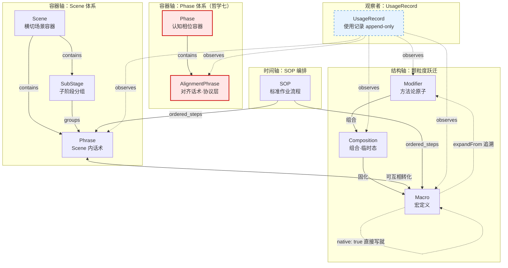
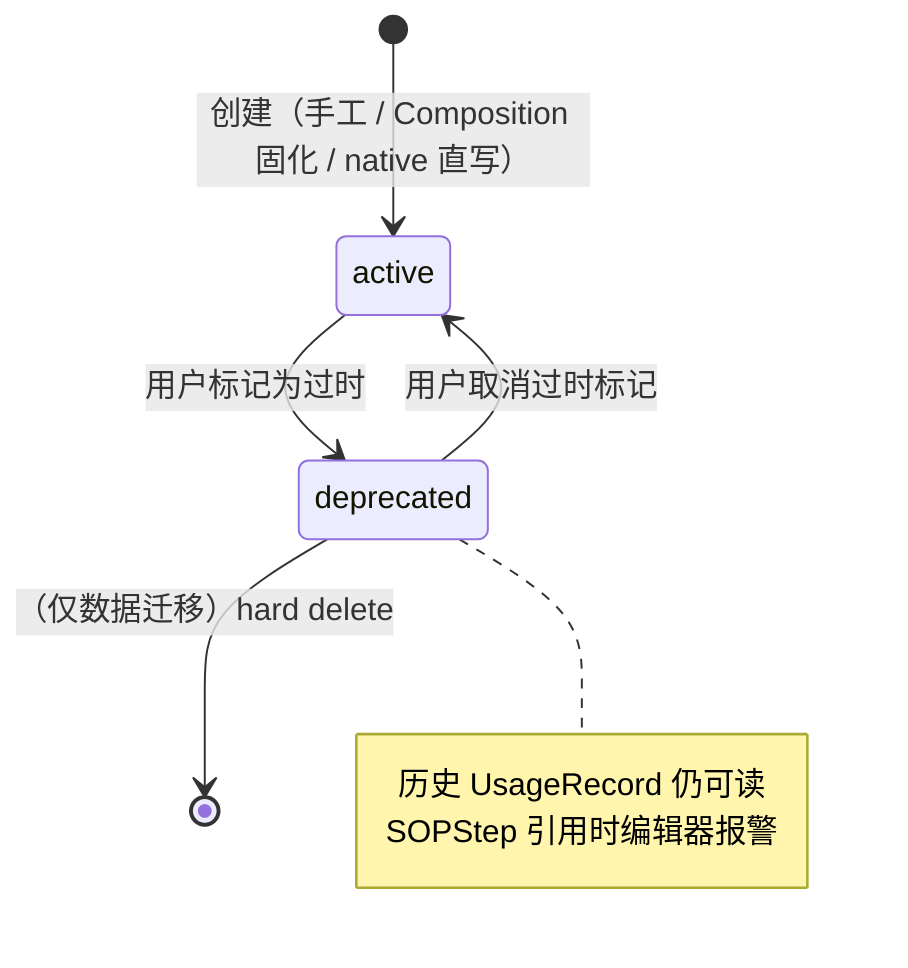
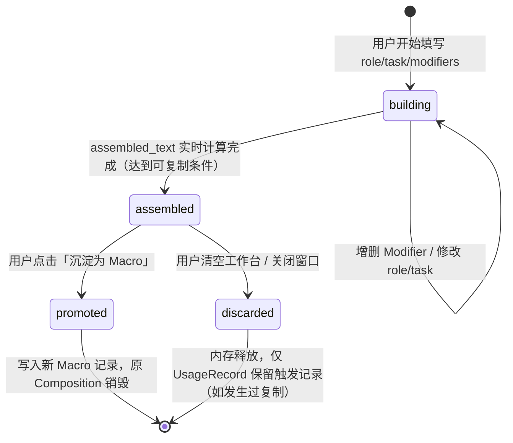
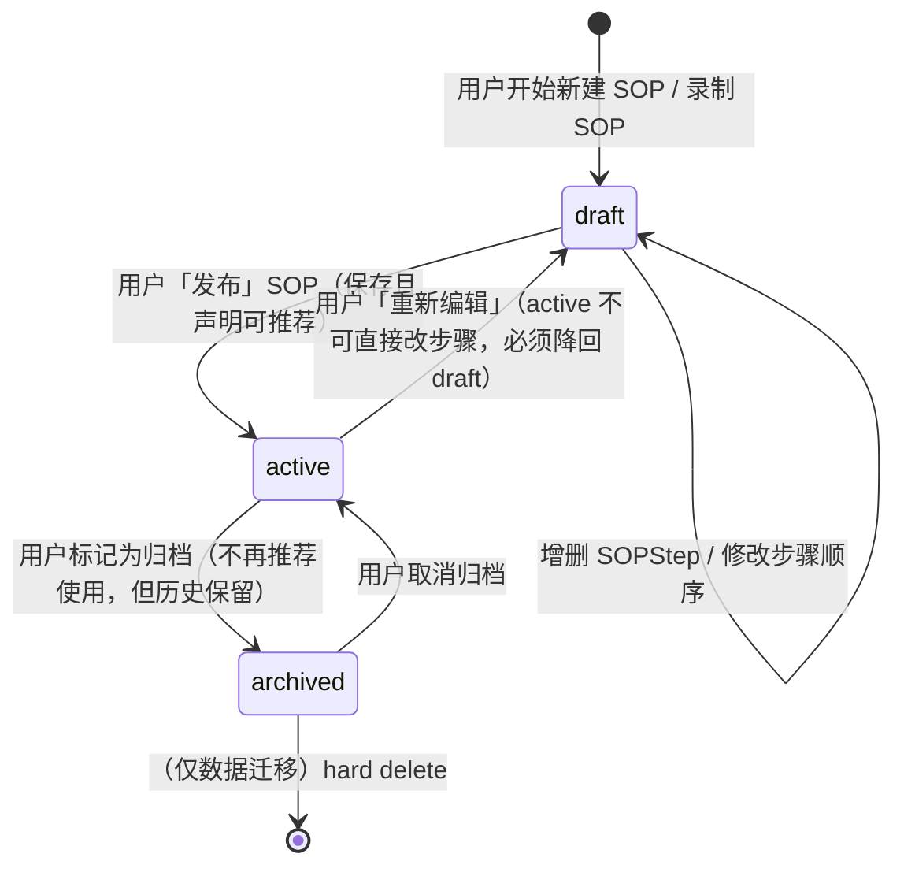

# PRD: prompt-hub（工程契约）

> 本文件是 `prompt-hub-prd.md` 拆分版的 **prd.md**——承载工程契约。
> 项目定位见 [[01-spec]]、UI 契约见 [[03-product-spec]]、实施计划见 [[prompt-hub-mvp]]。
>
> 本文件来源：原 PRD §5 功能模块 + §6 数据模型 + §7 非功能需求。
> §8 Boundaries 段是 v0.5 拆分时新增（基于原 §6.0 关系约束表 + 反哺自 [[../../Vault/知识库/技术积累/AI-PRD-Boundaries三段式|L3-1]]）。
> §9 安全 / 合规字段子节是 v0.5 拆分时新增（按 [[../../Vault/知识库/技术积累/AI编程项目安全合规字段清单|L3-2]] 的"完全本地+离线"档触发）。
> §6 数据模型 / §6.10 状态机 / §7.7 升级回滚契约 是 v0.6 修缮内容（B1-B3）。

---

## 5. 功能模块

这一章是对 [[03-product-spec#4-界面设计原则]] 的具体落地。每个模块会说明：它是什么、为什么存在、关键交互、与其他模块的关系。

### 5.0 搜索区

> 本节是 v0.5 新增模块，作为全景之外的兜底入口。

**定位**：首屏顶部居中，中等大小的全局搜索框。承担"扫视找不到时的兜底"角色，不是主入口。

**内容**：
- 搜索框（约 60% 宽度居中，浅灰背景，占位文字"搜索 Macro / Phrase / SOP / 对齐话术..."）
- 右侧小标签"兜底"——视觉提示这不是主路径
- 快捷键提示"⌘K"——主形态下唤起界面默认聚焦搜索框，但用户也可以直接按 ⌘K 重新聚焦

**关键交互**：
- **⌘K** → 焦点跳到搜索框
- 输入关键字 → 全局过滤所有资产（Macro / Phrase / AlignmentPhrase / SOP）
- ↑↓ 在结果中选择 → ⏎ 复制并隐藏窗口（主形态）/ 复制（辅形态）
- ESC → 清空搜索词，焦点回到首屏

**搜索范围**：

| 资产类型 | 是否纳入搜索 | 备注 |
|---------|----------|------|
| Macro | ✅ | 按 name + content + notes 模糊匹配 |
| Phrase（Scene 内话术） | ✅ | 同上 |
| AlignmentPhrase | ✅ | 同上，搜索结果中明确标注 Phase 归属 |
| SOP | ✅ | 按 SOP name + description 匹配 |
| Modifier | ❌ | Modifier 是组合材料，不直接复制使用 |
| Composition | ❌ | 临时态，无持久化 |

**搜索结果展示**：

激活搜索时（搜索词非空），整个首屏被搜索结果列表覆盖。结果按资产类型分组：

```
[搜索结果: "调研" - 7 条]
▸ Macro (2)
  借力最优解 (48 次)
  全局视角出方案 (15 次)
▸ Phrase (3)
  调研型话术 - 接手项目调研
  ...
▸ AlignmentPhrase (1)
  发散相位 - "我们做发散,铺开可能性"
▸ SOP (1)
  调研型 SOP (5 步)
```

ESC 或清空搜索词 → 返回默认全景视图。

**为什么是"兜底"而非"主入口"**：

- 哲学二（看见全局 > 操作最快）要求扫视为主——主要查找路径是看卡片墙
- 搜索框视觉权重刻意压低，不诱导优先使用
- 80% 使用场景下，用户根本不需要打开搜索框
- 但当用户记得有这条话术、忘了在哪个 Scene 时，搜索是必要的兜底——避免"找不到就重新写一遍"的浪费

**为什么不做命令式搜索（`#macro` `#scene:方案` 等过滤前缀）**：

- 现阶段使用者还在探索资产规模，过早引入语法会增加认知负担
- 全文模糊搜索已经能覆盖 80% 找不到的场景
- 详见 [[01-spec#10.7-搜索语法演化]] 开放问题

**实现注意**：
- 搜索是纯本地、纯字符串匹配，不依赖 AI
- 模糊匹配（不需要完全准确，"调研"应能匹配到"接手项目调研话术"）
- 搜索结果按相关度排序，相关度算法可演化

---

### 5.1 相位带（Phase Bar）

> 本节是 v0.3 新增模块，承载 AlignmentPhrase。v0.5 位置微调：搜索框下方（搜索框是视觉权重最低的顶部条带，相位带是视觉权重最高的协议层）。

**定位**：首屏顶部、搜索框下方，承载 AlignmentPhrase 一键调用，是"挡位指示器"和"协议切换器"的合体。在所有任务话术之前——这是哲学七的视觉落地。

**内容**：
- 8 个（或使用者配置的 N 个）Phase 横排，每个 Phase 是一个色块/按钮
- 当前激活的 Phase 高亮显示
- 每个 Phase 显示：相位名称、默认对齐话术的简短提示

**关键交互**：
- **单击 Phase** → 复制该 Phase 的**默认 AlignmentPhrase** 到剪贴板 + 状态栏切换显示"当前相位：X"
- **悬停/长按 Phase** → 展开该 Phase 下的所有 AlignmentPhrase 列表
- **展开后单击任一 AlignmentPhrase** → 复制并设为该 Phase 的当前选择
- **右键 Phase（鼠标）/ 长按（触控）** → 进入该 Phase 的编辑视图（增删 AlignmentPhrase、设为默认）

**为什么这样设计**：
- 哲学七要求 AlignmentPhrase 比任何任务话术更显眼（首屏顶部）
- 每个 Phase 一个默认对齐话术，让"切换相位"控制在 1 步内（哲学六）
- 当前相位的视觉持续展示，承担"挡位指示灯"功能（哲学三 + 哲学七）

**与其他模块的关系**：
- **不与 Macro 区互通**——AlignmentPhrase 不出现在 Macro 区，Macro 不出现在相位带（[[01-spec#8.6-不让对齐层与任务层混淆]]）
- **不被 SOP 引用**——SOP 是任务编排，相位切换是协议层动作
- **触发 UsageRecord**——每次相位切换都会被记录（target_type: 'alignment'）

---

### 5.2 Macro 快捷区

**定位**：首屏第二显眼位置（仅次于相位带），承载使用者最高频调用的任务话术。

**内容**：
- 使用者手动标记为 Macro 的话术
- 每张卡片显示：标题、内容预览（2-3 行）、使用次数、最近使用时间
- 卡片按使用频次排序（可切换为手动排序）

**关键交互**：
- 单击卡片 → 复制内容到剪贴板 + 视觉反馈
- 长按卡片（触控）/ 右键卡片（鼠标）→ 打开"拆解视图"（如果是从 Composition 固化而来，展示由哪些 Modifier 组成）
- 拖拽卡片 → 调整顺序
- 卡片右上角 "…" → 编辑、删除、移入 Scene、标记过时（deprecated）

**为什么这样设计**：
- Macro 承载了任务话术中 80% 的高频使用，必须最短路径可达（哲学二、4.2）
- "拆解视图"是 Macro 和 Modifier 之间的桥梁，让语言系统三层结构可追溯（哲学五）
- 标记过时而非直接删除——保留历史痕迹，月度 review 时可以回看

---

### 5.3 Scene 全景区

**定位**：按"使用时机"横切的话术分类展示。

**内容**：
- 10 个以内的 Scene 卡片，每个 Scene 显示：
  - Scene 名称和图标
  - 该 Scene 下的话术数量
  - 前 3-5 条话术的标题预览
  - 本周在该 Scene 的使用次数
- 点击某 Scene 后，在首屏展开该 Scene 的全部话术（不跳页）
- 如果 Scene 有 `sub_stages[]`（如"方案"Scene 的"生成→评审→修订→定版"四阶段），展开时按子阶段分组显示

**关键交互**：
- 点击 Scene 缩略图 → 在 Scene 区展开该 Scene 的所有话术
- 展开后点击任一话术 → 复制
- 长按话术（触控）/ 右键话术（鼠标）→ 编辑 / 升级为 Macro / 添加到 Composition 队列
- Scene 卡片右上角 → 折叠（暂时隐藏）

**为什么这样设计**：
- Scene 是一个正交维度，不应该占据首屏核心位置，但必须可见（哲学二）
- 不跳页的展开方式保证"全景不被破坏"（[[03-product-spec#4.1-布局原则]]）
- "添加到 Composition 队列"是从 Scene 话术直接进入组合模式的入口，避免模式切换
- 子阶段分组让"方案"这种多阶段 Scene 不会退化成扁平话术清单

---

### 5.4 Composition 组合工作台

**定位**：把 Modifier 按顺序拼装成完整 Composition 的工作区域。

**内容**：
- **Modifier 池**：20-30 个 Modifier 按四组排列（认知 / 动作 / 产出 / 约束）
- **组合队列**：被选中的 Modifier 按顺序排列
- **角色和任务输入框**：供使用者填写 Composition 的"变量部分"（角色名、具体任务描述）
- **实时预览**：底部展示当前组合出的完整 Composition

**关键交互**：
- 单击 Modifier → 加入组合队列
- 队列中的 Modifier 可拖拽排序
- 填写角色和任务后，预览实时刷新
- 按钮：**复制** / **保存为 Macro** / **保存为 Scene 话术** / **清空**

**为什么这样设计**：
- Modifier 按四组排列反映"认知 → 动作 → 产出 → 约束"的思考顺序（哲学五、[[01-spec#3.1-三层资产模型]]）
- 组合队列可拖拽排序——顺序本身是信息的一部分
- **"保存为 Macro"是整个系统的闭环按钮**——这是哲学四（使用即沉淀）落地的关键动作，必须显眼
- 角色和任务作为独立输入框——避免使用者每次都重复输入固定部分

**和其他模块的关系**：
- 从 Scene 话术可以直接添加到组合队列（跨越模式边界）
- 从 Composition 保存为 Scene 话术可以反向沉淀（资产闭环）
- **AlignmentPhrase 不进入组合工作台**——协议层与内容层物理分离（[[01-spec#8.6-不让对齐层与任务层混淆]]）

---

### 5.5 最近使用区

**定位**：短期记忆窗口，承载本次工作会话的复制历史。

**内容**：
- 最近 5 条复制记录（时间倒序）
- 每条显示：内容预览（一行）、来源（Macro/Scene/Composition/Alignment）、时间

**关键交互**：
- 单击任一条 → 再次复制（最常见用途：刚才粘贴错了，再来一次）
- 长按（触控）/ 右键（鼠标）→ 把该条话术升级为 Macro（如果是任务话术且还不是 Macro 的话）；AlignmentPhrase 类型则不提供"升级为 Macro"选项（[[01-spec#8.6-不让对齐层与任务层混淆]]）

**为什么这样设计**：
- 回答了使用者原始需求中的"刚刚操作了什么"（哲学二、[[03-product-spec#4.4-状态反馈原则]]）
- "再次复制"是高频隐性需求——使用者经常粘贴失误或需要重发
- 长按/右键升级为 Macro 是**最自然的沉淀入口**——刚用过的话术最容易被判断是否值得固化（哲学四）

**实现注意**：
- 本地 session 范围，不跨会话保留（跨会话用 usage_count + last_used_at 代替）
- 5 条是上限，再多就成了"历史记录"而非"最近使用"

---

### 5.6 SOP 导航区

**定位**：跨对话的工作流指引，是整个仪表盘中"向前看"的部分。

**内容**：
- **当前激活的 SOP 模板**：显示为一个带序号的步骤列表或简化流程图
- **进度标记**：已完成的步骤打勾，当前步骤高亮，下一步突出
- **SOP 模板切换器**：下拉选择其他 SOP 模板
- **"新建 SOP"按钮**：从使用历史录制新的 SOP

**关键交互**：
- 点击 SOP 中的某一步 → 复制对应话术 + 自动推进进度
- 切换 SOP 模板 → 重置进度
- "完成本 SOP" → 归档本次 SOP 执行记录（供月度 review）

**为什么这样设计**：
- 这是整个项目**最超前于传统提示词工具**的部分——它引入了"时间"维度
- 回答了使用者原始需求中的"未来可以怎么操作"（[[03-product-spec#4.5-引导原则]]）
- 是手动挡→自动挡的过渡桥梁——SOP 用熟之后，可以批量迁移为 Claude Code 的 composite commands
- 从使用历史"录制"SOP 让使用者不用凭空设计——自己的工作节奏是最好的 SOP 来源（哲学四）

**SOP 模板的初始设计**（基于前述分析推荐）：

- **方案设计型**：借力最优解 → 全局视角出方案 → 多 agent 评价 → 修订 → 更新
- **调研型**：接手项目 → 技术选型 → 子代理并行调研 → 调研整合出方案
- **排查型**：检查现有代码 → 定位根因 → 制定修复方案 → 执行修复 → 影响范围排查
- **复盘型**：项目复盘 AAR → 体系反哺 → 更新 lessons

SOP 模板应该是**可自定义的**，初始内置是锚点，使用者会很快演化出自己的 SOP 库。

**重要边界**：SOP 步骤**不**引用 AlignmentPhrase（[[01-spec#8.6-不让对齐层与任务层混淆]]）——相位切换由使用者在执行 SOP 过程中手动通过相位带完成，不混进 SOP 步骤序列。

---

### 5.7 状态仪表区

**定位**：量化使用数据，驱动迭代。

**内容**：
- 今日复制次数
- 今日最常用 Top 3
- 本周新增 Macro 数
- 当前所处相位（来自最近一次相位切换）
- 今日各相位停留次数分布
- 未分类草稿数（最近一周被复制过 3 次以上但未固化为 Macro 的 Composition）
- 提示词总数的变化趋势（新增 / 过时 / 净变化）

**关键交互**：
- 点击"未分类草稿数" → 进入待审阅页面，决定保存/丢弃
- 点击数字 → 进入对应的数据详情页
- 点击"当前所处相位" → 跳回相位带高亮当前相位

**为什么这样设计**：
- 这是哲学四（使用即沉淀）的**收口模块**——让沉淀从"默默发生"变成"显式可见"
- "未分类草稿"是整个系统里最宝贵的信号——它告诉使用者哪些高频使用尚未沉淀
- 相位分布数据揭示工作模式——比如发现自己一周"沉淀相位"使用次数为 0，是个有价值的反馈
- 月度 review 时，这块数据是最核心的参考资料

**实现注意**：
- 数字要大、显眼，不是装饰性小字
- 不要用花哨的图表——手动挡阶段追求的是信息密度，不是炫技
- **首次启动空状态**：UsageRecord 为零时显示引导文案"完成 3 次复制后将在这里看到你的使用趋势"，不能白屏

---

### 5.8 配置与迭代入口

**定位**：承载"界面自身也是被维护的资产"这条原则（[[01-spec#2.9-哲学九]]）。

**入口位置**：右上角小齿轮图标（不占主要视觉）

**可配置项**：
- Scene 的创建、重命名、删除、排序、颜色
- **Phase 的创建、重命名、删除、排序、颜色**（v0.3 新增）
- Modifier 池的增删、分组调整、重命名
- AlignmentPhrase 的批量编辑（增删、关联 Phase、设为默认）
- SOP 模板的创建、编辑、删除
- 首屏区域的高度比例、折叠状态
- 数据导入/导出（JSON 格式，方便备份和迁移）

**为什么这样设计**：
- 哲学九要求界面可配置，但不是所有配置都要暴露在首屏
- 把低频配置放在二级页面，让首屏保持清爽
- JSON 导入导出是对抗"工具锁定"的重要设计——使用者的资产必须随时可以带走

---

## 6. 数据模型

这一章定义核心数据结构。不讨论具体实现（不规定是 TypeScript 还是 JSON Schema），只讨论字段和关系。

### 6.0 资产关系总览

> 本节是 v0.3 新增章节，用 Mermaid 表达所有资产间的结构关系。

整个数据模型由三条正交的轴和两类特殊对象组成：

- **结构轴（颗粒度跃迁）**：Modifier → Composition → Macro
- **容器轴（归属分类）**：Scene 包含 Phrase / SubStage；Phase 包含 AlignmentPhrase
- **时间轴（工作流编排）**：SOP 串联 Macro 和 Phrase
- **孤岛对象**：AlignmentPhrase 不和任何其他资产产生结构关联（哲学七）
- **观察对象**：UsageRecord 观察所有可复制的资产，append-only，不持有结构关系

#### Mermaid 关系图



#### 关键关系约束

| 关系类型 | 允许 | 禁止 |
|---------|------|------|
| 结构轴 | Modifier→Composition→Macro 单向跃迁；Macro 可追溯 Modifier | Composition 不能跨越成为 SOP 步骤（必须先固化为 Macro） |
| 容器轴-Scene | Phrase ↔ Macro 双向转化；Phrase 归属 SubStage | Scene 不嵌套子 Scene；Modifier 不归属 Scene |
| 容器轴-Phase | AlignmentPhrase 归属 Phase（多对一）；Phase 可有 0-N 条 AlignmentPhrase | AlignmentPhrase 不归属 Scene |
| 时间轴-SOP | SOP 步骤引用 Macro 或 Phrase | SOP 步骤不引用 Modifier、Composition、AlignmentPhrase |
| 孤岛-AlignmentPhrase | 只与 Phase 关联 | 不参与 Modifier 拼接、不进 Scene、不进 SOP、不与 Macro 互转 |
| 观察者-UsageRecord | 观察所有可复制资产；append-only | 不持有任何资产间的结构关系；不修改不删除（除归档外） |
| 暂态-drafts（v0.7） | drafts.target_type ∈ {modifier / composition / macro / alignment_phrase}；promote 后写入对应正式表 | drafts 不引用任何正式资产、不被任何正式资产引用；正式资产不持有 draft_id 反向指针；详见 §10.1 |

### 6.1 Modifier

#### Fields

| Name | Type | Nullable | Default | Constraint | Description |
|------|------|----------|---------|------------|-------------|
| id | string | N | - | PK | 唯一标识 |
| name | string | N | - | - | 短名称（用于 UI 展示） |
| content | string | N | - | - | 实际文本内容（通常半句话，末尾带标点） |
| group | enum | N | - | 四值枚举，见 [[01-spec#3.4-分层语言系统]] | 哲学五分层语言四类（cognition / action / delivery / constraint） |
| usage_count | integer | N | 0 | ≥ 0 | 被 Composition 或 Macro 引用次数 |
| last_used_at | timestamp | Y | null | ISO 8601 | 最近使用时间戳 |
| created_at | timestamp | N | now() | ISO 8601 | 创建时间 |
| notes | string | Y | null | - | 迭代说明（为什么是这句话、为什么改过） |
| deprecated | boolean | N | false | - | 是否已过时（不删除，仅标记） |

#### Relations

| From | To | Cardinality | Description |
|------|-----|-------------|-------------|
| Composition.modifiers[] | Modifier.id | N:M | Composition 引用 Modifier 进行拼接 |
| Macro.expandFrom[] | Modifier.id | N:M | Macro 可追溯构成它的 Modifier（哲学五） |
| UsageRecord.modifier_ids[] | Modifier.id | N:M | UsageRecord 观察展开后的 Modifier |

#### 查询模式

按 `group` 过滤（[[#5.2-macro-快捷区]] / Composition 工作台分组），按 `usage_count DESC` 排序（"最常用"），按 `last_used_at DESC` 排序（"最近使用"）。实现层按需建索引。

#### 删除策略

> Modifier 不允许 hard delete（哲学：历史痕迹是资产），所有"删除"操作等价于 `deprecated = true`。被 Composition / Macro / UsageRecord 引用时，应用层应阻止 hard delete；如确需清理（数据迁移 / 异常），引用方需先解除（SET NULL）。**IndexedDB 无外键引擎，删除策略由应用层校验承担**。

#### 字段设计理由

- `group` 固定四类——这是哲学五（分层语言系统）的具体落地
- `notes` 字段可能看起来冗余，但这是对抗"我半年后忘了为什么这么写"的核心机制
- `deprecated` 不用删除而用标记——历史痕迹是资产的一部分
- **不带 phase 字段**——Phase 只服务于 AlignmentPhrase，不污染 Modifier（[[01-spec#3.5-认知相位（Phase）与对齐话术（AlignmentPhrase）]] 决策）

#### 象限（group_kind）补救入口（v0.12 · P3-6）

> `modifiers.group_kind` 由 omar 在 promote 时四象限手选（§10.2 决策 iii），此前选错后**不可改**。v0.12 扩展 IPC **`update_modifier(id, name, content, group_kind?)`**：可选 `group_kind` 入参（CHECK 拒非法值），单事务把该 Modifier 移到目标象限尾部；缺省 = 旧有仅改 name/content 语义（命令名不变，IPC 契约测试通过）。UI 入口 = aside Modifier 参考面 chip 的 hover 管理簇（[[03-product-spec#13.3]]）。
>
> **登记既有 drift**：上文「删除策略」的 soft-delete（`deprecated=true`）表述与现实装不符——`delete_modifier` IPC 自 AE 批次起即为 hard DELETE（P3-6 仅为其补了二次确认 UI）。差异属既有欠账，是否回改 soft-delete 待 omar 裁定，本版仅如实登记。

### 6.2 Composition（通常不持久化，临时态）

> **临时态说明**：Composition 默认存在于内存或 session storage，不持久化到 IndexedDB。值得沉淀的 Composition 升级为 Macro（[[#6.3-macro]]）后才创建持久化记录。因此本节 Fields 描述运行时结构，**无 id / 无 Indexes / Relations 仅描述引用**。
>
> **promoted Composition 例外（v0.8）**：MCP write pipeline（§10）引入了**持久化的 Composition**——Claude 提议、omar 在草稿 tab promote 后写入 `compositions` 表（migration 0004，字段见 [[#10.2-promote-路径契约]] 与 repo-core `models::Composition`）。这条例外不推翻本节"工作台 Composition 临时态"的定位：工作台 Composition 仍用完即弃，只有经 AI 提议 + omar promote 这条路径产生的才落库。两者同名不同生命周期。

#### Fields

| Name | Type | Nullable | Default | Constraint | Description |
|------|------|----------|---------|------------|-------------|
| role | string | N | - | - | 角色描述（使用者现场填写） |
| task | string | N | - | - | 任务描述（使用者现场填写） |
| modifiers | array&lt;string&gt; | N | [] | 元素为 Modifier.id，顺序敏感 | 引用的 Modifier 列表（按拼接顺序） |
| assembled_text | string | N | - | 派生字段，由 modifiers + role + task 实时计算 | 拼接后的完整文本 |
| created_at | timestamp | N | now() | ISO 8601 | 组装时间 |

#### Relations

| From | To | Cardinality | Description |
|------|-----|-------------|-------------|
| Composition.modifiers[] | Modifier.id | N:M | 引用 Modifier 进行拼接（被引用方应阻止 hard delete） |
| Composition → Macro | (升级关系) | 1:0..1 | Composition 固化为 Macro 时新建独立 Macro 记录，原 Composition 不留痕（除非进入 UsageRecord） |

#### 查询模式

无（临时态不查询，仅在状态栏/工作台读取当前 in-memory 实例）。

#### 字段设计理由

- Composition 本身通常是临时状态，用完即弃
- 值得沉淀的 Composition 会升级为 Macro（那时创建独立的 Macro 记录）
- `modifiers` 字段按顺序存储——顺序是信息的一部分（状态栏会用这些数据）
- 不给 id 字段——临时态不需要稳定标识，session 结束即消失

### 6.3 Macro

#### Fields

| Name | Type | Nullable | Default | Constraint | Description |
|------|------|----------|---------|------------|-------------|
| id | string | N | - | PK | 唯一标识 |
| name | string | N | - | - | 短名称 |
| content | string | N | - | - | 完整文本（组合而来或 native 直接写的） |
| expandFrom | array&lt;string&gt; | Y | null | 元素为 Modifier.id；与 native 互斥（native=true 时应为 null） | 由 Composition 固化时记录构成 Modifier |
| native | boolean | N | false | - | 是否原生 Macro（不由 Modifier 组合而来） |
| role | string | Y | null | - | 角色描述（如有） |
| task | string | Y | null | - | 任务描述（如有） |
| usage_count | integer | N | 0 | ≥ 0 | 使用次数 |
| last_used_at | timestamp | Y | null | ISO 8601 | 最近使用时间 |
| created_at | timestamp | N | now() | ISO 8601 | 创建时间 |
| notes | string | Y | null | - | 迭代说明 |
| scene_id | string | Y | null | FK → Scene.id（软关联） | 关联的 Scene（可空，Macro 可独立） |
| deprecated | boolean | N | false | - | 是否已过时 |

#### Relations

| From | To | Cardinality | Description |
|------|-----|-------------|-------------|
| Macro.expandFrom[] | Modifier.id | N:M | Macro 可追溯构成它的 Modifier（哲学五） |
| Macro.scene_id | Scene.id | N:1 | 软关联，Scene 删除时 Macro 解除归属（scene_id 置 null）但本体保留 |
| SOPStep.macro_id | Macro.id | 1:N | SOP 步骤引用 Macro |
| Phrase ↔ Macro | (互转关系) | 0..1:0..1 | Phrase 可升级为 Macro，Macro 可降级回 Phrase（详见 [[#6.4-scene]] Phrase） |
| UsageRecord.target_id (target_type=macro) | Macro.id | 1:N | 使用记录观察 |

#### 查询模式

按 `name` 模糊搜索（[[#5.0-搜索区]]），按 `usage_count DESC` / `last_used_at DESC` 排序（[[#5.5-最近使用区]]），按 `scene_id` 过滤展示 Scene 内 Macro，按 `deprecated = false` 过滤默认列表。实现层按需建索引。

#### 删除策略

> Macro 不允许 hard delete（哲学：历史痕迹是资产），所有"删除"操作等价于 `deprecated = true`。被 SOPStep 或 UsageRecord 引用时仍可标记 deprecated（不影响历史 SOP 执行 / 历史记录可读性），但 SOP 编辑器应在被 deprecated 时给出警告。

#### 字段设计理由

- `expandFrom` 是哲学五的关键——Macro 可以追溯到构成它的 Modifier
- `native: true` 标记那些不由组合而来的 Macro（比如直接写的成品话术）
- `scene_id` 是软关联——Macro 可以属于某个 Scene，也可以完全独立
- **不带 phase_id 或 is_alignment 字段**——AlignmentPhrase 独立成对象，不寄生在 Macro 里（哲学七、[[01-spec#3.5-认知相位（Phase）与对齐话术（AlignmentPhrase）]]）

### 6.4 Scene

Scene 节包含 3 个相关模型：**Scene**（场景容器）、**Phrase**（Scene 内话术）、**SubStage**（子阶段分组）。三者独立持久化，通过外键关联。

#### Scene Fields

| Name | Type | Nullable | Default | Constraint | Description |
|------|------|----------|---------|------------|-------------|
| id | string | N | - | PK | 唯一标识 |
| name | string | N | - | - | Scene 名称 |
| icon | string | Y | null | emoji 或图标标识符 | 显示用图标 |
| order | integer | N | - | ≥ 0 | 首屏显示顺序 |
| visible | boolean | N | true | - | 是否在首屏显示 |
| role_presets | array&lt;string&gt; | N | [] | - | 该 Scene 常用角色设定预设 |
| color | string | Y | null | 颜色 token 或 hex | 主题色 |

> 注：原伪代码中的 `phrases[]` 和 `sub_stages[]` 不再以嵌套数组持久化，而是通过 Phrase.scene_id / SubStage.scene_id（新增）反向关联。

#### Phrase Fields

| Name | Type | Nullable | Default | Constraint | Description |
|------|------|----------|---------|------------|-------------|
| id | string | N | - | PK | 唯一标识 |
| scene_id | string | N | - | FK → Scene.id | 所属 Scene |
| name | string | N | - | - | 短名称 |
| content | string | N | - | - | 文本内容 |
| usage_count | integer | N | 0 | ≥ 0 | 使用次数 |
| last_used_at | timestamp | Y | null | ISO 8601 | 最近使用时间 |
| created_at | timestamp | N | now() | ISO 8601 | 创建时间 |
| notes | string | Y | null | - | 迭代说明 |
| deprecated | boolean | N | false | - | 是否已过时 |
| sub_stage_id | string | Y | null | FK → SubStage.id（同 scene 内） | 所属子阶段 |

#### SubStage Fields

| Name | Type | Nullable | Default | Constraint | Description |
|------|------|----------|---------|------------|-------------|
| id | string | N | - | PK | 唯一标识 |
| scene_id | string | N | - | FK → Scene.id | 所属 Scene |
| name | string | N | - | - | 子阶段名（如"生成""评审""修订""定版"） |
| order | integer | N | - | ≥ 0 | 顺序序号 |

#### Relations

| From | To | Cardinality | Description |
|------|-----|-------------|-------------|
| Phrase.scene_id | Scene.id | N:1 | Phrase 必属于某个 Scene |
| SubStage.scene_id | Scene.id | N:1 | SubStage 必属于某个 Scene |
| Phrase.sub_stage_id | SubStage.id | N:1 | Phrase 可选归属于某个 SubStage |
| Macro.scene_id | Scene.id | N:1 | Macro 软关联到 Scene（详见 [[#6.3-macro]]） |
| Phrase ↔ Macro | (互转关系) | 0..1:0..1 | Phrase 跨层级升级为 Macro，新建独立 Macro 记录，原 Phrase 可保留或标记 deprecated |
| UsageRecord.target_id (target_type=phrase) | Phrase.id | 1:N | 使用记录观察 |

#### 查询模式

按 `Scene.visible = true` 过滤首屏展示（[[#5.3-scene-全景区]]），按 `Scene.order ASC` 排序，Phrase 按 `scene_id` + `sub_stage_id` 分组展示（[[#5.3-scene-全景区]] 子阶段分块），按 `usage_count DESC` / `last_used_at DESC` 排序高频 Phrase。实现层按需建索引。

#### 删除策略

> Scene 删除 → 应先迁移或归档其下所有 Phrase 与 SubStage，否则应阻止（应用层校验）。Phrase 不允许 hard delete，沿用 `deprecated = true` 策略。SubStage 删除时，其下 Phrase.sub_stage_id 置为 null（解除归属，Phrase 本体保留在 Scene 内）。

#### 写入口归属（创建入口指派）

> **Scene 容器与 SubStage 子阶段的增/改/删/排序由 UI 编辑态承载（Tauri-only，不经 MCP）**——与 Phrase 编辑入口一致（[[scene-phrase-editing#13]] repo-write 不被 MCP binary 依赖），外部 AI 无写面。此前 [[scene-phrase-editing]] 有意只做 Phrase 编辑、把 Scene/SubStage 结构编辑 defer，导致 `sub_stages` 表有 schema + 读路径但无写命令、SubStage 成死维度（永远 `[]`）；本指派由 [[scene-substage-editing]] 补齐，明确创建入口=UI 编辑态。删除语义同上「删除策略」：删非空 Scene 被阻止，删 SubStage 解绑其下 Phrase。

#### 字段设计理由

- Scene 内的 Phrase 和 Macro 是**类似但不同**的两种东西——Phrase 属于 Scene，Macro 独立
- 保持两者的数据结构相似，但允许一个话术从 Phrase 升级为 Macro（跨层级跃迁）
- `role_presets` 让 Scene 携带角色默认值，减少 Composition 中的重复输入
- `sub_stages[]` 让多阶段 Scene（如方案 Scene 的四阶段）不退化成扁平清单——这是哲学二（看见全局）在 Scene 内部的复用
- **Phrase / SubStage 改为反向 FK 而非嵌套数组**——为支持 Phrase 高频写入（usage_count 更新）和 SubStage 独立编辑，扁平表结构对 IndexedDB 友好

### 6.5 Phase（认知相位）

> 本节是 v0.3 新增数据表。

#### Fields

| Name | Type | Nullable | Default | Constraint | Description |
|------|------|----------|---------|------------|-------------|
| id | string | N | - | PK | 唯一标识 |
| name | string | N | - | 相位名集合见 [[01-spec#3.5-认知相位（Phase）与对齐话术（AlignmentPhrase）]]（如 发散/理解/规划/生成/执行/收敛/沉淀/迭代） | 相位名 |
| order | integer | N | - | ≥ 0 | 在认知流中的默认顺序 |
| color | string | Y | null | 颜色 token 或 hex | 相位带 UI 着色（余光感知关键） |
| description | string | Y | null | - | 相位说明（给使用者自己看） |
| visible | boolean | N | true | - | 是否在相位带展示 |
| default_alignment_phrase_id | string | Y | null | FK → AlignmentPhrase.id（同 phase 内） | 默认对齐话术（`⌘1-8` 键盘切相位时复制这条；**鼠标点击 Phase 只切换不复制**，复制走 chip 行——[[013-alignment-phrases-tab-inclusion]] + PhaseBar 解耦 commit `441764b`）|

#### Relations

| From | To | Cardinality | Description |
|------|-----|-------------|-------------|
| AlignmentPhrase.phase_id | Phase.id | N:1 | AlignmentPhrase 必属于某个 Phase（哲学七） |
| Phase.default_alignment_phrase_id | AlignmentPhrase.id | 1:0..1 | 反向冗余指针（与 AlignmentPhrase.is_default 互为冗余） |
| UsageRecord.phase_id | Phase.id | N:1 | UsageRecord 在 target_type=alignment 时记录所属 Phase |

#### 查询模式

按 `visible = true` 过滤相位带展示（[[#5.1-相位带（Phase-Bar）]]），按 `order ASC` 排序。点击 Phase 时通过 `default_alignment_phrase_id` 直接复制（1 步交互）。

#### 删除策略

> Phase 删除前应迁移或归档其下所有 AlignmentPhrase，否则应阻止（应用层校验）。Phase 不写死为枚举正是为支持演化，删除应当是低频但合法的操作。

#### 字段设计理由

- 独立成表（不写死为枚举）——因为 Phase 仍在演化中（[[01-spec#3.5-认知相位（Phase）与对齐话术（AlignmentPhrase）]]），使用者会根据实践增删
- `default_alignment_phrase_id` 让"点击 Phase 即可复制"的 1 步交互成立（[[#5.1-相位带（Phase-Bar）]]）
- `color` 是相位带视觉权重的重要承载——余光感知时颜色比文字更快被识别

### 6.6 AlignmentPhrase（对齐话术）

> 本节是 v0.3 新增数据表。

#### Fields

| Name | Type | Nullable | Default | Constraint | Description |
|------|------|----------|---------|------------|-------------|
| id | string | N | - | PK | 唯一标识 |
| phase_id | string | N | - | FK → Phase.id（必填） | 所属 Phase（无"无相位归属"的合法状态） |
| name | string | N | - | - | 短名称 |
| content | string | N | - | - | 完整话术文本 |
| is_default | boolean | N | false | 同 phase_id 下至多一条 is_default=true | 是否该 Phase 的默认对齐话术 |
| usage_count | integer | N | 0 | ≥ 0 | 使用次数 |
| last_used_at | timestamp | Y | null | ISO 8601 | 最近使用时间 |
| created_at | timestamp | N | now() | ISO 8601 | 创建时间 |
| notes | string | Y | null | - | 迭代说明 |
| deprecated | boolean | N | false | - | 是否已过时 |

#### Relations

| From | To | Cardinality | Description |
|------|-----|-------------|-------------|
| AlignmentPhrase.phase_id | Phase.id | N:1 | 必属于某个 Phase（哲学七） |
| Phase.default_alignment_phrase_id | AlignmentPhrase.id | 1:0..1 | Phase 反向引用 default（与 is_default 互为冗余） |
| UsageRecord.target_id (target_type=alignment) | AlignmentPhrase.id | 1:N | 使用记录观察（target_type=alignment + phase_id） |

#### 关系约束（哲学七 — 协议层与内容层物理分离）

参见 [[01-spec#8.6-不让对齐层与任务层混淆]]。AlignmentPhrase 与其他资产的**禁止性关系**：

| 禁止关系 | 含义 |
|---------|------|
| ✗ Modifier 拼接 | AlignmentPhrase 不参与 Composition.modifiers |
| ✗ Scene 归属 | 无 scene_id 字段，不属于任何 Scene |
| ✗ SOP 引用 | SOPStep 不能引用 AlignmentPhrase（[[#6.7-sop]] 强约束） |
| ✗ Macro 互转 | 不能直接转化为 Macro（即使内容相似也是两个独立对象） |

#### 查询模式

按 `phase_id` 过滤展示该 Phase 下所有对齐话术（[[#5.1-相位带（Phase-Bar）]] 详情面板），按 `is_default DESC` + `usage_count DESC` 排序（default 置顶）。

#### 删除策略

> AlignmentPhrase 不允许 hard delete，沿用 `deprecated = true` 策略。若被 Phase.default_alignment_phrase_id 引用，删除前需先解除引用（应用层校验，提示用户重新选择 default）。

#### 字段设计理由

- **独立对象**而非 Macro 子类型——哲学七要求协议层和内容层物理分离
- `phase_id` 必填——AlignmentPhrase 没有"无相位归属"的合法状态
- `is_default` 与 Phase 的 `default_alignment_phrase_id` 互为冗余——这是刻意为之，方便不同方向的查询（从 Phase 找 default / 列出 Phase 下所有 default）

#### 默认话术切换（v0.12 · P3-6 补写入口）

> 此前 default 只在 seed 里钉死：delete 拒绝默认项、create 恒非默认——默认话术不可换是资产生命周期缺口。v0.12 新增 IPC **`set_default_alignment_phrase(phase_id, id)`**（Tauri-only，不经 MCP）：单事务把旧默认置 `is_default=0`、新默认置 `=1`，**同步维护 `phases.default_alignment_phrase_id` 冗余指针**（导出/Phase 模型依赖该指针）；目标不存在或不属该 phase → `TargetNotFound`（与 reorder 契约一致）。UI 入口 = 对齐话术编辑态非默认行的 Star 按钮（[[03-product-spec#13.3]] 区域 2-bis）。

### 6.7 SOP

SOP 节包含 2 个相关模型：**SOP**（标准作业流程）、**SOPStep**（步骤）。

#### SOP Fields

| Name | Type | Nullable | Default | Constraint | Description |
|------|------|----------|---------|------------|-------------|
| id | string | N | - | PK | 唯一标识 |
| name | string | N | - | - | SOP 名称 |
| description | string | Y | null | - | 简介 |
| created_at | timestamp | N | now() | ISO 8601 | 创建时间 |
| last_executed_at | timestamp | Y | null | ISO 8601 | 最近执行时间 |
| execution_count | integer | N | 0 | ≥ 0 | 执行次数 |
| source | enum | N | 'manual' | `'manual'` \| `'recorded'` | 手工创建 / 从历史录制 |
| status | enum | N | 'active' | `'draft'` \| `'active'` \| `'archived'` | 生命周期状态（详见 [[#6.10-状态机]]） |

> 注：新增 `status` 字段（B2 状态机所需），替代旧版仅靠"是否在用"的隐式判断。`draft` 状态用于未完成编辑的 SOP（如录制中），`archived` 用于沉淀历史但不再推荐使用。原伪代码中 SOP 无 deprecated 字段，新版用 status='archived' 等价表达。

#### SOPStep Fields

| Name | Type | Nullable | Default | Constraint | Description |
|------|------|----------|---------|------------|-------------|
| id | string | N | - | PK | 唯一标识（持久化需要） |
| sop_id | string | N | - | FK → SOP.id | 所属 SOP |
| order | integer | N | - | ≥ 0，sop_id 内唯一 | 顺序序号 |
| target_type | enum | N | - | `'phrase'` \| `'macro'`（禁止 `'alignment'`） | 引用类型 |
| target_id | string | N | - | FK → Phrase.id 或 Macro.id（按 target_type 解析） | 指向的话术 ID |
| optional | boolean | N | false | - | 是否可选步骤 |
| branch_condition | string | Y | null | - | 分支条件描述（预留扩展） |
| note | string | Y | null | - | 本步的说明 |

#### Relations

| From | To | Cardinality | Description |
|------|-----|-------------|-------------|
| SOPStep.sop_id | SOP.id | N:1 | 步骤必属于某 SOP |
| SOPStep.target_id (target_type=phrase) | Phrase.id | N:1 | 步骤引用 Phrase |
| SOPStep.target_id (target_type=macro) | Macro.id | N:1 | 步骤引用 Macro |
| SOPStep → AlignmentPhrase | ✗ 禁止 | - | 哲学七边界：SOP 是任务层，AlignmentPhrase 是协议层（[[01-spec#8.6-不让对齐层与任务层混淆]]） |
| UsageRecord.sop_id + sop_step_order | SOP / SOPStep | N:1 | 使用记录追溯 SOP 执行 |

#### 查询模式

按 `status = 'active'` 过滤可推荐 SOP（[[#5.6-sop-导航区]]），按 `last_executed_at DESC` 排序高频 SOP，按 `source = 'recorded'` 过滤实战录制 SOP。SOPStep 按 `sop_id` + `order ASC` 排序展示。

#### 删除策略

> SOP 不允许 hard delete（哲学：历史 SOP 反映过去的工作流，删除会丢失方法论演化痕迹）。"删除"操作等价于 `status = 'archived'`。SOP 删除（archived）后其 SOPStep 保留（用于历史 UsageRecord 可追溯）。被 Macro/Phrase 引用的步骤，被引用方进入 deprecated 时，SOP 编辑器应给出警告（参见 [[#6.3-macro]] 删除策略）。

#### 字段设计理由

- `source` 字段区分手工创建和录制——录制的 SOP 代表真实使用模式，价值更高
- `optional` 让 SOP 允许跳过某些步骤——不是所有场景都必须走全部流程
- `branch_condition` 为未来扩展预留空间——当前版本可以不实现，但数据结构要预留
- **SOPStep 只能引用 Macro 或 Phrase**——不能引用 AlignmentPhrase（[[01-spec#8.6-不让对齐层与任务层混淆]] 哲学七边界）
- **`status` 三态而非 deprecated 布尔**——SOP 的"草稿期"是真实存在的（录制中未保存 / 编辑中），二值无法表达；其他模型沿用 deprecated 布尔（[[#6.10-状态机]] §6.10.1 说明）

### 6.8 UsageRecord（使用记录）

#### Fields

| Name | Type | Nullable | Default | Constraint | Description |
|------|------|----------|---------|------------|-------------|
| id | string | N | - | PK | 唯一标识（append-only，单调递增） |
| timestamp | timestamp | N | now() | ISO 8601 | 复制发生时间 |
| target_type | enum | N | - | `'modifier'` \| `'macro'` \| `'phrase'` \| `'composition'` \| `'alignment'` | 被复制对象的类型 |
| target_id | string | Y | null | FK → 对应类型表的 id（target_type=composition 时可 null） | 对应的资产 id |
| source | enum | N | - | `'macro_area'` \| `'scene'` \| `'recent'` \| `'sop'` \| `'composition'` \| `'phase_bar'` | 触发入口 |
| modifier_ids | array&lt;string&gt; | Y | null | 元素为 Modifier.id；仅 target_type ∈ {composition, macro} 时填充 | 展开后的 Modifier 列表（实战组合分析数据） |
| sop_id | string | Y | null | FK → SOP.id；仅 source='sop' 时填充 | SOP 流程上下文 |
| sop_step_order | integer | Y | null | ≥ 0；仅 source='sop' 时填充 | SOP 步骤序号 |
| phase_id | string | Y | null | FK → Phase.id；仅 target_type='alignment' 时填充 | 相位使用分布数据 |

#### Relations

| From | To | Cardinality | Description |
|------|-----|-------------|-------------|
| UsageRecord.target_id (target_type=modifier) | Modifier.id | N:1 | 观察 Modifier 使用 |
| UsageRecord.target_id (target_type=macro) | Macro.id | N:1 | 观察 Macro 使用 |
| UsageRecord.target_id (target_type=phrase) | Phrase.id | N:1 | 观察 Phrase 使用 |
| UsageRecord.target_id (target_type=alignment) | AlignmentPhrase.id | N:1 | 观察 AlignmentPhrase 使用 |
| UsageRecord.modifier_ids[] | Modifier.id | N:M | 展开后的 Modifier 集合 |
| UsageRecord.sop_id | SOP.id | N:1 | SOP 执行上下文 |
| UsageRecord.phase_id | Phase.id | N:1 | Phase 上下文 |

> 注：UsageRecord **不被任何对象反向引用**——它是观察者，单向观察可复制资产。

#### 查询模式

按 `timestamp DESC` 排序展示最近使用（[[#5.5-最近使用区]]），按 `target_type` + `target_id` 聚合统计单个资产使用次数（驱动 `usage_count` 反向汇总），按 `source` 聚合分析不同入口效率，按 `sop_id` + `sop_step_order` 重建 SOP 执行路径，按 `phase_id` 聚合分析相位使用分布（[[#5.7-状态仪表区]]）。**高频写入场景**：实现层应考虑批量写入和定期归档。

#### 删除策略

> UsageRecord **append-only**，不修改、不删除（除归档外）。归档策略：定期（如季度）将 90 天前的记录导出为冷备 JSON，从主存储清理；归档操作不可逆，导出文件由用户保管。

#### 字段设计理由

- 不只是"复制了什么"，还要记录"从哪里触发的"——这为分析不同入口的使用效率提供数据
- `target_type` 增加 `'alignment'` 选项——AlignmentPhrase 使用同样需要被记录
- `source` 增加 `'phase_bar'` 选项——区分来自相位带的触发
- `phase_id` 让"相位使用分布"成为可查询数据（[[#5.7-状态仪表区]] 用）
- `modifier_ids` 让"哪些 Modifier 在实战中被组合得最多"成为可分析数据，是 [[01-spec#10.1-Modifier-池的增长管理]] 治理的数据基础
- `sop_id` + `sop_step_order` 让 SOP 执行可追溯——可以统计"方案设计 SOP 平均走到第几步就完成了"，是 [[01-spec#10.2-SOP-的粒度]] 调整的数据基础
- 这张表是最高频写入的，实现时建议 **append-only**（不修改旧记录，只追加新行）——避免任何同步冲突，也方便定期归档

### 6.9 数据导出 JSON Schema

为对应 §7.5 的可迁移性要求，导出格式必须稳定且向后兼容。建议结构：

```json
{
  "schema_version": "1.1",
  "exported_at": "2026-05-18T10:00:00Z",
  "modifiers": [/* Modifier[] */],
  "macros": [/* Macro[] */],
  "scenes": [/* Scene[] */],
  "phrases": [/* Phrase[] */],
  "sub_stages": [/* SubStage[] */],
  "phases": [/* Phase[] */],
  "alignment_phrases": [/* AlignmentPhrase[] */],
  "sops": [/* SOP[] */],
  "usage_records": [/* UsageRecord[]，可选，只导出最近 N 天 */]
}
```

**字段设计理由**：
- `schema_version` 从 v1.0 升级到 v1.1，对应 Phase 和 AlignmentPhrase 的新增
- `usage_records` 可选——大数据量场景下可只导出当前资产、不导出历史使用记录
- 所有 ID 在导出 JSON 内部保持一致（不重新生成），导入时按 ID 还原关联

**v1.7 实现现状（2026-06-28）**：导出/导入已落地（repo-core `export.rs` + repo-write `import.rs`，data schema_version `1.1`），但与上方建议结构有两处刻意差异：
- **不含 `usage_records`**（决策 D2）：导出仅含资产，使用记录不随备份带走；因此整库替换导入时 `usage_records` 一并清空（其 `phase_id` FK 在还原后会悬空，故不保留）——语义为"还原到备份时的资产状态"。
- **不含 `sops`**：SOP 功能仍 `planned`（S3 / v1.2 未编码，无 SOP 写入路径），故本期导出不含 `sops` 键。待 SOP 落地（S3）再补 `sops` + `sop_steps` 导出/导入，届时 data schema_version 视字段变更决定是否 bump。
- 全保真：导出走独立无过滤 SELECT，**包含** `deprecated=1` / `visible=0` 行（读路径会过滤这些行，但备份必须完整），保证整库替换不丢数据。

### 6.10 状态机

> 本节是 v0.6 新增章节（B2）。定义关键资产的生命周期状态流转，**仅描述行为流，不引入新字段**（除 §6.7 SOP 已显式持有 `status` 枚举外，其他模型的状态由 `deprecated` 布尔 + 隐式上下文 computed 推导）。

#### 6.10.1 状态承载策略总览

| 资产 | 状态承载字段 | 状态计算公式 | 备注 |
|------|------------|-------------|------|
| Macro | `deprecated`（布尔） | `active` ≜ `deprecated = false`；`deprecated` ≜ `deprecated = true` | 二值即可（无草稿期，创建即可用） |
| Composition | 无持久化字段（运行时态） | 由 in-memory 流程节点决定（building / assembled / discarded / promoted） | 临时态，状态机描述行为流而非数据状态 |
| SOP | `status`（枚举 `draft` \| `active` \| `archived`） | 直接读 `status` 字段 | 三值（有草稿期 — 录制中/编辑中），唯一显式持有 status 的模型 |

> **为什么 SOP 显式 status 而其他模型用 deprecated？** — SOP 的"草稿期"是真实存在的（录制中未保存、多步编辑中），二值无法表达。其他模型（Modifier / Macro / Phrase / AlignmentPhrase）创建后即可用，不存在草稿期，`deprecated` 布尔足够。

#### 6.10.2 Macro 状态机



**迁移条件表**：

| From | To | 触发 | 前置条件 | 副作用 |
|------|-----|------|---------|--------|
| - | active | 用户创建 Macro / 从 Composition 升级 / native:true 直写 | name 与 content 非空 | 写入新 Macro 记录 |
| active | deprecated | 用户在配置面板标记 | 无 | `deprecated = true`；UI 列表默认隐藏 |
| deprecated | active | 用户取消标记 | 无 | `deprecated = false` |
| deprecated | (删除) | 数据迁移 / 异常清理 | 无 SOPStep 引用（或先解除） | 仅迁移工具可触发，普通用户不可见 |

#### 6.10.3 Composition 状态机



**迁移条件表**：

| From | To | 触发 | 前置条件 | 副作用 |
|------|-----|------|---------|--------|
| - | building | 用户进入 Composition 工作台 | 无 | 初始化 in-memory Composition 实例 |
| building | assembled | role / task 任一非空 + modifiers 至少 1 个 | - | assembled_text 派生计算 |
| assembled | discarded | 用户主动清空 / session 结束 | 无 | 内存释放，未沉淀 |
| assembled | promoted | 用户点击「沉淀为 Macro」按钮 | name 非空（升级时补填） | 新建 Macro 记录（`expandFrom = modifiers`, `native = false`），Composition 销毁 |

> **关键边界**：Composition 不持久化，所以"状态"仅描述用户在工作台的操作流程，不映射到任何字段。promoted 是单向跃迁，跃迁后原 Composition 不复存在（哲学：临时态用完即弃）。

#### 6.10.4 SOP 状态机



**迁移条件表**：

| From | To | 触发 | 前置条件 | 副作用 |
|------|-----|------|---------|--------|
| - | draft | 用户新建 SOP（手工 / 录制开始） | 无 | 写入新 SOP 记录，`status = 'draft'`，`source = 'manual' / 'recorded'` |
| draft | active | 用户「发布」 | name 非空 + 至少 1 个 SOPStep | `status = 'active'`，进入 [[#5.6-sop-导航区]] 可推荐列表 |
| active | draft | 用户「重新编辑」 | 无 | `status = 'draft'`，从推荐列表隐藏；保护已有 execution_count |
| active | archived | 用户「归档」 | 无 | `status = 'archived'`，从推荐列表隐藏；UsageRecord 中历史 sop_id 仍可读 |
| archived | active | 用户「取消归档」 | 无 | `status = 'active'` |
| archived | (删除) | 数据迁移 | 无 UsageRecord 引用约束（archived 但保留 UsageRecord） | 仅迁移工具触发 |

> **active ↔ draft 双向迁移的设计意图**：避免"active SOP 被随意改坏 → 推荐列表中出现破损 SOP"。强制降回 draft 编辑，保留 active 版本的稳定性。如需保留旧版同时新版迭代，建议复制 SOP 而非原地编辑。

#### 6.10.5 状态机与 deprecated 字段的关系

| 视角 | deprecated 布尔 | status 枚举（仅 SOP） |
|------|----------------|---------------------|
| 数据存储 | 字段实际值 | 字段实际值 |
| 状态机 | 通过 `active ↔ deprecated` 二值映射 | 通过 `draft → active → archived` 三态映射 |
| UI 行为 | 列表默认过滤 `deprecated = false` | 列表默认过滤 `status = 'active'` |
| 历史可读性 | UsageRecord 保留对 deprecated Macro 的引用 | UsageRecord 保留对 archived SOP 的 sop_id |

**核心约束**：状态机是行为流的描述视图，不引入新的存储字段（SOP.status 是已有字段）。任何实现都应通过 deprecated / status 实际值驱动 UI，而非在内存中维护额外状态。

---

## 7. 非功能需求

### 7.1 性能

- **首屏加载时间**：≤ 1.5 秒（冷启动）
- **任何点击响应**：≤ 100 毫秒（包括复制、搜索、切换 Scene、切换 Phase）
- **支持数据量**：Modifier 30 条、Macro 100 条、Scene 10 个、Phase 12 个、AlignmentPhrase 50 条、SOP 20 个、Phrase 总计 300 条——超过这个规模说明资产膨胀需要清理，不是性能问题

### 7.2 离线可用

- 完全本地运行，不依赖任何后端服务
- 部署后可作为 PWA 安装到主屏（iPad 场景）或独立窗口运行（Mac 副屏场景），离线场景可用
- 数据持久化在 localStorage 或 IndexedDB（Web 路径）/ 本地数据库（原生路径），不上传到云端

**理由**：使用者涉及敏感业务场景（政府/公安数据方向），任何云端存储都是硬伤。本地优先是硬性要求。

### 7.3 隐私

- 不内置任何第三方分析脚本（Google Analytics、Sentry 等一律禁用）
- 不调用任何外部 API 做话术生成（不做 AI 辅助生成，那是另一个产品的事）
- **唯一出站例外**：应用自动更新检查出站至 GitHub Releases（[[017-enable-auto-update]] 受限豁免——仅版本号 + 下载包、无资产载荷、首启 opt-in + 总开关可关），披露见 [[10-ops-spec#§9]]
- 如果部署到公网，必须有访问控制（Cloudflare Access 密码 / Tailscale-only）

### 7.4 跨设备

- **主要设备**：Mac/Windows 桌面（主形态：快捷键唤起 + 全屏覆盖；辅形态：副屏常驻）
- **次要设备**：iPad（横屏，无副屏条件或便携场景；仅作为辅形态的备选）
- **辅助设备**：iPhone（移动场景下临时查看，只读为主）

- 桌面端是核心承载——主形态对全局快捷键的依赖决定了 iPad 不能完整复刻
- iPad 上无法注册全局快捷键，故仅承担"查看 / 复制"的简化职能
- 数据通过 Git 仓库（或 iCloud 同步的 JSON 文件）在设备间同步
- 不做多设备实时协同——单人使用，最终一致性即可

### 7.5 可迁移性

**最重要的非功能需求之一**：使用者应该随时可以**把数据拿走、换个工具继续用**。

- 所有数据以 JSON 格式存储，schema 见 §6.9
- 提供"导出全部数据"按钮，一键下载完整备份
- 提供"从 JSON 导入"功能，允许从其他工具迁入或还原历史版本
- 数据格式保持稳定（向后兼容），避免升级后旧数据无法读取
- `schema_version` 字段驱动未来的迁移逻辑

**理由**：对抗工具锁定是长期价值观。使用者的**资产**是核心，工具只是载体。

### 7.6 可维护性

- 代码结构应该是"使用者也能改"的——这是一个长期自用的工具，未来可能需要自己调整
- 数据层、状态层、UI 层分离
- 关键业务逻辑（拼接、沉淀触发、SOP 推进、相位切换）独立成可测试函数

**这条对"项目的 Claude Code 化"很重要**——如果结构清晰，未来可以让 Claude Code 自动维护和扩展功能，而不是每次都要手动改。

### 7.7 升级回滚契约

> 本节是 v0.6 新增章节（B3）。定义 `schema_version` 升级与回滚的兼容契约，保障 §7.5 可迁移性"数据可以拿走、换工具继续用"的承诺在版本演进中持续成立。
> 方法论参考：[[../../Vault/知识库/技术积累/AI编程项目安全合规字段清单]] §2.3 H 类。

#### 7.7.1 版本号策略

`schema_version` 采用 **`major.minor`** 字符串格式（与 §6.9 JSON Schema 一致），不含 patch。语义：

| 升级类型 | 触发条件 | 示例 | 用户感知 |
|---------|---------|------|---------|
| **minor 升级** | 向后兼容的字段增加 / 索引调整 / 可空字段引入 | `1.1` → `1.2` | 无感（旧数据可直接读） |
| **major 升级** | 不兼容变更：字段删除 / 字段重命名 / 类型变更 / 枚举值删除 / 必填字段引入 | `1.x` → `2.0` | 显式弹窗 + 强制迁移 + 旧版导出兜底 |

#### 7.7.2 兼容矩阵

当前 schema_version：**`1.1`**（v0.3 起）。下表定义已发布版本与未来版本的兼容窗口：

| 当前版本 | 可读取 | 可写入 | 不可读取 | 说明 |
|---------|--------|--------|---------|------|
| v1.0 | v1.0 | v1.0 | v0.x / v2.x | v1.0 不识别 Phase / AlignmentPhrase（v1.1 新增） |
| **v1.1**（当前） | v0.9, v1.0, v1.1 | v1.1 | v2.x | 向后兼容 2 个 minor 版本（v1.0 + 假设的 v0.9） |
| v1.2（未来） | v1.0, v1.1, v1.2 | v1.2 | v2.x（除非提供迁移） | 同上，2 个 minor 窗口 |
| v2.0（未来） | v2.0 | v2.0 | v1.x（必须先经迁移） | major 升级，要求显式迁移流程 |

> **回滚兼容窗口**：v1.2 写出的数据 v1.1 应能读取（向前兼容）但忽略 v1.2 新增字段；v1.3 不保证 v1.1 可读（超出 2 个 minor 窗口）。

#### 7.7.3 升级路径与迁移函数契约

每次发布升级都必须提供迁移函数（双向或单向），契约如下（仅描述责任，不规定实现语言）：

| 路径 | 方向 | 函数职责 | 失败处理 |
|------|-----|---------|---------|
| `migrate_1_0_to_1_1` | 前向（自动） | 为现有数据补充 `phases: []` / `alignment_phrases: []` 空数组；旧 `schema_version` 字段升级为 `"1.1"` | 失败回滚到 v1.0 数据快照（迁移前自动备份） |
| `migrate_1_1_to_1_2` | 前向（自动） | （示例占位）补充 v1.2 引入的可空字段；旧 schema_version 升级 | 同上 |
| `migrate_1_x_to_2_0` | 前向（**用户确认**） | 字段重命名 / 删除 / 类型变更；显式弹窗告知用户哪些字段会被丢弃或转换 | 失败回滚 + 强制提示用户先导出 v1.x 备份 |
| `rollback_1_1_to_1_0` | 后向（用户确认） | 剥离 v1.1 新增的 Phase / AlignmentPhrase 数据；warning 用户 v1.0 不识别这些资产 | 失败保留 v1.1 原状不变 |

#### 7.7.4 升级流程规范

| 阶段 | 动作 | 必须项 |
|------|------|-------|
| 1. 检测 | 启动时读 `schema_version`，对比代码内置当前版本 | 不可静默升级 |
| 2. 备份 | 任何迁移前自动生成完整数据快照（JSON 导出） | 备份文件命名含时间戳 + 旧版本号 |
| 3. minor 升级 | 自动执行迁移函数，无需用户确认 | 仅适用于向后兼容场景 |
| 4. major 升级 | 弹窗告知：①影响范围 ②会丢失的字段 ③可选回滚 | 必须用户主动点击"开始迁移" |
| 5. 验证 | 迁移后校验所有 schema 引用完整性（FK 不悬空、enum 值合法） | 任一失败即回滚到备份 |
| 6. 完成 | 更新 `schema_version` 字段，记录迁移日志（migration_log） | 日志可在配置面板查看 |

#### 7.7.5 不兼容变更升级策略

major 升级（v1.x → v2.0）需满足：

- **发布前 ≥ 1 个 minor 版本预告**：在 v1.x 的最后一个 minor 版本中加入"v2.0 即将到来"提示与字段废弃 warning
- **保留旧版导出**：v2.0 第一次启动时强制要求用户导出 v1.x 数据，导出文件保留在用户指定位置（不删除）
- **提供 v1.x → v2.0 转换工具独立可运行**：即使 v2.0 自动迁移失败，用户也能用独立工具或回退 v1.x 二进制继续工作

#### 7.7.6 字段增减表（用于追踪历史）

> 此表随每次 schema 升级追加，作为升级路径的事实清单。当前仅含 v1.0 → v1.1。

| 升级 | 新增字段 | 删除字段 | 类型变更 | 枚举增减 |
|------|---------|---------|---------|---------|
| v1.0 → v1.1 | `phases[]` / `alignment_phrases[]`（导出 JSON 根级数组）；Macro 删除内嵌 phase_id（哲学七拆分） | - | - | UsageRecord.target_type 增加 `'alignment'`；UsageRecord.source 增加 `'phase_bar'` |
| v1.1 → v1.2（预占位） | （待定） | - | - | - |

#### 7.7.7 设计原则

- **minor 升级零感知** — 用户无需任何操作，启动时静默完成
- **major 升级强同意** — 用户必须显式确认，并保留旧版导出兜底
- **任何升级都可回滚** — 自动备份是硬约束，无备份不迁移
- **schema_version 是真理之源** — 任何代码逻辑都通过读 `schema_version` 决定如何处理数据，禁止"猜版本"

---

## 8. Boundaries（v0.5 拆分新增 — 反哺自 L3-1）

> 本节由 v0.5 拆分时新增，整合原 §6.0 关系约束表（数据维度）+ 行为级 Always/Ask/Never（行为维度）。
> 方法论参考：[[../../Vault/知识库/技术积累/AI-PRD-Boundaries三段式]]。

### 8.1 数据维度边界（沿用原 §6.0）

详见 [[#6.0-资产关系总览]] 的「关键关系约束」表——管 **结构** 而非行为。

### 8.2 行为维度边界

#### Always do（默认动作）

| # | 操作 | When | Why | Exception |
|---|------|------|-----|-----------|
| A1 | 复制后自动隐藏窗口 | 主形态下任何成功复制操作完成后 | 哲学一手动挡 + 用完即走 | 辅形态下不隐藏 |
| A2 | 每次复制追加 UsageRecord | 任何复制操作（含相位切换、SOP 步骤、Macro、Phrase、Composition、AlignmentPhrase） | 哲学四「使用即沉淀」的核心机制 | 无 |
| A3 | 数据本地优先 | 任何数据写入操作 | §7.2 离线可用 + §7.3 隐私（敏感业务，云端是硬伤） | 无 |
| A4 | UsageRecord append-only 写入 | 任何 UsageRecord 写入 | 避免同步冲突 + 便于归档 | 无 |

#### Ask first（边界模糊）

| # | 操作 | When | Options to present | Why |
|---|------|------|-------------------|-----|
| Q1 | 删除 Modifier / Macro / Phrase / Phase / AlignmentPhrase | 用户点击删除 | ①删除 ②标记为 deprecated（保留历史） | 资产是用户付出心智的沉淀，删错破坏方法论体系 |
| Q2 | 从历史录制 SOP | 用户点击"新建 SOP" → 从历史录制 | ①最近 N 步 ②选时间段 ③手动选步骤 | 录制粒度不同产生完全不同的 SOP |
| Q3 | 批量重命名分组 | 用户在配置面板对 Modifier 分组重命名 / Scene 重命名 | ①确认 ②预览影响范围（影响多少条话术） | 改名是不可逆的字段变更，应让用户看到影响 |
| Q4 | 清空所有数据 / 重置 | 用户点击"清空所有数据" | ①导出当前数据后清空 ②直接清空 ③取消 | 不可逆操作必须二次确认 |

#### Never do（绝对禁止）

| # | 操作 | Trigger | Why | Override |
|---|------|---------|-----|----------|
| N1 | 任何上传到外部 / 云端 / 第三方服务 | 任何含 `http(s)://` 且非 `localhost` 的网络请求 | §7.3 隐私 + 涉及敏感业务场景（政府 / 公安数据方向） | 默认无 override。**唯一显式声明的受限豁免**：应用自动更新出站（[[017-enable-auto-update]] / [[10-ops-spec#§9]]——仅版本号 + 下载包、无资产载荷、首启 opt-in + 总开关可关）；其余一律必须改代码 + 显式声明 |
| N2 | 自动调用任何外部 AI 生成内容 | 任何 LLM API 调用（Claude / OpenAI / Gemini 等） | [[01-spec#8.1-不做-AI-生成]]：失去自己思考 = 摧毁手动挡核心价值 | 无 override。**v0.7 reaffirm**：本条禁的是 prompt-hub 主动调 LLM；外部 AI（如 Claude Code）通过 §10 MCP server 调工具写 drafts **不违反**此条——方向相反 |
| N3 | 自动发送话术给任何 AI | 复制后自动 paste / 自动 send to Claude Code | [[01-spec#8.3-不做自动执行]]：手动复制粘贴是思考的缓冲 | 无 override。**v0.7 reaffirm**：drafts promote 仍需 omar 在 Scene 草稿 tab 显式点击，不存在"自动 promote → 自动复制"路径 |
| N4 | 跨进程 / 跨窗口写入 | 任何写入非应用本身 sandbox 的位置（修改其他应用配置 / 系统目录） | 应用应严格限制在自身数据范围 | 无 override |
| N5 | 持久化 AlignmentPhrase 到 Macro 类型 | 任何 INSERT / UPDATE 将 AlignmentPhrase 内容写入 Macro 表 | [[01-spec#8.6-不让对齐层与任务层混淆]]：哲学七要求物理分离 | 无 override |

### 8.3 五层防线配置

按 [[../../Vault/知识库/技术积累/AI-PRD-Boundaries三段式#4-与-sandbox--权限隔离配合]] 的五层防线：

| 层 | 本项目实现 | 状态 |
|----|---------|------|
| L1 PRD Boundaries | 本节 8.2 | ✅ |
| L2 工具白名单 | Tauri 默认 sandbox + capabilities 收紧（fs/clipboard + updater/process）；网络出站仅「自动更新检查 → GitHub Releases」一条受限例外（[[017-enable-auto-update]]，详见 §7.3 / N1 + [[10-ops-spec#§9]]）| 实施时配置 |
| L3 sandbox | 桌面应用进程隔离 + localStorage / IndexedDB 域隔离 | 实施时配置 |
| L4 approval gate | 删除操作的二次确认 + 配置面板编辑保存确认 | 实施时配置 |
| L5 审计 + 回滚 | UsageRecord append-only + 数据导出 JSON 作为备份 | ✅ |

---

## 9. 安全 / 合规字段（v0.5 拆分新增 — 反哺自 L3-2）

> 本节由 v0.5 拆分新增。按 [[../../Vault/知识库/技术积累/AI编程项目安全合规字段清单]] 的「完全本地+离线」档触发：
> - **必填**：A 输入验证 + C 敏感数据销毁
> - **不必**：B 认证（无用户概念）/ D 速率限制（无对外服务）/ E 日志审计（本地工具）/ F 加密（无云存储）/ G 供应链（个人项目暂不要求 SBOM）

### 9.1 A 输入验证（MVP 必填）

| 字段 | 要求 |
|------|------|
| InputSchema | 所有用户输入（Modifier content / Macro content / AlignmentPhrase content / Phrase content / role / task）必须长度限制 + 字符集限制；**v0.7 扩展**：drafts.payload_json 全字段同等约束 + `#[serde(deny_unknown_fields)]` 拒绝未知键 |
| MaxSize | 单条话术 ≤ 5000 字符；总数据导出 JSON ≤ 10 MB；**v0.7 扩展**：单 draft payload ≤ 64KB / `import_json` 单 batch ≤ 100 条且 request total ≤ 5MB（详见 §10.4.2） |
| AllowedTypes | 文本（UTF-8）+ JSON（数据导入）+ 标准 markdown 符号 |
| SanitizationRule | XSS 过滤（render 时 escape）；JSON 导入时 schema 校验（拒绝 `__proto__` / `constructor` 等键）；**v0.7 扩展**：drafts 写入按 SHA-256(payload_json) 计算 payload_hash 去重，pending 行命中唯一索引 idx_drafts_hash_pending 则 skip |

**Why**：防止恶意 JSON 导入（如包含 `__proto__` 触发原型污染 / 超大字段炸应用）；MCP 接口面向外部 AI，输入侧加固防 schema 漂移与批量灌入。

### 9.2 C 敏感数据销毁（MVP 必填）

| 字段 | 要求 |
|------|------|
| Field | 涉及 AI 协作的话术可能含敏感业务上下文（角色 / 任务 / 内容引用） |
| DeleteTrigger | 用户主动删除 Modifier/Macro/Phrase + 配置面板"清空所有数据" |
| ScrubMethod | localStorage / IndexedDB 物理删除 + 内存中变量置 null + 清空剪贴板（敏感复制后 30 秒）|
| VerifyDeletion | 删除后检查 localStorage 不含相关 key + 内存释放 |

**Why**：单机本地 + 涉敏业务场景，资产 deprecated 不等于销毁。

### 9.3 B 认证（不必，因无用户概念）

本项目是单人工具，无用户系统。但若未来扩展副屏跨设备访问：
- 副屏访问主屏数据时（同一台机器内）→ 不需要认证
- 副屏访问其他机器（云同步等）→ 本项目明确不支持（§7.4 不做实时协同）

### 9.4 未触发档位说明

- **D 速率限制**：无对外端点 → 不必
- **E 日志审计**：本地工具，UsageRecord 已承担数据可追溯 → 不必额外审计日志
- **F 加密**：无云存储 + 单机本地 → 不必。若未来某天接入云同步，需触发本项
- **G 依赖供应链**：个人项目，但 Tauri/Electron 依赖较大，建议未来用 `npm audit` 定期扫描；不强制 SBOM

---

## 10. MCP write pipeline（v0.7 新增 — 反哺自 [[015-expose-mcp-write-pipeline]]）

> 本章是 PRD 首个「接口契约」专章，承载 prompt-hub 向外部 AI（首版 = Claude Code 本地 stdio）暴露的写入面：drafts 暂态层 + 6 Tauri IPC（v0.12 补 `get_draft`）+ 14 MCP tool。
>
> 决策依据见 [[015-expose-mcp-write-pipeline]] Accepted；实施步骤与风险登记见 [[mcp-write-pipeline]] v0.2。本章只承载**接口契约**——具体 schema 演进与 promote 流程的代码级细节由 plan / repo-write crate 持有。

### 10.0 定位与范围

**一句话定位**：让 Claude Code（本地）通过 MCP stdio 调工具，把对话里产生的提示词资产写入 prompt-hub 的 **drafts 收件箱**；omar 在 Scene 全景区 "📥 草稿" tab 显式 promote → 归入正式资产表（4 类）。

#### ✅ 包含

- drafts 表（暂态层，4 类 target_type，forward-only migration 0003）
- `prompt-hub-mcp` 独立 binary（rmcp 1.7 + stdio + tracing→stderr）
- 14 MCP tool（5 CRUD + 3 helpers + 6 read）+ AI 友好错误响应
- 6 Tauri IPC（prompt-hub 主 bin 独占，**不暴露给 MCP**；v0.12 补 `get_draft` UI 水合）
- promote 跨表事务（DraftRepo + AssetRepo + 4 variant match）

#### ❌ 不包含（明确排除）

- HTTP / SSE / Streamable HTTP transport（仅 stdio）
- 远程 MCP / claude.ai cloud 接入（需另开 ADR-016）
- 主动调用 LLM 生成 draft 内容（违反 §8.2 N2）
- 自动 promote 路径（违反 §8.2 N3）
- macOS 之外平台
- draft expire / GC 任务（首版不做，仅加阈值告警 + 写入熔断，见 plan §10 R9）

### 10.1 drafts 数据模型

#### 10.1.1 drafts 表 schema

| Name | Type | Nullable | Default | Constraint | Description |
|------|------|----------|---------|------------|-------------|
| id | string | N | - | PK | 唯一标识 |
| target_type | string | N | - | CHECK ∈ {modifier / composition / macro / alignment_phrase} | 暂态资产类型，promote 时路由到对应正式表 |
| schema_version | integer | N | - | ≥ 1 | drafts 表层版本号（与 payload 内 schema_version 双层防漂移） |
| payload_json | string | N | - | UTF-8 JSON，≤ 64KB | 资产负载，匹配 §10.1.2 DraftPayload enum |
| payload_hash | string | N | - | SHA-256(payload_json) hex（64 字符）| 去重指纹，配合 idx_drafts_hash_pending 唯一索引 |
| provenance | string | N | - | UTF-8 JSON，匹配 §10.1.3 | 来源元数据（source_app / tool_name / model_hint / confidence）|
| status | enum | N | 'pending' | CHECK ∈ {pending / discarded} | promote 后 row 删除（事务内），不引入 'promoted' 终态 |
| created_at | timestamp | N | - | ISO 8601 | 写入时间 |
| updated_at | timestamp | N | - | ISO 8601 | 末次 update_draft 时间 |

**索引**：
- `idx_drafts_status_created (status, created_at DESC)` — Scene 草稿 tab 倒序列表
- `idx_drafts_target_type (target_type)` — target_type 过滤
- `idx_drafts_hash_pending (payload_hash) WHERE status='pending'` — **仅 pending 行去重**，discarded 历史保留以备审计

**Migration**：`0003_drafts.sql`，forward-only，由 prompt-hub 主 bin 独占 ownership（详见 §10.4.4 R1 缓解）。废弃 drafts 表须新开 0004 + ADR-015 supersede 链。

#### 10.1.2 DraftPayload enum（4 variant，serde tagged union）

| Variant | 必填字段 | 可选字段 | 约束 |
|---------|---------|---------|------|
| Modifier | schema_version, name, content, phase_id | scene_id | content ≤ 5000 字符；**phase_id / scene_id promote 时丢弃**（`modifiers` 表无此列，Modifier 是 phase 无关积木，[[#4.2-数据模型严守三层]]）；`modifiers.group_kind`（NOT NULL）不在 payload，由 omar 在 promote 时供（决策 iii，见 §10.2）|
| Composition | schema_version, name, modifier_ids, phase_id | scene_id | modifier_ids ≥ 1 |
| Macro | schema_version, name, content, phase_id | scene_id | content ≤ 5000 字符；**phase_id promote 时丢弃**（`macros` 表无此列），按 scene_id 归档；promoted macro 恒为 native=0 / expand_from=NULL |
| AlignmentPhrase | schema_version, name, content, phase_id, is_default | — | phase_id 强制必填（[[02-constitution#B2]]）；同 phase 内 is_default=true 只允许一条（promote 时校验） |

**反序列化约束（v0.8 修正）**：`#[serde(tag = "target_type")]` internally-tagged enum —— serde **不支持** `deny_unknown_fields`（编译错误），故未知键静默忽略，不直接拒绝。schema 漂移防线改由 **promote 时重反序列化**兜底（缺字段 / 类型漂移在落库前再 validate 一次，repo-write `promote_rejects_schema_drifted_payload` 守）。

#### 10.1.3 Provenance struct

| Field | Type | Nullable | Description |
|-------|------|----------|-------------|
| source_app | string | N | 来源应用，首版固定 "Claude Code" |
| conversation_ref | string | N | 来源会话 hash / id，便于事后审计串联 |
| tool_name | string | N | 调用的 MCP tool 名（"create_draft" / "save_conversation_as_macro" / "import_json" 等）|
| model_hint | string | Y | 来源模型名（"claude-opus-4-7" 等），仅作展示 |
| confidence | float | Y | AI 自评置信度（0.0-1.0），UI 可作可视化提示，不影响逻辑 |

**用途**：
- Scene 草稿 tab 卡片展示 "claude-code · claude-opus-4-7"
- `import_json` 必标 tool_name='bulk_import'，便于事后异常审计
- promote 后**不**写入正式资产表（正式资产无 provenance 字段，避免 schema 污染）

#### 10.1.4 状态机

```
[空] ──create_draft──▶ pending
pending ──update_draft──▶ pending   (in-place，updated_at 刷新)
pending ──promote_draft──▶ discarded   (Tauri IPC，跨表事务，同事务内 mark_discarded)
pending ──delete_draft / discard_draft──▶ discarded   (软删，保留行)
discarded ──[终态]
```

**为什么 promote 后置 discarded 而非 DELETE 行（v0.8 修正）**：
- 原 v0.7 设计为 promote 后 DELETE 行；实现时改为**软删（status='discarded'）保留行**，与 discard 路径统一，且保留 provenance 供未来审计（"这条 draft 被 promote 成了哪个资产、何时、来自哪次对话"）
- 正式资产已在对应表（macros / modifiers / compositions / alignment_phrases）持有真理副本，drafts 行不再是真理源
- **幂等性**：promote 成功后 draft 已 discarded，重复 promote 撞 status 检查得 `DraftNotPending`（非 "draft not found"）——同样杜绝二次落库（repo-write `promote_is_rejected_for_non_pending_draft` 守）
- 代价：drafts 表无 GC 时 discarded 行累积（R9 已登记，首版不做 GC）

### 10.2 promote 路径契约

promote 由 Tauri IPC `promote_draft` 触发（**不**暴露给 MCP），在 `repo-write` crate 内执行：

```
1. SELECT * FROM drafts WHERE id=? AND status='pending'
2. serde_json::from_str::<DraftPayload>(payload_json)?
   ↑ 再次 validate（重反序列化），防 schema 漂移残留
3. BEGIN TRANSACTION
4. match DraftPayload variant:
     Modifier         → AssetRepo::insert_modifier(name, content, group_kind)
                        ↑ group_kind 来自 PromoteOptions（omar 手选）；缺失 → PromoteMissingField，回滚
                        ↑ payload.phase_id / scene_id 丢弃
     Composition      → AssetRepo::insert_composition(...)
     Macro            → AssetRepo::insert_macro(name, content, scene_id)
                        ↑ payload.phase_id 丢弃；native=0 / expand_from=NULL
     AlignmentPhrase  → AssetRepo::insert_alignment_phrase(...)
5. mark_discarded(id)   (UPDATE drafts SET status='discarded' WHERE id=? AND status='pending')
6. COMMIT
```

**Atomicity**：步骤 4-5 同事务；若 4 抛错（如 phase_id 已不存在、或 Modifier 缺 group_kind），整体回滚，draft 仍 pending。
**Idempotency**：promote 成功后 draft 已 discarded，重复调用撞 status 检查得 `DraftNotPending`（见 §10.1.4），不会二次落库。
**PromoteOptions 参数（v0.8）**：promote 时由 UI 供、不在 draft payload 里的输入聚合为一个 struct：
- `override_payload?` — UI edit 后直接 promote 的快捷路径，以传入 payload 覆盖落库前的 row payload，省一次 update_draft + promote 两阶段调用
- `group_kind?` — **仅 Modifier promote 需要**（决策 iii）。`modifiers.group_kind`（cognition/action/delivery/constraint，NOT NULL）是 omar 的四象限认知判断，不让 AI 在 payload 里代填——这是哲学六/七「方向盘在人手里」在数据层的落点。其余三类忽略此字段。

### 10.3 Tauri IPC（6 个，prompt-hub bin 独占）

| IPC | 入参 | 出参 | 用途 |
|-----|------|------|------|
| `list_drafts` | status?, target_type?, limit? | `[{ id, target_type, name, preview, provenance, created_at }]` | Scene 草稿 tab 渲染列表（preview ≤ 80 字符，`DraftPayload::preview()` 口径）|
| `count_pending_drafts` | — | `{ count: u32 }` | 主形态顶部 badge（仅 N>0 显示）|
| `get_draft`（v0.12 · P3-2 新增）| id | 完整 Draft（full payload + provenance + status + timestamps）| **UI 编辑前水合全量 payload**——list 只发 80 字有损 preview，而 `update_draft` 是全量替换写，直接编辑 preview 会截断内容并丢隐藏字段；复用 `DraftRepo::get_draft`，与 MCP 侧同名 tool（§10.4.1）语义一致（「update 前必读」）。原表列 5 个，本行是第 6 个 |
| `promote_draft` | id, override_payload?, group_kind? | `{ inserted_asset_id, inserted_asset_type }` | 跨表事务，详见 §10.2；group_kind 仅 Modifier 需要（决策 iii）。**composition promote 暂缓注记（v0.12 · P0-5）**：命令本身保留 4 类 arm 不变，但 UI 侧（DraftInbox）对 target_type=composition 禁用归档入口 +「该类型暂无 UI 承载」提示——v0.9 UI 减负后 Composition 无查看/搜索/删除承载，promote 入库即成孤儿数据；discard 不受影响。解锁条件 = Composition 重获 UI 承载（[[03-product-spec#13.3]] 区域 4）|
| `update_draft` | id, payload | `{ ok: true, updated_at }` | UI 编辑保存（v0.12 起被 DraftCard「编辑」动作实际消费：`get_draft` 水合 → 改 name+content → 全量替换保存）|
| `discard_draft` | id | `{ ok: true }` | UI 显式丢弃（status='discarded'）|

**边界**：以上 IPC **不**通过 MCP server 暴露——promote / edit / discard 是 omar 主导动作，外部 AI 不应触达。

**性能预算**：`count_pending_drafts` 必须 ≤ 1ms（prepared statement + 索引），守 [[02-constitution#C1]] 200ms 唤起；若破预算降级为 lazy load（Scene tab 打开时再查）。

> **v0.12 资产管理命令补记（drafts 面之外，Tauri-only 不经 MCP）**：本表只列 drafts 接口面；同批产品走查修缮（P3-6）新增/扩展了两个资产管理 IPC，契约细节住 §6 各资产节，此处登记指针——
> - `set_default_alignment_phrase(phase_id, id)`：单事务切换 Phase 默认对齐话术（旧默认 `is_default=0` / 新默认 `=1`，同步 `phases.default_alignment_phrase_id` 反规范化指针）；目标不存在或跨 phase → `TargetNotFound`（与 reorder 契约一致）。这是默认话术唯一可变更入口（delete 拒绝默认项、create 恒非默认），见 §6.5/§6.6
> - `update_modifier(id, name, content, group_kind?)`：新增可选 `group_kind` 入参（cognition/action/delivery/constraint，CHECK 拒非法值）——单事务把 Modifier 移到目标象限尾部，补救 promote 时象限选错（决策 iii 的修正路径）；缺省 = 旧有仅改 name/content 语义，命令名不变

### 10.4 MCP tool 集（14 个，双层）

> 接口面向外部 AI，错误响应规范见 §10.4.4。完整调研依据见 plan §5 + ADR-015 §4。

#### 10.4.1 Write — Draft CRUD（5 个）

| Tool | 入参 | 出参 | 说明 |
|------|------|------|------|
| `create_draft` | target_type, payload, provenance | `{ draft_id }` | 唯一原子写入入口；payload 必须 match DraftPayload enum |
| `list_drafts` | status?, target_type?, limit? | `[{ id, target_type, name, preview, provenance.tool_name, created_at }]` | **仅返 metadata + preview**（≤ 80 字符，v0.12 校正为 `DraftPayload::preview()` 代码口径），避免百条 draft 撑爆 LLM context |
| `get_draft` | id | `{ full payload + provenance + status + timestamps }` | AI 在 list 后看完整 payload；隔天 update 前必读 |
| `update_draft` | id, payload | `{ ok, updated_at }` | AI 修订未 promote 的 draft；payload 全替换非 partial |
| `delete_draft` | id | `{ ok }` | AI 撤回 draft（→ status='discarded'，非物理删除）|

#### 10.4.2 Write — Helpers（3 个，业务级语义 + 6 条加固）

| Tool | 入参 | 出参 | 说明 |
|------|------|------|------|
| `bootstrap_from_markdown` | markdown_content | `[draft_id]` | 解析 markdown → 拆多 draft，按 heading 推断 target_type |
| `save_conversation_as_macro` | transcript, phase_id, name? | `{ draft_id }` | 对话片段 → Macro draft（最高频路径）|
| `import_json` | json_array | `{ created: N, skipped_duplicates: M, errors: [...] }` | 批量导入；6 条加固见下 |

**`import_json` 6 条加固契约**（v0.7 收录）：

| # | 约束 | 触发动作 |
|---|------|---------|
| 1 | 单 batch ≤ 100 条 | 超出 → 整批拒绝，error 提示拆分 |
| 2 | 单 payload ≤ 64KB | 超出 → 该条跳过 + errors 列出 |
| 3 | 整批 request total ≤ 5MB | 超出 → 反序列化前即拒绝（防 OOM） |
| 4 | 事务化全失败回滚 | 任一条 schema 校验失败 → 整批回滚 |
| 5 | SHA-256(payload_json) 去重 | 命中 idx_drafts_hash_pending → skipped_duplicates +1，返回现有 draft_id |
| 6 | 每小时 ≤ 5 次 quota | 进程内存计数（重启重置）；超出 → error 提示稍后重试 |

**额外硬熔断**：调用前 `PRAGMA page_count * page_size` 查 DB 大小，> 250MB 拒绝写入，error 提示 "DB approaching size limit, please promote or discard pending drafts first"（同时作用于 `create_draft`，见 plan §10 R9）。

#### 10.4.3 Read — 给 AI 参考避免重复（6 个）

| Tool | 入参 | 出参 | 说明 |
|------|------|------|------|
| `list_phases` | — | `[{ id, name, order }]` | AI 选 phase_id 必读（4 类 payload 都强制 phase_id）|
| `list_alignment_phrases` | phase_id? | `[{ id, name, content, phase_id }]` | 协议层只读，AI 避免重复入库 AlignmentPhrase |
| `list_modifiers` | phase_id?, scene_id? | `[{ id, name, content_preview, phase_id, scene_id }]` | 同上，针对 Modifier |
| `list_compositions` | phase_id?, scene_id? | `[{ id, name, modifier_ids, phase_id, scene_id }]` | 同上，针对 Composition |
| `list_macros` | phase_id?, scene_id? | `[{ id, name, content_preview, phase_id, scene_id }]` | 同上，针对 Macro |
| `list_scenes` | — | `[{ id, name }]` | AI 选 scene_id（4 类 payload 中 scene_id 可选）|

**为什么 4 类资产 read 必须全开**：写 4 类但只读 3 类，AI 写 Modifier / Composition 时看不到现有同类，会被迫重复入库（A 路 challenge v0.2 发现）。

#### 10.4.4 错误响应规范

错误响应**不走** JSON-RPC error 通道（client 会吞掉，LLM 读不到），改走 tool result 内 `isError: true`：

```json
{
  "isError": true,
  "content": [{
    "type": "text",
    "text": "phase_id 'phase-bogus' not found. Use list_phases() to see available phases, then retry with a valid id."
  }]
}
```

**必含三段**：
- **what**：什么字段 / 操作失败
- **why**：为什么失败（约束 / 不存在 / 超限）
- **suggested next tool**：明确建议的下一个工具调用

参考 [cyanheads/obsidian-mcp-server](https://github.com/cyanheads/obsidian-mcp-server) 的 `file_exists` 错误模式。

### 10.5 边界 reaffirm

本章接口与 §8.2 行为边界完全兼容，**不**新增任何铁律：

| 项 | 关系 |
|----|------|
| §8.2 N2（自动调用外部 AI） | 反向兼容——本章是「外部 AI 调本工具」，prompt-hub 仍不主动调 LLM |
| §8.2 N3（自动发送话术给 AI） | 兼容——promote 仍需 omar 显式点击，无自动 promote → 自动复制路径 |
| §8.2 N5（持久化 AlignmentPhrase 到 Macro 表）| 加强——DraftPayload enum 4 variant 在编译期物理分离，无法把 alignment_phrase payload 写入 macros 表 |
| §7.3 隐私（不上传数据）| 兼容——stdio transport 限定本地进程通讯，无 HTTP transport（详见 §10.0 ❌ 不包含）|
| §6.6 AlignmentPhrase 关系约束 | 加强——AlignmentPhrase variant 强制 phase_id 必填 + promote 时 phase_id 存在校验 |

[[02-constitution]] D1（不内嵌 LLM SDK 用于话术生成）在 ADR-015 §4 已 reaffirm，本 PRD 不复述。

### 10.6 风险登记

完整 10 条风险（R1 migration race / R2 stdout 污染 / R3 rmcp major bump / R4 schema 漂移 / R5 badge 破预算 / R6 import_json DoS / R7 AlignmentPhrase 协议层污染 / R8 4 类 promote type-safe / R9 drafts 无 GC / R10 MCP 进程死亡）见 [[mcp-write-pipeline#§10]]。

PRD 不复刻风险表，避免双源真理漂移；实施侧风险/缓解以 plan 为准，本章只承载接口契约面。

---

**关联文件**：
- [[01-spec]] — 项目定位与哲学
- [[03-product-spec]] — UI 契约（信息架构 / 模块布局 / 用户旅程 / UI 草案）
- [[05-design-spec]] — 视觉规范
- [[prompt-hub-mvp]] — 五阶段实施任务清单
- [[015-expose-mcp-write-pipeline]] — §10 决策依据 ADR（Accepted）
- [[mcp-write-pipeline]] — §10 实施 plan v0.2（含 12 步代码提纲与 R1-R10 风险登记）

---

## 修订记录

### v0.12（2026-07-01）— 产品走查修缮批次涟漪：get_draft IPC + composition promote 暂缓 + 资产管理命令补记

**触发**：2026-07-01 产品走查修缮批次（P0-5 / P3-2 / P3-6）落地后按方法论 §7 回流代码事实。

| 章节 | 改动 |
|------|------|
| §10.0 / §10.3 | Tauri IPC 5 → **6**：新增 `get_draft(id)`——UI 编辑前水合全量 payload（list 只发 80 字有损 preview 而 `update_draft` 是全量替换写），复用 `DraftRepo::get_draft`，与 MCP 同名 tool 语义一致（P3-2）|
| §10.3 `promote_draft` 行 | 补 **composition promote 暂缓注记**（P0-5 止血）：命令 4 类 arm 不变，UI 侧对 composition 草稿禁用归档 +「该类型暂无 UI 承载」，discard 可用；解锁条件 = Composition 重获 UI 承载 |
| §10.3 注 / §6.6 / §6.1 | 资产管理命令补记（Tauri-only 不经 MCP）：新增 `set_default_alignment_phrase(phase_id, id)`（单事务换默认 + 同步 `phases.default_alignment_phrase_id` 指针，跨 phase 拒 `TargetNotFound`）；`update_modifier` 扩展可选 `group_kind` 入参（象限选错补救，决策 iii 修正路径）|
| §10.3 / §10.4.1 | preview 口径校正：≤ 100 字 → **≤ 80 字符**（`DraftPayload::preview()` 代码口径）|
| §6.1 | 登记既有 drift：`delete_modifier` 实为 hard DELETE，与「删除策略」soft-delete 表述不符（AE 批次遗留，是否回改待裁定）|

验证：`pnpm test` 全绿（含 IPC 三方契约 gate 46 命令一致）/ `cargo test --workspace` 全绿。UI 契约涟漪见 [[03-product-spec]] v0.13。

### v0.11（2026-06-27）— scene-substage-editing 涟漪：§6.4 补「写入口归属」指派

**触发**：产品走查（2026-06-27）发现 `sub_stages` 表有 schema + 读路径 + FK 但无任何写命令、无种子——SubStage 是「死维度」，Scene 容器也不可编辑。根因 [[scene-phrase-editing]] 有意只做 Phrase 编辑、defer 结构编辑，留下 UI 死端。[[scene-substage-editing]] 收尾补齐。

**改动**：§6.4 加「写入口归属（创建入口指派）」小节——明确 **Scene 容器 + SubStage 子阶段的增/改/删/排序由 UI 编辑态承载（Tauri-only，不经 MCP）**，与 Phrase 编辑入口一致。删除语义沿用既有「删除策略」（删非空 Scene 阻止 / 删 SubStage 解绑其下 Phrase）。契约层既有字段/FK/删除语义未变，仅补创建入口归属。不开新 ADR。后端 74 / 前端 109 全绿，真机 CRUD 落盘待验。

### v0.8（2026-06-03）— M-X.1 promote 收口：Modifier/Macro field-mapping + 两处文档/代码对齐

**触发**：M-X.1 repo-write 落 Modifier/Macro promote arm（omar 拍板 field-mapping 决策 iii）→ 涟漪进 PRD（方法论 §7）。

**改动总览**：

| 区域 | 改动 |
|------|------|
| frontmatter | version v0.7 → v0.8 / last_modified → 2026-06-03 |
| §6.2 Composition | 加「promoted Composition 例外」注：MCP pipeline 引入持久化 Composition（migration 0004），与工作台临时态同名不同生命周期 |
| §10.1.2 DraftPayload | Modifier 约束补 phase_id/scene_id promote 时丢弃 + group_kind 由 omar 供（决策 iii）；Macro 补 phase_id 丢弃 + native=0 |
| §10.1.2 反序列化约束 | **对齐代码**：`deny_unknown_fields` 在 internally-tagged enum 不可用（编译错误），改为未知键静默忽略 + promote 时重反序列化兜底 |
| §10.1.4 状态机 | **对齐代码**：promote 后置 `discarded`（mark_discarded 软删）而非 DELETE 行；幂等性改述为重复 promote 得 `DraftNotPending` |
| §10.2 promote 路径 | step 4 补 group_kind 入参 + phase_id/scene_id 丢弃；step 5 改 mark_discarded；`override_payload` 参数升级为 `PromoteOptions { override_payload?, group_kind? }` |
| §10.3 IPC | `promote_draft` 入参加 `group_kind?` |

**field-mapping 决策（iii）依据**：`modifiers.group_kind`（四象限分类）是 omar 的认知判断，由 promote UI 手选而非 AI 在 payload 代填——回溯哲学六/七「方向盘永远在人手里」。备选 (i) 默认 cognition 污染分类、(ii) 加 payload 触发 schema bump 且让 AI 代判，均劣于 (iii)。决策留痕见 [[015-expose-mcp-write-pipeline#补遗]]。

### v0.7（2026-06-01）— 新增 §10 MCP write pipeline 接口契约

**触发**：[[015-expose-mcp-write-pipeline]] Accepted + [[mcp-write-pipeline]] v0.2 落盘 → 涟漪进 PRD（M-X.0 第 3 项）。

**改动总览**：

| 区域 | 改动 |
|------|------|
| frontmatter | version v0.6 → v0.7 / last_modified → 2026-06-01 / related 加 ADR-015 + plan / description 补 §10 |
| §6.0 关系约束表 | 加「暂态-drafts」行，明确 drafts 与 4 类正式资产无反向指针 |
| §8.2 N2 / N3 | 行末加 v0.7 reaffirm note：MCP 反向 AI 写入兼容此边界 |
| §9.1 InputSchema | 字段扩展 drafts.payload_json 约束 + 64KB / 100 batch / 5MB cap / SHA-256 去重 |
| **§10 新增**（全章）| 接口契约专章：10.0 范围 / 10.1 drafts 数据模型 / 10.2 promote 路径 / 10.3 5 Tauri IPC / 10.4 14 MCP tool / 10.5 边界 reaffirm / 10.6 风险（引 plan §10）|

**设计取舍**：

- **单开 §10 而非拆碎到 §5/§6/§7**：drafts + IPC + MCP tool 是同一接口面的多个切面，分散后失去叙事整体性
- **§10.6 风险只 1 行引用 plan**：避免 PRD / plan 双源真理漂移；plan 持有完整 R1-R10 + 缓解动作
- **正式资产表不持有 draft_id 反向指针**：drafts 是暂态层，正式资产 schema 不应被收件箱机制污染（§10.1.4 状态机说明）
- **promote 后 drafts row 删除而非置 'promoted'**：正式表已有真理副本，保留只增 GC 负担

**反哺方向（待批次落地）**：

- L3 反哺：MCP 接口契约「双层 read / write」对称性 → 反哺到 [[../../Vault/知识库/技术积累/AI-PRD-Boundaries三段式|L3-1]] 加「外部接口必须读写对称」条目
- L3 反哺：drafts 暂态层 + payload_hash 去重 → 反哺到 [[../../Vault/知识库/技术积累/AI编程项目安全合规字段清单|L3-2]] 「批量入口加固模式」

### v0.6（2026-05-19）— B 段修缮：数据模型三表式 + 状态机 + 升级回滚

**B1 §6.1-6.8 三表式重写**（应对五审稿评分 6.5/10 反馈：结构 > 内容 / 字段化 > prose）

| 节 | 改动要点 |
|----|---------|
| §6.1 Modifier | 伪代码块 → Fields / Relations 两表 + 查询模式散文 + 删除策略 + 字段设计理由 |
| §6.2 Composition | 临时态显式标注（无 id 无 Indexes），Relations 含"升级 Macro"跃迁关系 |
| §6.3 Macro | 三表式 + 软关联 Scene 删除策略（scene_id 置 null）+ Phrase↔Macro 互转关系 |
| §6.4 Scene+Phrase+SubStage | 三个子模型独立三表式，**Phrase / SubStage 改为反向 FK**（非嵌套数组，IndexedDB 友好） |
| §6.5 Phase | 三表式 + Phase ↔ default_alignment_phrase_id 反向冗余指针关系 |
| §6.6 AlignmentPhrase | 三表式 + **关系约束表**（哲学七四条禁止性关系正式表格化） |
| §6.7 SOP+SOPStep | 三表式 + **新增 SOP.status 枚举字段**（draft / active / archived，SOP 是唯一显式持有 status 的模型） |
| §6.8 UsageRecord | 三表式 + append-only 归档策略明确（季度归档冷备 JSON） |

**B2 §6.10 状态机新增**

新增章节，含三个状态机：
- §6.10.2 Macro（active ↔ deprecated 二值映射 deprecated 布尔）
- §6.10.3 Composition（building / assembled / discarded / promoted，运行时态无字段持久化）
- §6.10.4 SOP（draft / active / archived，唯一显式 status 字段）
- §6.10.1 状态承载策略总览解释为什么 SOP 例外
- §6.10.5 状态机与 deprecated 字段关系映射

**B3 §7.7 升级回滚契约新增**

新增章节，按 [[../../Vault/知识库/技术积累/AI编程项目安全合规字段清单|L3-2]] §2.3 H 类落地：
- §7.7.1 版本号策略：`major.minor` 字符串
- §7.7.2 兼容矩阵：minor 兼容 2 个版本，major 必须显式迁移
- §7.7.3 迁移函数契约：4 种典型路径（前向/后向/major/rollback）
- §7.7.4 升级流程规范：6 阶段（检测/备份/迁移/验证/完成/日志）
- §7.7.5 不兼容变更升级策略：≥1 个 minor 版本预告 / 保留旧版导出 / 独立转换工具
- §7.7.6 字段增减表：作为升级路径事实清单
- §7.7.7 设计原则：minor 零感知 / major 强同意 / 任何升级可回滚 / schema_version 是真理之源

**反哺方向（待落地批次 3）**

- L1 §10 加 #10「对比度必须实测+暴露不达标」（已在 design-spec v0.6 验证）
- L1 §5.3 反模式表加「色彩仅声明不实测」
- L3-2 加实战反馈段：候选 A 4.43→4.05 教训（sRGB gamma 非线性）

### v0.5（2026-05-18）— 拆分初版

从 `prompt-hub-prd.md` 拆出 prd.md 部分，新增 §8 Boundaries（三段式）和 §9 安全/合规字段（本地+离线档）。
