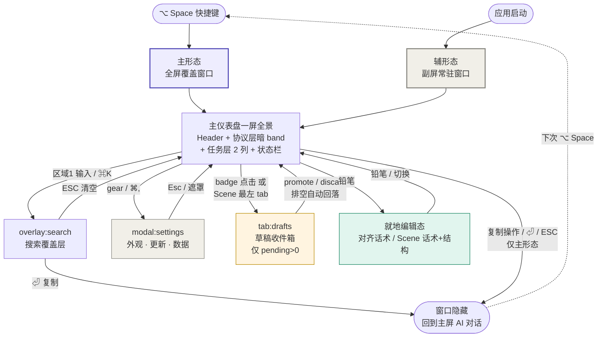

# Sitemap: prompt-hub

> **桌面应用语境**：无 URL 路由，只有「形态 / 区域 / 浮层 / 编辑态」。本文件回答三个问题：
> 1. 系统里**有什么对象**？（§1 资产对象树）
> 2. 屏幕上**有哪些地方**？（§2 区域地图 + §3 浮层与模式）
> 3. 用户**怎么从一处到另一处**？（§4 唤起路径 + §5 焦点导航 + §6 跳转图）
>
> 不画 UI wireframe（[[03-product-spec#13]] 管），不画交互细节（[[03-product-spec#4.3]] 管）。
> v0.1 时代的「13 视图清单」已整体失真——本版重写为「单窗口一屏全景 + 浮层」模型，旧视图去向对照见 §8。

---

## §1 资产对象树

完整 mermaid 关系图见 [[06-prd#6.0]]。本节是**导航视角**的简化版：

```
prompt-hub 数据世界
├── 资产层（用户创作 + 沉淀）
│   ├── 结构轴（三层）
│   │   ├── Modifier        — 方法论原子（30 上限）· UI 承载 = aside「原子库参考面」
│   │   ├── Composition     — 组合层 · 数据层与 promote 链路保留，当前无 UI 承载（v0.9 UI 减负）
│   │   └── Macro           — 高频组合的固化（100 上限）· UI 承载 = 任务列 Macro 横条
│   │
│   ├── 容器轴
│   │   ├── Scene           — 横切场景（10 上限）
│   │   │   ├── Phrase      — Scene 内话术（300 总上限）
│   │   │   └── SubStage    — Scene 子阶段分组
│   │   └── Phase           — 认知相位（12 上限，现行 8 个横排）
│   │       └── AlignmentPhrase — 对齐话术（50 上限）⚠️ 孤岛
│   │
│   └── 时间轴
│       └── SOP             — 工作流模板（20 上限）
│           └── SOPStep     — 引用 Macro 或 Phrase
│
├── 暂态收件箱（非资产层，[[06-prd#6.0]] 暂态-drafts）
│   └── Draft               — 外部 AI 经 MCP 写入的待审草稿
│                             （promote 后归入正式资产表 / discard 软删；不是第 4 层资产，不违反 [[02-constitution#B1]]）
│
└── 观察层（系统自动追加）
    └── UsageRecord         — append-only，观察所有可复制资产
```

**关键约束**（导航视角）：
- AlignmentPhrase 是**孤岛**——只从协议层暗 band 的 chip 行访问，不出现在任何任务层区域（[[02-constitution#B2]]）
- Composition 是**「只进不显」态**——draft 可归档为 Composition 的链路数据层保留，但 promote/编辑按钮当前 disabled（[[03-product-spec#13.3]] 区域 4 · P0-5 止血），解锁条件 = Composition 重新获得 UI 承载
- Draft 是**暂态**——只在 Scene 区「📥 草稿」tab（收件箱）可见，promote / discard 后离开收件箱
- UsageRecord **不可见**——用户只在状态栏（区域 7）看聚合数据，不直接浏览原始记录

---

## §2 区域地图（主仪表盘 = 唯一「页面」）

主仪表盘是**单窗口一屏全景**，无页面跳转；区域编号沿用 [[03-product-spec#13.3]]。自上而下：

| 层 | 区域 | 内容 | 备注 |
|---|---|---|---|
| chrome | UpdaterBanner | 更新可用/进度横幅 | 条件显示（[[017-enable-auto-update]]；auto 检查失败静默不挂横幅） |
| chrome | **区域 0 · Header** | slim 行：logo（中性强调）+ 标题 + **内嵌 SearchBar** + gear | v0.11 起（[[018-absorb-promptscape-design]]）；gear / `⌘,` 开设置弹窗 |
| chrome | 区域 1 · 搜索区 | Header 中段内联字段，`⌘K` 聚焦 | 输入即触发搜索覆盖层（§3） |
| chrome | 区域 8 · 待审 badge | Header 右段「📥 N 条待审」 | **仅 pending>0 显示**；点击跳 Scene 区草稿 tab；不进 Tab cycle |
| 协议层 | **ProtocolBand 暗色 band** | 区域 2 相位带 + 区域 2-bis 对齐话术的容器 | 双主题恒为深底浅字（`--band-*` 层级固定色，[[020-restore-protocol-dark-band]]） |
| 协议层 | 区域 2 · 相位带 | 8 个 Phase 横排；点击 = 仅切换，`⌘1-8` = 切换 + 复制默认话术 + 隐藏 | 哲学七视觉落地 |
| 协议层 | 区域 2-bis · 对齐话术 | 当前 Phase 的 AlignmentPhrase chip 行，点击即复制 | 编辑态含「设为默认」（v0.13） |
| 任务层 | **2 列 resizable 全景**（group id `panorama-2col`） | task 列 ≈68% + aside 列 ≈32%，列宽可拖、persist localStorage | v0.11 起 3→2 列（ADR-018 / ADR-016 补遗） |
| 任务层 · task 列 | 区域 3 · Macro 区 | 顶部紧凑横条，auto-fill 卡片，按热度排序，点击复制即隐藏 | |
| 任务层 · task 列 | 区域 4 · Scene 区 | Scene tab 切换 + 子阶段 auto-fit 多列全景；**Tab 行最左为「📥 草稿」tab（仅 pending>0 显示）** | 含就地编辑态（话术 + 结构，§3） |
| aside 列 | Modifier 原子库参考面 | 四象限 chip，点击复制（不记 usage）；hover 管理簇（移象限/删除） | 非编号区域、非 Tab region；挂「协议层 · 参考」层标记 pill |
| aside 列 | 区域 5 · 最近使用 | 最近 5 条复制记录，点击再次复制 | |
| aside 列 | 区域 6 · SOP 进度 | 进度条 + 下一步建议；未激活折叠 | |
| chrome | 区域 7 · 状态栏 | 今日复制次数 · 当前相位 · 草稿待沉淀 + 快捷键提示 | 常驻底部，**不是弹出层**（v0.1 `view:status-panel` 已裁撤） |

---

## §3 浮层与模式清单（桌面「路由」）

主仪表盘之上只有覆盖层 / 弹窗 / 就地编辑态，无子窗口（`⌘N` Composition 子窗口仍是规划态，见 §8）：

| ID | 触发方式 | 容器形态 | 数据对象 / 页面 | 退出 |
|---|---|---|---|---|
| `overlay:search` | 区域 1 输入关键字（`⌘K` 聚焦） | 覆盖全景的搜索结果层 | Macro / Phrase / AlignmentPhrase / SOP | ESC 清空回全景；⏎ 复制并隐藏 |
| `modal:settings` | Header gear / `⌘,` | 居中 overlay 模态（scrim 遮罩） | 三页：**外观**（主题三态 + 强调色 5 色）/ **更新**（opt-in + 检查/安装）/ **数据**（导出备份 / 导入整库替换） | Esc / 遮罩 / X |
| `tab:drafts` | Scene 区最左「📥 草稿」tab / 待审 badge 点击 | Scene 区内容替换（收件箱视图） | pending Draft 列表：promote / 编辑（`get_draft` 水合）/ discard；composition 类 promote+编辑 disabled | 点其他 Scene tab；**排空自动回落 Scene 视图** |
| `mode:alignment-edit` | 区域 2-bis 铅笔 | chip 行就地展开编辑区 | AlignmentPhrase 增/改/删 + 设为默认 | 铅笔再点 / 切 Phase 自动退出 |
| `mode:scene-edit` | 区域 4 tab 行右侧铅笔 | Scene 区就地编辑态 | Phrase 增改删/拖排 + 结构编辑器 inset（Scene 改名/删/新建/前后移，SubStage 增改名删/拖排） | 铅笔再点 / 切 Scene 自动退出 |
| `mode:modifier-manage` | aside Modifier chip hover / focus-within | chip 上的最小管理簇 | 移动象限 / 删除（二次确认） | 移开焦点 |
| `toast` | 操作反馈（复制失败 / 导入结果等） | 短时浮层 | intent 分级（error 4000ms） | 自动消失 |

**弹出层不进 Tab cycle**：设置弹窗有自己的焦点域；搜索覆盖层以 ↑↓⏎ 内部导航（[[03-product-spec#13.4]]）。

---

## §4 双形态与唤起路径

单一应用、双形态承载（[[03-product-spec#4.0]]）；两形态共享同一套区域地图（§2）与数据后端：

| 形态 | 进入 | 承载 | 退出 |
|---|---|---|---|
| **主形态**（80% 场景） | 全局快捷键 `⌥ Space` | 全屏覆盖窗口，半透明背景 | **复制即隐藏** / ESC / 点击窗口外 |
| **辅形态**（20% 场景） | 应用启动即常驻副屏 | 副屏独立窗口，不透明 | 不退出（关应用即关） |

形态差异只在「触发」与「退出」：辅形态不自动隐藏、供余光感知（当前相位 / SOP 进度 / 待审 badge）。

---

## §5 焦点导航（Tab cycle）

区域级 Tab 循环共 **6 站**（[[03-product-spec#13.4]]，v0.9 UI 减负后现行口径）：

```
相位带 → 对齐话术 → Macro → Scene 全景 → 最近使用 → SOP 进度 → (循环)
```

- **不进 cycle**：Header / 设置弹窗（chrome / 模态，自有焦点域）、待审 badge（纯状态指示器，`tabIndex=-1`）、Modifier 参考面（非 region，chip 本身仍键盘可达）
- **区域内**：`↑↓←→` 在卡片间移动，`⏎` 复制当前选中项并隐藏（主形态）
- **草稿收件箱键盘路径**：Tab 到 Scene region → `←/→` 到最左「📥 草稿」tab → 方向键选卡 + 显式动作键 promote/discard（不绑单 `⏎`，守 [[06-prd#8.2]] N3）
- 快捷键总表见 [[03-product-spec#13.4]]（`⌥ Space` / ESC / `⌘K` / `⌘1-8` / `⌘,` 等）

---

## §6 视图跳转图



**图例**：
- 紫色 = 主形态入口（哲学三时间分离）
- 米色 = 辅形态入口 / chrome 层（哲学三空间分离）
- 琥珀 = 暂态收件箱（MCP 写入待审）
- 绿色 = 任务层就地编辑态

> 图中 hex 为文档配图字面量，不受组件 CSS token 铁律约束（CLAUDE §4.1 只管代码）。

---

## §7 关键导航约束

| # | 约束 | 来源 |
|---|---|---|
| N1 | 主形态任何复制操作 → 自动隐藏窗口；辅形态不自动隐藏 | [[06-prd#8.2-A1]] |
| N2 | 「📥 草稿」tab 与待审 badge **同生同灭**（仅 pending>0 显示）；收件箱排空自动回落 Scene 视图 | [[03-product-spec#13.3]] 区域 4/8 |
| N3 | Draft promote 须 omar 显式点击，无自动 promote 路径；promote/discard IPC 不经 MCP 暴露 | [[06-prd#10.3]] / [[02-constitution#D1]] |
| N4 | composition 类草稿 promote/编辑 disabled（无 UI 承载会成孤儿数据），discard 可用 | [[03-product-spec#13.3]] 区域 4 · P0-5 |
| N5 | 协议层（相位带 / 对齐话术）物理隔离在暗 band 内，不出现在任何任务层区域；Macro/Scene 区零 alignment 引用（源码级 gate） | [[02-constitution#B2]] / ADR-020 |
| N6 | 设置弹窗「数据」页导入 = 清空 + 整库替换，**必须过确认弹窗**且不可撤销；导入失败不得留下半库 | [[06-prd#6.9]] / [[03-product-spec#13.3]] 区域 9 |
| N7 | 删除非空 Scene 后端阻止；删 SubStage 时其下 Phrase 解绑为「无分组」（不连带删） | [[06-prd#6.4]] |
| N8 | 任何唤起路径改动须守 200ms P95 唤起预算 | [[02-constitution#C1]] |

---

## §8 v0.1 视图清单的去向（对照表）

v0.1 曾列 13 个 `view:*`。多轮改版（v0.9 UI 减负 / ADR-018 / ADR-020）后逐一对照：

| v0.1 视图 | 现状 |
|---|---|
| `view:home-main` / `view:home-aux` | ✅ 保留 = 双形态（§4），共享同一区域地图 |
| `view:search-results` | ✅ 保留 = `overlay:search`（§3） |
| `view:scene-tab` | ✅ 保留 = 区域 4 Scene tab 切换，新增「📥 草稿」tab |
| `view:config` | 🔄 改道 = `modal:settings`（外观/更新/数据三页）；资产编辑不走配置面板，改各区域**就地编辑态** |
| `view:data-io` | 🔄 改道 = 设置弹窗「数据」页 |
| `view:phase-edit` | 🔄 改道 = AlignmentPhrase 编辑走区域 2-bis 就地编辑态；Phase 本体编辑无 UI（右键编辑视图未实装） |
| `view:status-panel` | ❌ 裁撤 = 状态栏是常驻区域 7，无弹出层 |
| `view:composition` | ⏳ 规划态 = `⌘N` 子窗口未实装；v0.9 移除常驻工作台，数据层保留（[[03-product-spec#13.5]] #1） |
| `view:phase-detail` | ⏳ 规划态 = 长按 Phase 浮层样式未定（[[03-product-spec#13.5]] #3） |
| `view:sop-detail` / `view:sop-edit` | ⏳ 规划态 = 现只有区域 6 SOP 进度展示，详情/编辑 UI 未实装 |
| `view:monthly-review` | ⏳ 规划态 = 辅形态深度场景待第五阶段细化（[[03-product-spec#13.5]] #5） |

---

## §9 待决议的导航细节

- `⌘N` Composition 子窗口概念是否废止 → 待 omar 决定（[[03-product-spec]] v0.9 修订记录遗留项）
- 辅形态专属面板（月度 review 等）的区域划分 → 辅形态细化时补
- 搜索覆盖层结果分组的跳转粒度（组间/组内导航）→ 随 [[011-search-usagesource]] Reserved 项一并决

---

## 修订记录

### v0.2（2026-07-02）— 对齐 product-spec v0.13 的全量重写

v0.1（2026-05-19 pre-code）后 UI 历经 ADR-018 Promptscape 吸收、v0.9 UI 减负（Tab cycle 8→6）、ADR-019 视觉锚点更替、ADR-020 暗 band 恢复、M-X 草稿收件箱等多轮改版，「13 视图清单 + 子窗口」模型整体失真。本版重写为「单窗口一屏全景（区域 0-9）+ 浮层/就地编辑态」模型：

- §1 资产树补暂态 drafts 收件箱、Composition「只进不显」现状、Modifier 参考面承载
- §2 新增区域地图（slim Header / 协议层暗 band / 任务层 2 列 resizable / aside 三件套 / 状态栏）
- §3 视图清单改浮层与模式清单（搜索覆盖层 / 设置弹窗三页 / 草稿 tab / 三处就地编辑态）
- §5 新增焦点导航（Tab cycle 6 区现行口径）
- §8 新增 v0.1 视图去向对照表（3 改道 / 1 裁撤 / 5 规划态）

🤖 AI 主笔，status: draft 待 omar 人审；依据 [[03-product-spec]] v0.13 + ADR-018/019/020 + 代码现状（`src/layouts/Dashboard.tsx`）。

### v0.1（2026-05-19）— pre-code 初版

资产对象树 + 13 视图清单 + 视图跳转图（设计期推演，未经代码校准）。
