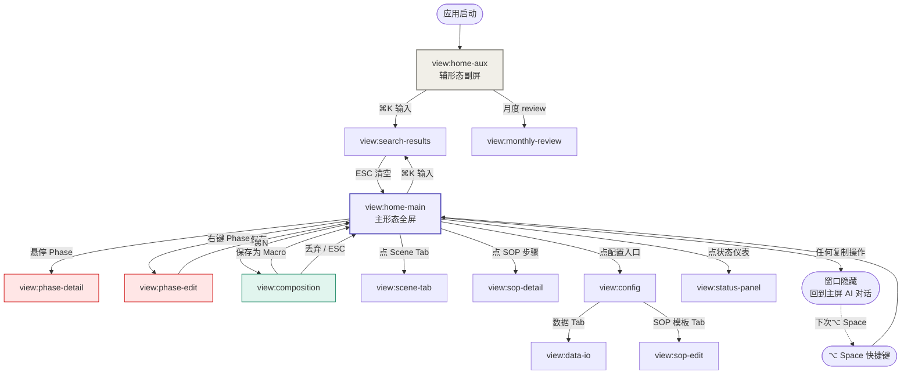

# Sitemap: prompt-hub

> **桌面应用语境**：无 URL 路由，只有「视图 / 窗口 / 弹窗」。本文件回答两个问题：
> 1. 系统里**有什么对象**？（资产对象树）
> 2. 用户**怎么从一个视图跳到另一个视图**？（视图导航图）
>
> 不画 UI wireframe（[[03-product-spec#13]] 管），不画交互细节（[[03-product-spec#4.3]] 管）。

---

## §1 资产对象树

完整 mermaid 关系图见 [[06-prd#6.0]]。本节是**导航视角**的简化版：

```
prompt-hub 数据世界
├── 资产层（用户创作 + 沉淀）
│   ├── 结构轴（三层）
│   │   ├── Modifier        — 方法论原子（30 上限）
│   │   ├── Composition     — 临时态组合（不持久化）
│   │   └── Macro           — 高频组合的固化（100 上限）
│   │
│   ├── 容器轴
│   │   ├── Scene           — 横切场景（10 上限）
│   │   │   ├── Phrase      — Scene 内话术（300 总上限）
│   │   │   └── SubStage    — Scene 子阶段分组
│   │   └── Phase           — 认知相位（12 上限）
│   │       └── AlignmentPhrase — 对齐话术（50 上限）⚠️ 孤岛
│   │
│   └── 时间轴
│       └── SOP             — 工作流模板（20 上限）
│           └── SOPStep     — 引用 Macro 或 Phrase
│
└── 观察层（系统自动追加）
    └── UsageRecord         — append-only，观察所有可复制资产
```

**关键约束**（导航视角）：
- AlignmentPhrase 是**孤岛**——只能从「相位带」入口访问，不出现在任何任务层视图
- Composition 是**临时态**——无独立视图列表，只在 Composition 工作台内 in-memory 存在
- UsageRecord **不可见**——纯观察层，用户在「状态仪表区」看其聚合数据，不直接浏览原始记录

---

## §2 视图清单（桌面应用 "路由"）

桌面应用无 URL，但每个视图有一个**触发方式**和**显式 ID**：

| 视图 ID | 触发方式 | 容器形态 | 数据对象 | 权限 |
|---|---|---|---|---|
| `view:home-main` | 全局快捷键（⌥ Space） | 主形态全屏覆盖 | 全部资产 | 单人 |
| `view:home-aux` | 应用启动 / 副屏窗口 | 辅形态副屏独立窗口 | 全部资产 | 单人 |
| `view:search-results` | `view:home-*` 中 ⌘K 输入 | 替换首屏 | Macro / Phrase / AlignmentPhrase / SOP | 单人 |
| `view:phase-detail` | `view:home-*` 中悬停/长按 Phase | 弹出层 | AlignmentPhrase[] of one Phase | 单人 |
| `view:phase-edit` | `view:home-*` 中右键 Phase | 子窗口 | Phase + AlignmentPhrase[] | 单人 |
| `view:composition` | `view:home-*` 中 ⌘N | 子窗口 | Composition（临时态） + Modifier[] | 单人 |
| `view:scene-tab` | `view:home-*` 中点 Scene Tab | 替换 Scene 区内容 | Scene + Phrase[] + SubStage[] | 单人 |
| `view:sop-detail` | `view:home-*` 中点 SOP 步骤 | 弹出层 | SOP + SOPStep[] | 单人 |
| `view:sop-edit` | `view:config` → SOP 模板编辑 | 子窗口 | SOP + SOPStep[] | 单人 |
| `view:config` | `view:home-*` 中点配置入口 | 子窗口（多 Tab） | Phase / Scene / 快捷键 / 布局 | 单人 |
| `view:data-io` | `view:config` → 数据导入导出 Tab | `view:config` 内 Tab | 全部数据（JSON 序列化） | 单人 |
| `view:status-panel` | `view:home-*` 中点状态仪表 | 弹出层 | UsageRecord 聚合 + 相位分布 | 单人 |
| `view:monthly-review` | `view:home-aux` 限定 | 辅形态内独立面板 | UsageRecord 长期趋势 | 单人 |

**视图总数**：13 个。覆盖 prd §6 全部数据对象。

---

## §3 视图跳转图



**图例**：
- 紫色 = 主形态入口（哲学三时间分离）
- 米色 = 辅形态入口（哲学三空间分离）
- 红色 = 协议层视图（[[02-constitution#B2]] 物理隔离）
- 绿色 = 任务层视图

---

## §4 关键导航约束

| # | 约束 | 来源 |
|---|---|---|
| N1 | 主形态任何复制操作 → 自动隐藏窗口 | [[06-prd#8.2-A1]] |
| N2 | 辅形态不自动隐藏，常驻在场 | [[06-prd#8.2-A1-exception]] |
| N3 | `view:composition` 退出时必须确认是否保存（Q2 ask-first） | [[06-prd#8.2-Q1]] |
| N4 | `view:config` 内的删除操作必须二次确认 | [[06-prd#8.2-Q1]] |
| N5 | 协议层视图（`view:phase-*`）不允许跳转到任务层 Macro/Phrase 视图 | [[02-constitution#B2]] |
| N6 | `view:data-io` 导入失败必须回滚到导入前快照 | [[06-prd#7.7.4]] |

---

## §5 待决议的视图细节

- `view:monthly-review` 的具体数据维度（哪些字段聚合）→ 详见 [[03-product-spec#4.5.5]] 未覆盖 flow
- ✅ `view:status-panel` 是否包含 schema_version 升级状态 → 已由 [[10-ops-spec#§5.1]] 决议：迁移日志在 `view:config` 配置面板，**不在** status-panel
- 配置入口的 Tab 划分（4 Tab 还是 5 Tab）→ 待 product-spec 修订
