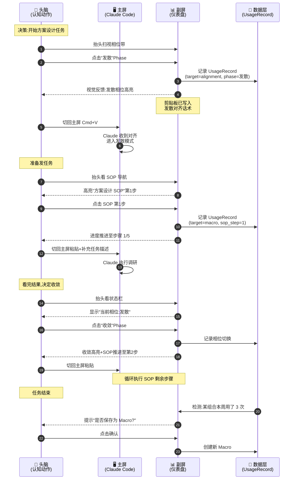
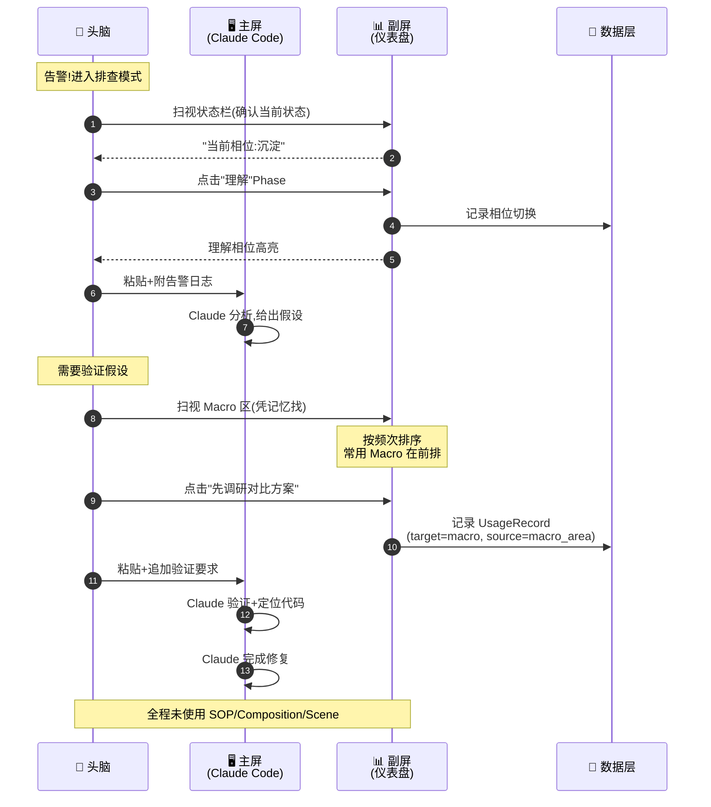
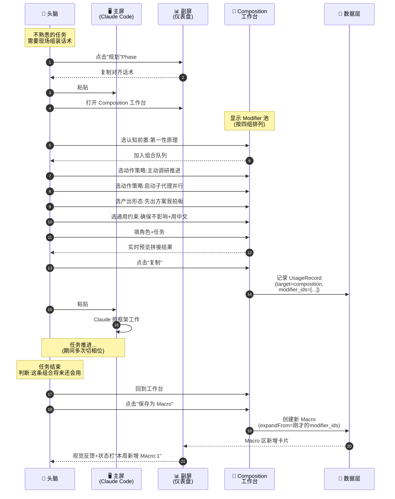
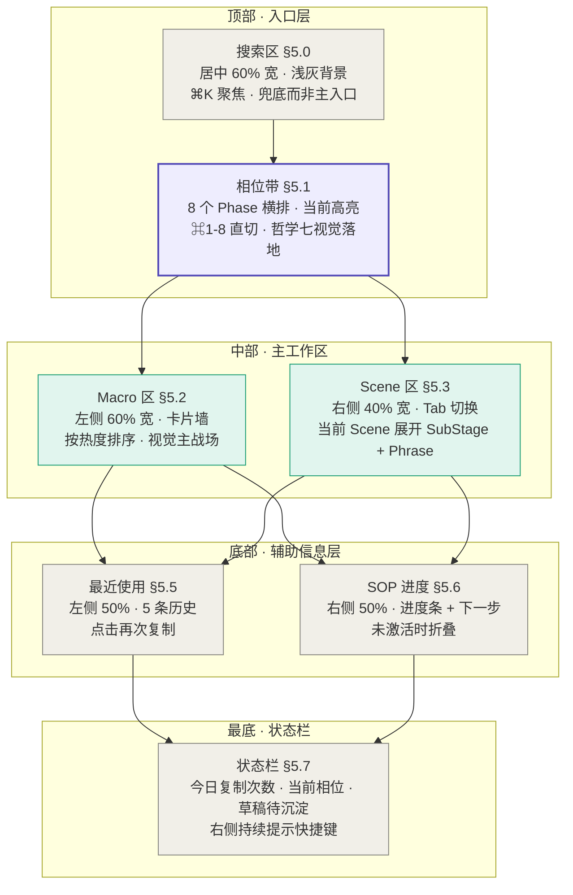

# Product Spec: prompt-hub（UI 契约）

> 本文件是 `prompt-hub-prd.md` 拆分版的 **product-spec.md**——承载 UI 契约（信息架构 + 模块布局 + 用户旅程 + UI 草案）。
> 项目定位见 [[spec]]、视觉规范见 [[design-spec]]、数据契约见 [[prd]]。
>
> 本文件来源：原 PRD §4 界面设计原则 + §4.5 用户旅程 + §13 主形态 UI 草案。
> §4.3 的视觉 Token 部分已迁至 [[design-spec]]，本文件只保留「交互频率与路径」行为表。
> 原 §4.6 已升格为 [[spec#2.9-哲学九]]，本文件不重复。

---

## 4. 界面设计原则

### 4.0 双形态架构

> 本节是 v0.5 新增章节，承接哲学八（[[spec#2.8-哲学八]]）。

#### 4.0.1 两种形态的关系

本项目采用**单一应用、双形态承载**架构：

- **主形态：快捷键唤起的全屏覆盖窗口**——80% 使用场景
- **辅形态：副屏常驻视图**——20% 深度场景

**关键性质**：

- **一个桌面应用**：两种形态由同一个 Tauri/Electron 应用提供，不是两个产品
- **共享数据后端**：所有 Modifier / Macro / Phrase / Phase / AlignmentPhrase / Scene / SOP / UsageRecord 由两种形态共享，零同步成本
- **共享 UI 模块**：相位带、Macro 区、Scene 区、最近使用、SOP 导航等模块代码复用，只是容器布局不同
- **形态切换无成本**：用户的所有沉淀、配置、使用记录在两种形态下完全一致

#### 4.0.2 主形态的核心特征

- **触发**：全局快捷键（默认 `⌥ Space`，可配置）
- **承载**：全屏覆盖窗口，半透明背景（透明度约 92%），主屏内容可透出感知
- **退出**：复制话术后自动隐藏；ESC 手动隐藏；点击窗口外区域隐藏
- **使用画面**：

> 在主屏想事情 → 按下快捷键 → 仪表盘全屏覆盖 → 扫视/搜索定位话术 → 点击或回车复制 → 窗口自动隐藏 → 回到主屏粘贴

这是 80% 场景下使用者与本应用交互的全部流程。详见 §4.5 user flow 与 [[prd#5-功能模块]]。

#### 4.0.3 辅形态的核心特征

- **触发**：应用启动时常驻于副屏
- **承载**：副屏常驻窗口，不覆盖主屏
- **退出**：不退出（关闭应用即关闭副屏视图）
- **使用画面**：

> 月度 review / 整理资产 / 跟随长 SOP 时 → 抬头看副屏 → 在副屏点击/编辑 → 主屏继续工作

这是 20% 场景下使用者依赖副屏的全部流程。详见 §4.5 user flow 中的相应场景。

#### 4.0.4 UI 共用规则

两种形态使用**同一套 UI 模块**，区别只在容器布局：

| 模块 | 主形态（快捷键全屏） | 辅形态（副屏常驻） |
|------|-----------------|----------------|
| 搜索框（[[prd#5.0-搜索区]]） | 顶部居中，中等大小 | 顶部居中，中等大小 |
| 相位带（[[prd#5.1-相位带（Phase-Bar）]]） | 搜索框下方，8 个横排 | 搜索框下方，8 个横排 |
| Macro 区（[[prd#5.2-Macro-快捷区]]） | 中部左侧，60% 宽 | 中部左侧，60% 宽 |
| Scene 区（[[prd#5.3-Scene-全景区]]） | 中部右侧，40% 宽 | 中部右侧，40% 宽 |
| 最近使用（[[prd#5.5-最近使用区]]） | 底部左侧 | 底部左侧 |
| SOP 导航（[[prd#5.6-SOP-导航区]]） | 底部右侧 | 底部右侧 |
| 状态栏（[[prd#5.7-状态仪表区]]） | 最底部 | 最底部 |

差异点：
- **主形态**：背景半透明、有"复制即隐藏"动画、ESC 关闭
- **辅形态**：背景不透明、不会隐藏、可选展开 Composition 工作台为侧栏

#### 4.0.5 形态之间的边界

**主形态承载 80% 高频动作**：切相位、调用 Macro、查找话术、复制粘贴、查看 SOP 下一步。

**辅形态承载 20% 深度动作**：
- 月度 review（看长期趋势、清理 deprecated 资产）
- 整理资产（批量编辑 Modifier、调整 Scene 结构）
- 跟随长 SOP（持续可见进度，不希望窗口隐藏打断节奏）
- 配置管理（编辑 Phase、增删 Scene）

**两种形态都做的事**：都能完整复制任何话术；都显示完整的相位带和 SOP 进度；都可以编辑资产（只是辅形态体验更好）。

**只有主形态做的事**：ESC 隐藏 / 复制即隐藏。

**只有辅形态做的事**：余光感知状态（因为主形态用完即走，没有"余光"的概念）。

#### 4.0.6 哲学映射

| 哲学 | 在主形态如何落地 | 在辅形态如何落地 |
|------|--------------|--------------|
| 二·看见全局 | 唤起时一屏铺开全景 | 持续呈现全景 |
| 三·分离 | 时间分离（按需唤起） | 空间分离（副屏） |
| 四·使用即沉淀 | 唤起时推送沉淀提示 | 状态仪表持续可见 |
| 六·受控离手 | 按快捷键是一次明确的离手 | 抬头看副屏是一次明确的离手 |
| 七·协议对齐 | 相位带永远在最顶部 | 相位带永远在最顶部 |
| 八·双形态承载 | 自身即是哲学八的落地 | 自身即是哲学八的落地 |

---

### 4.1 布局原则：一屏全景

**真实仪表盘对应物**：汽车仪表盘上，时速表、转速表、油量、水温、挡位指示灯**同时可见**，驾驶员不需要切换视图。

**决策**：仪表盘首屏（两种形态都适用）必须同时呈现以下七个区域：

1. **搜索框（顶部居中，中等大小）**——全局兜底入口，⌘K 唤起聚焦
2. **相位带**——8 个 Phase 横排，承载 AlignmentPhrase 一键调用
3. **Macro 区**——当前所有 Macro 作为卡片墙置顶
4. **Scene 区**——按场景横切的话术分类（Tab 切换）
5. **最近使用区**——最近 5 次复制历史（时间倒序）
6. **SOP 导航区**——当前激活的 SOP 模板 + 进度指示
7. **状态栏**——今日复制次数、当前相位、未分类草稿等指标

**为什么搜索框是"兜底"而非"主路径"**：
- 哲学二要求扫视为主、搜索为辅——主要查找路径是"扫视卡片墙找到目标"
- 搜索是"知道有这条话术但记不清在哪"时的兜底
- 搜索框视觉权重刻意压低（背景浅灰、占位文字、约 60% 宽度居中），不诱导优先使用
- 详见 [[prd#5.0-搜索区]] 设计

**理由**：
- 哲学二（看见全局 > 操作最快）要求全景呈现
- 哲学三（分离）要求形态承担"思考工具面板"的角色，不能只是被动列表
- 哲学七（协议对齐）要求相位带位于最显眼位置
- 把 SOP 导航放进首屏是整个设计的点睛之笔——它回答了"未来可以怎么操作"这个问题

**反设计**（明确拒绝的方案）：
- ❌ 搜索框作为主导航（Raycast、Alfred）——隐藏了全局信息，违背哲学二
- ❌ 瀑布流式——需要滚动才能看全
- ❌ 主导航 Tab 式——把同类信息藏在不同 Tab 里（注：Tab 仅用于 Scene 内部切换，不用于资产类型切换）

---

### 4.2 点击路径原则：按频率分层

**真实仪表盘对应物**：换挡杆的挡位布局——1、3、5 挡在上排（常用），2、4、R 挡在下排（次常用）。使用者的手在熟悉之后会**按频率找挡位**，不是按字母顺序。

**决策**：不同层级的话术对应不同的点击步数：

| 层级 | 点击路径 | 步数 |
|------|---------|------|
| AlignmentPhrase（相位带） | 首屏顶部 → 点击即复制 | 1 步 |
| Macro | 首屏直达 → 点击即复制 | 1 步 |
| 最近使用 | 首屏直达 → 点击即复制 | 1 步 |
| Scene 内话术 | 点 Scene → 点话术 | 2 步 |
| Composition 组合 | 进入组合模式 → 勾选 → 调序 → 复制 | 3-4 步 |

**理由**：
- 哲学二允许"多一步"，但不应允许"步数和频率倒挂"
- 哲学六（减少但不消除离手）要求高频操作必须极短路径
- 哲学七要求 AlignmentPhrase 比任何任务话术优先级更高，所以放在最顶部
- 这套阶梯让 80% 的调用落在 1-2 步内，保证流畅

**实现要求**：
- 相位带和 Macro 区必须在屏幕上半部分，避免使用者低头
- Scene 切换不应打开新页面——在首屏的 Scene 区直接展开当前 Scene 的全部话术

---

### 4.3 交互频率与路径（行为契约）

> 原 PRD §4.3「视觉设计原则」的视觉 Token 部分已迁至 [[design-spec]]，本节只保留行为契约部分。

| 调用频率 | 主要路径 | 设计要求 |
|---------|---------|---------|
| 极高频（70%）| 快捷键唤起 → 扫视 → 点击/回车复制 | 主形态默认入口，1-2 秒完成 |
| 高频（15%）| 快捷键唤起 → ⌘K 搜索 → 选 → 复制 | 搜索作为兜底，3-4 秒完成 |
| 中频（10%）| 快捷键唤起 → Composition 工作台（`⌘N`） → 组装 → 复制 | 现场组装场景 |
| 低频（5%）| 副屏深度操作 → 整理 / 配置 / Review | 月度场景，不追求速度 |

这种分层意味着**仪表盘 UI 不需要为所有动作都做"极致快"的优化**——核心是把 70% 高频路径做到 2 秒内完成。

---

### 4.4 状态反馈原则：刚刚发生了什么

**真实仪表盘对应物**：转向灯指示、挡位指示灯、车速变化——驾驶员需要持续知道"刚才的操作生效了没"。

**决策**：任何操作都必须有即时的视觉确认：

- **复制成功**：话术卡片闪一下绿色 + 角落显示"已复制"
- **相位切换**：相位带高亮当前相位 + 状态栏显示"当前相位：X"
- **组合添加**：组合队列区出现新条目 + 该 Modifier 卡片变色
- **Macro 保存**：Macro 区顶部出现新卡片 + 轻微上浮动画
- **使用次数更新**：话术卡片右上角的数字 +1
- **拆解视图展开**：Macro 长按（触控场景）/ 右键（鼠标场景）展开"由哪些 Modifier 组成"——这是哲学五（分层语言系统）的可视化入口

**理由**：
- 哲学四（使用即沉淀）需要让沉淀过程"看得见"
- 哲学七（协议对齐）需要让"当前在哪个相位"持续可见——这是状态反馈最重要的应用
- 手动挡阶段使用者需要信心反馈——"我刚才做的操作真的被记录了吗"
- 视觉确认比单纯的"静默成功"更能建立信任
- 拆解视图是连接 Macro 和 Modifier 的桥梁，否则三层结构在 UI 上不可见

---

### 4.5 引导原则：未来可以怎么操作

**真实仪表盘对应物**：导航仪告诉驾驶员"下一个路口右转"——不是命令，是建议。

**决策**：SOP 导航区不只是显示当前进度，还要**主动建议下一步**：

- 用户复制了某条话术之后，如果这条话术是某个 SOP 的一步，高亮下一步
- 如果用户已经偏离了任何已知 SOP，提示"是否开启新的 SOP 录制？"
- 首屏角落显示"今日建议的 SOP"，基于使用历史（比如上午常做调研型任务）

**理由**：
- 这是"手动挡变自动挡"的预热——使用者通过跟随 SOP 建议，无意中训练出自己的工作节奏
- 没有这个引导，SOP 视图就只是一张静态流程图，没有真正提升驾驶体验
- 但引导必须是**建议性**的，不能是**强制性**的——手动挡阶段人仍然是决策主体

**反设计**：
- ❌ 自动跳到下一步（那是自动挡）
- ❌ 强制使用者按 SOP 顺序点（那是流水线，不是仪表盘）

> 原 §4.6 迭代原则已升格为 [[spec#2.9-哲学九]]——本文件不重复。

---

## 4.5 用户旅程（User Flow）

> 本节是 v0.4 新增章节，承接 §4 界面设计原则，先于 [[prd#5-功能模块]] 展开。

### 4.5.0 关于本节

传统 App 的 user flow 是"用户从 A 屏点到 B 屏完成 X 任务"。本项目的 user flow **不只是 UI 跳转**——它必须把"人机协同的认知节奏"画出来，因为：

- 仪表盘不是独立 App，而是**主屏工作流的副产品**
- 一次完整任务横跨**主屏（Claude Code 对话）+ 仪表盘 + 头脑（认知动作）**三个空间
- 仪表盘的真正价值发生在"召唤仪表盘的瞬间"——这个瞬间不在常规 UI flow 图里

#### 形态视角说明（v0.5 新增）

下面的场景均按**主形态（快捷键唤起全屏覆盖窗口）**视角描写。"按下快捷键"即唤起仪表盘，"复制"后窗口自动隐藏。

如果使用辅形态（副屏常驻），关键差异是：
- 不需要"按下快捷键"——副屏永远在场，直接"抬头看副屏"
- 复制后窗口不会自动隐藏——副屏持续呈现
- 余光感知关键状态（当前相位、SOP 进度）

两种形态共享同一套 UI 模块与数据，差异仅在"触发方式"和"退出方式"。详见 §4.0 双形态架构。

#### 场景采用两层呈现

- **叙事层（A）**：第一人称讲一遍，让画面感成立
- **机制层（C）**：跨屏序列图，让运作机制可被验证

三个场景代表仪表盘的**三种典型协同模式**：

1. **完整 SOP 驱动型**（§4.5.1）：方案设计——展示完整的"对齐 → 任务 → 沉淀"循环
2. **单点快速调用型**（§4.5.2）：日常排查——展示"快速切相位 + 一键 Macro"的轻量路径
3. **组合工作台沉淀型**（§4.5.3）：新型任务——展示"现场组装 + 升级 Macro"的沉淀路径

三个场景合起来，覆盖了仪表盘所有核心模块在真实任务中的运转。

---

### 4.5.1 场景一：完整 SOP 驱动型（方案设计任务）

#### 任务背景

我接到一个新需求："给现有系统加一个数据导出模块"。这是典型的方案设计任务——已有"方案设计型 SOP"模板可以驱动整个流程。

#### 叙事层（第一人称）

> 我在主屏的 Claude Code 里打开了项目，光标停在对话框里。但我没有立刻打字——我先**抬头看副屏**。
>
> 副屏的相位带最顶部，8 个 Phase 横排着。我此刻要做的是方案设计，第一步应该是**调研外部最佳实践**——这是"发散"相位。我**点了一下"发散"**，剪贴板里立刻有了那条对齐话术。我**回到主屏**，Cmd+V 粘贴，回车。
>
> Claude 收到了对齐话术，回了一句"好，我们现在进入发散模式，先不下结论"。
>
> 然后我**再次抬头看副屏**——SOP 导航区已经识别出我刚才用的话术属于"方案设计型 SOP"的第 1 步，自动把这个 SOP 模板高亮出来，第 1 步标着"借力最优解"。我**点击 SOP 中的第 1 步**，剪贴板里换成了"借力最优解"这条 Macro。**回到主屏粘贴**，加上我的具体任务描述："调研外部主流系统的数据导出方案，给出 5 个不同实现思路"。
>
> Claude 开始干活。它跑了一会儿，给我铺开了 5 个方案。
>
> 我看完，发现已经够发散了，该收敛了。**抬头看副屏**——状态栏显示"当前相位：发散"，提醒着我现在的状态。我**点击相位带的"收敛"**，剪贴板里有了收敛对齐话术，**主屏粘贴**：让 Claude 从 5 个方案里选最优解。SOP 导航区同步推进到了第 2 步"全局视角出方案"。
>
> 后续步骤照此节奏：每切一次相位都用相位带，每发一次任务都用 SOP 导航或 Macro 区。整个 SOP 走完后，副屏的状态仪表显示："今日相位分布：发散 2 次、收敛 3 次、沉淀 1 次"。
>
> 任务结束前，副屏弹出一个不打扰的提示："你今天用了一个新组合 3 次，是否保存为 Macro？" 我**点确认**，那个组合成了 Macro 区的新卡片。

#### 机制层（跨屏序列图）

#### 这个 flow 验证了哪些设计

- **哲学三（物理分离）**：每次"抬头看副屏"都是从执行态切回决策态
- **哲学四（使用即沉淀）**：UsageRecord 默默记录、SOP 进度自动推进、组合自动识别为 Macro 候选
- **哲学六（受控离手）**：每次离手都是 1-2 步，且与认知动作绑定
- **哲学七（协议对齐）**：相位带在每次任务变化时被显式调用，框定本次协作模式
- **[[prd#5.1-相位带]]** 承担挡位切换器角色
- **[[prd#5.6-SOP-导航区]]** 承担"下一步建议"角色
- **[[prd#5.7-状态仪表区]]** 承担相位监视器角色

---

### 4.5.2 场景二：单点快速调用型（日常排查任务）

#### 任务背景

凌晨值班，监控告警了一个生产 bug。我需要快速排查，不走 SOP——这种任务太熟，凭肌肉记忆走就行。

#### 叙事层（第一人称）

> 告警弹出来，我直接打开 Claude Code，光标进对话框。
>
> 我**抬头一眼副屏**——不为切相位，只为确认当前状态。状态栏显示"当前相位：沉淀"（这是我上次工作留下的）。这次任务我要进入"理解"——先搞清楚 bug 是什么。
>
> 我**点击相位带的"理解"**，剪贴板有了对齐话术。**回主屏粘贴**，加上一句"这是生产告警日志：[贴日志]，请帮我定位根因"。
>
> Claude 开始分析。
>
> 我没动副屏，直接看 Claude 的输出。Claude 提出了一个假设：可能是某个服务的连接池耗尽了。
>
> 我需要让它去验证。这次任务有标准 Macro——"先调研对比方案"。我**抬头看 Macro 区**，第二排第一张卡片就是它（按使用频次排序，它经常用），**点击**，剪贴板就绪。**回主屏粘贴**，加上"验证你刚才的假设，看代码里有没有连接池配置问题"。
>
> Claude 给了一个明确答复+代码定位。问题确认了。
>
> 我让 Claude 直接修复。修完后我跑了测试通过，部署上线。
>
> 整个过程**没有打开 SOP 导航、没有用 Composition 工作台**——只用了相位带和 Macro 区。事后看状态仪表："今日复制次数 6 次"，跟我直觉吻合。

#### 机制层（跨屏序列图）

#### 这个 flow 验证了哪些设计

- **哲学二（看见全局 > 操作最快）的"反例验证"**：高频任务下,凭肌肉记忆只用相位带+Macro 区,**不需要看全景**——但全景"在那里"作为安全网，需要时随时可看
- **§4.2 点击路径分层**：1 步抵达 Macro 是高频任务的命脉
- **状态仪表的余光价值**：开始任务时一眼扫到"当前相位"，不需要打开任何界面
- **[[prd#5.6-SOP-导航区]] 的"克制"**：成熟任务不被 SOP 强制——这是哲学四（建议性而非强制性）

---

### 4.5.3 场景三：组合工作台沉淀型（新型任务）

#### 任务背景

我接到一个不熟悉的任务："给这个 Python 项目加单元测试覆盖率检查"。我没有现成的 SOP，没有现成的 Macro 能直接用——我得**临时组装一条话术**，并且这条话术可能将来还会再用。

#### 叙事层（第一人称）

> 我打开 Claude Code，但没立刻打字。这个任务我需要**先想清楚怎么问**。
>
> 我**切到副屏**，先点击相位带的"规划"——告诉 Claude 我们现在要规划，不是直接执行。**回主屏粘贴**。
>
> 然后我**回到副屏，打开 Composition 工作台**（[[prd#5.4-Composition-组合工作台]]）。
>
> 工作台左边是 Modifier 池，分四组排列着我所有的方法论原子。我开始挑：
>
> - 认知前置组：选**"第一性原理思考"**（因为我不熟这个领域，需要回到本质想）
> - 动作策略组:选**"主动调研推进"**（需要 Claude 自己去查最佳实践）和**"启动子代理并行"**（让多个 sub-agent 并行）
> - 产出形态组：选**"先出方案我拍板"**（不要直接动手）
> - 通用约束组：选**"确保不影响现有功能"**和**"用中文回答"**
>
> 选完后，我在角色输入框写"作为质量保障合伙人"，在任务输入框写"为本项目设计单测覆盖率检查方案"。
>
> 工作台底部实时预览，把我选的 Modifier 按顺序拼好了：
>
> > 作为质量保障合伙人，（使用第一性原理思考，）为本项目设计单测覆盖率检查方案，（主动调研、推进，启动子代理并行调研，）（先出方案供我拍板，确保不影响现有功能，用中文回答。）
>
> 我点**"复制"**——剪贴板就绪。
>
> **回主屏粘贴**，回车。Claude 开始按这个框架工作。
>
> 任务推进过程中我用了几次相位带切换相位。最终 Claude 交付了方案，我验收通过。
>
> 任务结束后，我**回到副屏的 Composition 工作台**。刚才那条组合还在预览区。我想了想——这条组合**将来做类似的"为陌生项目设计某类方案"还会用**。我点了**"保存为 Macro"**。
>
> 弹出来一个简短的命名框，我命名为"陌生领域方案设计"。Macro 区立刻多了一张新卡片，使用次数从 0 开始计数。
>
> 状态仪表显示"本周新增 Macro: 1"。一次新任务，沉淀出了一个新资产。

#### 机制层（跨屏序列图）

#### 这个 flow 验证了哪些设计

- **哲学五（话术是分层语言系统）**：完整跑通"Modifier 原子 → Composition 组合 → Macro 固化"三层跃迁
- **[[prd#5.4-Composition-组合工作台]]**：作为"陌生任务的应对工具"和"沉淀新资产的入口"双重价值
- **expandFrom 字段的实战价值**：新 Macro 保留了它的 Modifier 组成，将来可拆解回看
- **哲学四（使用即沉淀）的最强体现**：一个新任务的副产品是一个新 Macro——沉淀成本几乎为零

---

### 4.5.4 跨场景对照表

三个场景对仪表盘各模块的使用强度对照：

| 模块 | 场景一 SOP驱动 | 场景二 单点调用 | 场景三 现场组装 |
|------|:-:|:-:|:-:|
| [[prd#5.0-搜索区]] | — | — | — |
| [[prd#5.1-相位带（Phase-Bar）]] | ⭐⭐⭐ | ⭐⭐ | ⭐⭐ |
| [[prd#5.2-Macro-快捷区]] | ⭐⭐ | ⭐⭐⭐ | ⭐（创建） |
| [[prd#5.3-Scene-全景区]] | — | — | — |
| [[prd#5.4-Composition-组合工作台]] | — | — | ⭐⭐⭐ |
| [[prd#5.5-最近使用区]] | — | — | — |
| [[prd#5.6-SOP-导航区]] | ⭐⭐⭐ | — | — |
| [[prd#5.7-状态仪表区]] | ⭐（事后） | ⭐（事前） | ⭐（事后） |

**关键观察**：

- **相位带**在所有场景都被使用——这印证了哲学七（协议对齐）的普适性
- **不同场景使用不同核心模块**——这印证了 §4.1 一屏全景的必要性（任何模块都可能是某个场景的主角，藏起来都不行）
- **Scene 区在三个场景中都未直接出场**——这是个**值得标记的现象**（详见 [[spec#10.6-Scene-区在-user-flow-中的存在感]]）

---

### 4.5.5 未被覆盖的 flow（明示）

为了诚实，列出本节**未覆盖**的 flow，避免读者误以为这三个场景穷尽了一切：

- **冷启动 flow**：第一次打开仪表盘、配置初始 Modifier/Macro/Phase 的流程
- **数据导入/迁移 flow**：从 prompt-combiner 或其他工具迁移历史资产
- **月度 review flow**：基于状态仪表的数据复盘 Macro 池、清理 deprecated 资产
- **Scene 内深度工作 flow**：长时间停留在某个 Scene 内（如"调研"Scene 一干一下午）
- **跨设备同步 flow**：Mac 副屏切换到 iPad 时的衔接

这些 flow 在未来版本可能补充，当前不写——因为它们不影响 MVP 设计决策。

---

## 13. 附录：主形态 UI 草案

> 本节是 v0.5 新增附录，落地了快捷键唤起全屏覆盖窗口的具体 UI 布局。两种交付形式：Mermaid 区域结构图 + 文字描述版。

### 13.1 设计前提

本 UI 草案是在以下决策已锁定的前提下产出的：

- **触发方式**：全局快捷键（默认 `⌥ Space`）
- **承载形态**：全屏覆盖窗口，背景半透明约 92%，主屏内容可透出
- **退出方式**：复制即隐藏 / ESC / 点击窗口外
- **导航策略**：扫视为主、搜索为兜底；不做主导航 Tab（仅 Scene 内部用 Tab）
- **从资产结构反推 UI**：不从 UI 形态出发去设计，而是从 [[spec#3-核心概念]] 已确定的提示词资产结构（Modifier / Composition / Macro / Phrase / AlignmentPhrase / Phase / Scene / SOP）反推页面布局

### 13.2 区域布局结构图

颜色编码说明（详见 [[design-spec#2.4-颜色编码]]）：
- **紫色（相位带）**：协议层，视觉权重最高
- **绿色（Macro 区 / Scene 区）**：任务层主战场
- **灰色（搜索框 / 最近使用 / SOP 进度 / 状态栏）**：辅助信息层，视觉权重较低

### 13.3 文字描述版（按区域）

#### 区域 1：搜索区（[[prd#5.0-搜索区]]）

- **位置**：最顶部，居中
- **尺寸**：约 60% 宽度，单行高度（约 40px）
- **样式**：浅灰背景、占位文字"搜索 Macro / Phrase / SOP / 对齐话术..."、右侧"兜底"小标签
- **快捷键**：⌘K 聚焦
- **行为**：输入关键字 → 整个面板被搜索结果覆盖 → ↑↓ 选 → ⏎ 复制并隐藏 → ESC 退出搜索回到全景
- **视觉权重**：刻意压低，不抢相位带的视觉重心

#### 区域 2：相位带（[[prd#5.1-相位带（Phase-Bar）]]）

- **位置**：搜索区下方
- **尺寸**：占满整宽，高度约 80px（视觉权重最高）
- **内容**：8 个 Phase 横排（发散 / 理解 / 规划 / 生成 / 执行 / 收敛 / 沉淀 / 迭代）
- **当前激活态**：紫色高亮（背景 `#EEEDFE`、边框 `#534AB7` 2px 加粗）
- **其他态**：灰色背景 + 浅灰边框
- **每个 Phase 显示**：相位名称（13px）+ 快捷键标签（10px ⌘1-⌘8）
- **行为**：
  - 点击 Phase → 复制该 Phase 的默认 AlignmentPhrase → 状态栏切换显示当前相位
  - 悬停/长按 → 展开该 Phase 下所有 AlignmentPhrase 列表
  - 右键 → 进入该 Phase 编辑视图

#### 区域 3：Macro 区（[[prd#5.2-Macro-快捷区]]）

- **位置**：中部左侧
- **尺寸**：占整宽 60%
- **布局**：2 列 × N 行的卡片墙（自适应卡片数量）
- **排序**：按 usage_count 自动降序，顶部 2-4 张为"热门 Macro"（边框加粗、火焰图标）
- **每张卡片显示**：
  - 标题（14px 加粗）
  - 使用次数（11px 灰色，热门带火焰图标）
  - 最近使用时间（11px 灰色，"2h ago" / "昨天" / "3 天前"）
- **行为**：
  - 单击卡片 → 复制 → 自动隐藏窗口
  - 长按/右键 → 展开"拆解视图"（显示 expandFrom 的 Modifier）
  - 拖拽 → 调整顺序（切换为手动排序模式）

#### 区域 4：Scene 区（[[prd#5.3-Scene-全景区]]）

- **位置**：中部右侧
- **尺寸**：占整宽 40%
- **顶部 Tab**：7-10 个 Scene 横排小标签（pill 样式，约 24px 高）
  - 当前激活 Tab：紫色背景 + 紫色文字
  - 未激活 Tab：浅灰背景 + 灰色文字
- **下方内容**：当前 Scene 展开
  - 如果 Scene 有 SubStage：按 SubStage 分组显示，每组前显示"▸ 子阶段名"
  - 每组下挂 Phrase 卡片（13px，比 Macro 卡片更紧凑）
- **行为**：
  - 点击 Tab → 切换 Scene
  - 点击 Phrase → 复制 → 自动隐藏窗口
  - 长按 Phrase → 升级为 Macro / 添加到 Composition 队列

#### 区域 5：最近使用区（[[prd#5.5-最近使用区]]）

- **位置**：底部左侧
- **尺寸**：占整宽 50%
- **内容**：最近 5 条复制记录（时间倒序），每条单行显示
- **每条显示**：
  - 左侧：话术标题或预览（12px，过长截断）
  - 右侧：时间（11px 灰色，"2分钟前" / "12分钟前"）
- **行为**：
  - 单击 → 再次复制
  - 长按 → 升级为 Macro（如果是任务话术且尚未是 Macro）

#### 区域 6：SOP 进度（[[prd#5.6-SOP-导航区]]）

- **位置**：底部右侧
- **尺寸**：占整宽 50%
- **内容**：
  - 顶部一行：图标 + "SOP 进度 · {当前 SOP 名}"（12px）
  - 中部：进度条（5 段，已完成绿色实色、当前浅绿、未完成灰色，4px 高）
  - 底部：进度描述（12px，"2/5 · 下一步: {步骤名}"）
- **未激活态**：折叠隐藏，不占位置
- **行为**：点击进度条某段 → 跳转到对应步骤

#### 区域 7：状态栏（[[prd#5.7-状态仪表区]]）

- **位置**：最底部
- **尺寸**：占满整宽，高度约 32px
- **背景**：浅灰
- **左侧**：今日复制 N 次 · 当前相位 · 草稿待沉淀 N 条（11px）
- **右侧**：快捷键提示串 "⌘K 搜索 · ⏎ 复制 · ⌘N 新建 · ⌘, 设置"（11px）

### 13.4 关键交互快捷键总览

| 快捷键 | 动作 | 备注 |
|--------|------|------|
| `⌥ Space` | 全局唤起仪表盘 | 默认值，可配置 |
| `ESC` | 关闭仪表盘 | 任何时候可用 |
| `⏎` | 复制当前选中项 + 自动隐藏窗口 | 主形态默认行为 |
| `⌘K` | 焦点跳到搜索框 | 唤起即已默认聚焦 |
| `⌘1` - `⌘8` | 直接切换到第 N 个相位 + 复制对齐话术 | 哲学七的极速通道 |
| `⌘N` | 唤起 Composition 工作台子窗口 | 现场组装 |
| `⌘,` | 唤起配置面板 | 编辑 Scene/Phase/Modifier |
| `↑` `↓` `←` `→` | 在卡片间移动焦点 | 键盘党的扫视路径 |
| `Tab` | 在区域间切换焦点（相位带 / Macro / Scene / 最近 / SOP） | 区域级导航 |

### 13.5 这个 UI 草案没解决的问题（v0.5 明示）

为了诚实，列出本 UI 草案**尚未给出明确答案**的问题：

1. **Composition 工作台的 UI**：通过 ⌘N 唤起子窗口，但子窗口的具体布局未画
2. **配置面板的 UI**：通过 ⌘, 唤起，但配置 UI 未画
3. **AlignmentPhrase 多条候选展开 UI**：长按 Phase 后如何展开多条 AlignmentPhrase，具体浮层样式未定
4. **搜索结果列表的具体样式**：草案描述了"按资产类型分组"，但每组的视觉细节未画
5. **辅形态（副屏常驻）的 UI**：v0.5 主形态优先，辅形态在第五阶段实施前再细化

这些问题不阻塞 MVP 启动——它们将在实施过程中根据真实使用反馈逐步明确。

---

**关联文件**：
- [[spec]] — 项目定位与哲学
- [[design-spec]] — 视觉规范
- [[prd]] — 工程契约（数据模型 / 模块字段 / NFR / Boundaries）
- [[plan]] — 五阶段实施任务清单
